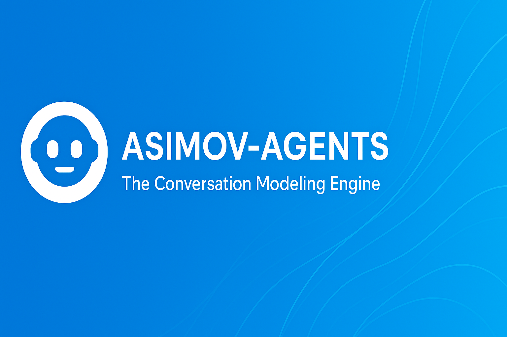
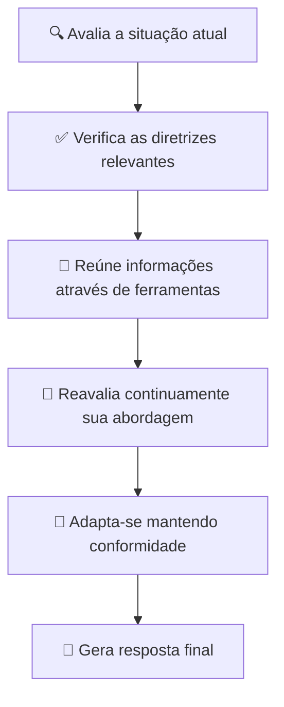

<div align="center">

# 🤖 Daneel


<h2 style="background: linear-gradient(45deg, #667eea 0%, #764ba2 100%); -webkit-background-clip: text; -webkit-text-fill-color: transparent; font-size: 2.5em; margin: 20px 0;">
O Motor de Modelagem de Conversas Inteligente
</h2>

<div style="margin: 30px 0;">
<a href="https://pypi.org/project/parlant/"></a>
<a href="https://pypi.org/project/parlant/"></a>
<a href="https://opensource.org/licenses/Apache-2.0"></a>
<a href="https://github.com/emcie-co/parlant"></a>
<a href="https://discord.gg/duxWqxKk6J"></a>
</div>

<div style="margin: 40px 0;">
<a href="https://www.parlant.io/" style="text-decoration: none; margin: 0 15px;">
  
</a>
<a href="https://www.parlant.io/docs/quickstart/introduction" style="text-decoration: none; margin: 0 15px;">
  
</a>
<a href="https://www.parlant.io/docs/tutorial/getting-started" style="text-decoration: none; margin: 0 15px;">
  
</a>
<a href="https://discord.gg/duxWqxKk6J" style="text-decoration: none; margin: 0 15px;">
  
</a>
</div>



</div>

<!-- Seção de Avisos Importantes -->
<div align="center" style="margin: 40px 0;">

> ### 📢 **Importante:** Este projeto está sendo renomeado de PARLANT para DANEEL
> *A identidade visual e nomes dos pacotes serão atualizados em versões futuras.*

> ### 🎉 **Novidades da v2.0.0 (Janeiro 2025)**
> ✨ Sistema avançado de tags • 🔗 Relacionamentos entre diretrizes • 📊 Logs em tempo real  
> 🗣️ API de Utterances • 🔄 Migração automática • 🛠️ Tool Insights aprimorados

</div>

---

<div align="center">

## 📋 **Navegação Rápida**

<table>
<tr>
<td align="center" width="25%">
<a href="#-o-que-é-modelagem-de-conversas">

</a>
</td>
<td align="center" width="25%">
<a href="#-por-que-usar-o-daneel">

</a>
</td>
<td align="center" width="25%">
<a href="#-instalação">

</a>
</td>
<td align="center" width="25%">
<a href="#-guia-de-início-rápido">

</a>
</td>
</tr>
</table>

</div>

---

<!-- Vídeo de Introdução -->
<div align="center">

## 🎬 **Vídeo de Introdução**

<a href="https://www.youtube.com/watch?v=_39ERIb0100" target="_blank">
  
</a>

<p style="margin-top: 15px; color: #666; font-style: italic;">
👆 Clique para assistir a demonstração completa
</p>

</div>

---

<!-- Seção Principal: O que é Modelagem de Conversas -->
<div align="center">

## 🤔 **O que é Modelagem de Conversas?**

<p style="font-size: 1.2em; color: #4a5568; margin: 20px 0; max-width: 800px;">
A <strong>Modelagem de Conversas (MC)</strong> é uma abordagem poderosa e confiável para controlar como seus agentes de IA interagem com usuários.
</p>

</div>

### 💡 **O Problema**

<div style="background: linear-gradient(135deg, #ff6b6b, #feca57); padding: 20px; border-radius: 15px; margin: 20px 0; color: white;">
<strong>🚨 Situação Comum:</strong> Você construiu um agente de IA—isso é ótimo! No entanto, quando você realmente o testa, percebe que ele não está lidando adequadamente com muitas interações de clientes, e seus especialistas de negócios estão insatisfeitos.
</div>

### 🎯 **A Solução**

<div style="background: linear-gradient(135deg, #667eea, #764ba2); padding: 20px; border-radius: 15px; margin: 20px 0; color: white;">
<strong>✅ Nossa Abordagem:</strong> Um <strong>modelo de conversa</strong> é um conjunto estruturado de princípios, ações, objetivos e termos que um agente aplica a uma determinada conversa para garantir interações consistentes e de alta qualidade.
</div>

### 🆚 **Comparação com outras abordagens**

<div align="center">

| 🔧 **Abordagem** | 💻 **Tecnologias** | ⚡ **Características** |
|:-----------------|:-------------------|:----------------------|
| **🔄 Motores de Fluxo** | Rasa, Botpress, LangFlow | *Forçam* interações predefinidas |
| **📝 Engenharia de Prompts** | LangGraph, LlamaIndex | Leva à *inconsistência* |
| **🎯 Modelagem de Conversas** | **🤖 DANEEL** | *Adapta-se* dinamicamente + *Garante* conformidade |

</div>

---

<!-- Por que usar o Daneel -->
<div align="center">

## 🚀 **Por que usar o Daneel?**

<div style="display: grid; grid-template-columns: repeat(auto-fit, minmax(300px, 1fr)); gap: 20px; margin: 30px 0;">

<div style="background: linear-gradient(135deg, #667eea, #764ba2); padding: 25px; border-radius: 15px; color: white; box-shadow: 0 10px 25px rgba(0,0,0,0.1);">
<h3>🎯 Controle Preciso</h3>
<p>Controle preciso sobre o comportamento dos agentes</p>
</div>

<div style="background: linear-gradient(135deg, #f093fb, #f5576c); padding: 25px; border-radius: 15px; color: white; box-shadow: 0 10px 25px rgba(0,0,0,0.1);">
<h3>🔒 Consistência</h3>
<p>Consistência garantida nas interações</p>
</div>

<div style="background: linear-gradient(135deg, #4facfe, #00f2fe); padding: 25px; border-radius: 15px; color: white; box-shadow: 0 10px 25px rgba(0,0,0,0.1);">
<h3>🔄 Adaptabilidade</h3>
<p>Adaptabilidade dinâmica aos diferentes contextos</p>
</div>

<div style="background: linear-gradient(135deg, #43e97b, #38f9d7); padding: 25px; border-radius: 15px; color: white; box-shadow: 0 10px 25px rgba(0,0,0,0.1);">
<h3>✅ Conformidade</h3>
<p>Conformidade rigorosa com diretrizes regulatórias</p>
</div>

<div style="background: linear-gradient(135deg, #fa709a, #fee140); padding: 25px; border-radius: 15px; color: white; box-shadow: 0 10px 25px rgba(0,0,0,0.1);">
<h3>📊 Monitoramento</h3>
<p>Monitoramento avançado para diagnóstico em tempo real</p>
</div>

</div>

</div>

---

<!-- Quem usa o Daneel -->
<div align="center">

## 🏢 **Quem usa o Daneel?**

<div style="display: grid; grid-template-columns: repeat(auto-fit, minmax(280px, 1fr)); gap: 20px; margin: 30px 0;">

<div style="background: #f7fafc; border-left: 5px solid #667eea; padding: 20px; border-radius: 10px;">
<h4>🏦 **Serviços Financeiros**</h4>
<p>Para comunicações regulamentadas e seguras</p>
</div>

<div style="background: #f7fafc; border-left: 5px solid #48bb78; padding: 20px; border-radius: 10px;">
<h4>🏥 **Área de Saúde**</h4>
<p>Para interações sensíveis com pacientes</p>
</div>

<div style="background: #f7fafc; border-left: 5px solid #ed8936; padding: 20px; border-radius: 10px;">
<h4>📜 **Assistência Jurídica**</h4>
<p>Para precisão e conformidade legal</p>
</div>

<div style="background: #f7fafc; border-left: 5px solid #9f7aea; padding: 20px; border-radius: 10px;">
<h4>🛡️ **Conformidade**</h4>
<p>Para casos críticos que exigem auditoria</p>
</div>

<div style="background: #f7fafc; border-left: 5px solid #f56565; padding: 20px; border-radius: 10px;">
<h4>🎯 **Atendimento Premium**</h4>
<p>Para experiências personalizadas e sensíveis à marca</p>
</div>

<div style="background: #f7fafc; border-left: 5px solid #38b2ac; padding: 20px; border-radius: 10px;">
<h4>🤝 **Representação**</h4>
<p>Para advocacia pessoal e assistência especializada</p>
</div>

</div>

</div>

---

<!-- Principais Recursos -->
<div align="center">

## 🔥 **Principais Recursos**

<h3 style="color: #4a5568; margin: 30px 0;">
🧑‍💻 Desenvolvedores e Cientistas de Dados estão usando o Daneel para:
</h3>

</div>

<div style="display: grid; grid-template-columns: repeat(auto-fit, minmax(350px, 1fr)); gap: 25px; margin: 30px 0;">

<div style="background: linear-gradient(45deg, #667eea, #764ba2); padding: 20px; border-radius: 15px; color: white;">
<h4>🤖 **Criação Rápida**</h4>
<p>Criar agentes conversacionais personalizados de forma rápida</p>
</div>

<div style="background: linear-gradient(45deg, #f093fb, #f5576c); padding: 20px; border-radius: 15px; color: white;">
<h4>👣 **Diretrizes Confiáveis**</h4>
<p>Definir comportamentos que são seguidos de forma consistente</p>
</div>

<div style="background: linear-gradient(45deg, #4facfe, #00f2fe); padding: 20px; border-radius: 15px; color: white;">
<h4>🛠️ **Ferramentas Inteligentes**</h4>
<p>Anexar ferramentas com orientações contextuais</p>
</div>

<div style="background: linear-gradient(45deg, #43e97b, #38f9d7); padding: 20px; border-radius: 15px; color: white;">
<h4>📖 **Glossário Gerenciado**</h4>
<p>Garantir interpretação estrita de termos</p>
</div>

<div style="background: linear-gradient(45deg, #fa709a, #fee140); padding: 20px; border-radius: 15px; color: white;">
<h4>👤 **Personalização**</h4>
<p>Adicionar informações específicas do cliente</p>
</div>

<div style="background: linear-gradient(45deg, #a8edea, #fed6e3); padding: 20px; border-radius: 15px; color: #2d3748;">
<h4>🏷️ **Sistema de Tags**</h4>
<p>Organizar e categorizar entidades</p>
</div>

<div style="background: linear-gradient(45deg, #d299c2, #fef9d7); padding: 20px; border-radius: 15px; color: #2d3748;">
<h4>🔗 **Relacionamentos**</h4>
<p>Estabelecer conexões complexas entre diretrizes</p>
</div>

<div style="background: linear-gradient(45deg, #89f7fe, #66a6ff); padding: 20px; border-radius: 15px; color: white;">
<h4>📊 **Monitoramento**</h4>
<p>Debugar agentes em tempo real</p>
</div>

<div style="background: linear-gradient(45deg, #fdbb2d, #22c1c3); padding: 20px; border-radius: 15px; color: white;">
<h4>🔄 **Migração**</h4>
<p>Gerenciar atualizações de versão transparentes</p>
</div>

</div>

---

<!-- Como funciona -->
<div align="center">

## 🔍 **Como funciona o Daneel?**

<h3 style="color: #4a5568; margin: 30px 0;">🔄 Fluxo de Processamento</h3>

<p style="max-width: 800px; margin: 0 auto; color: #666; font-size: 1.1em;">
Quando um agente precisa responder a um cliente, o motor do Daneel:
</p>

</div>

<div style="display: flex; justify-content: center; margin: 40px 0;">
<div style="max-width: 600px;">



</div>
</div>

---

<!-- Compatibilidade -->
<div align="center">

## 💻 **Compatibilidade com LLMs**

<p style="color: #4a5568; margin: 20px 0; font-size: 1.1em;">
O Daneel funciona com os principais provedores de LLM:
</p>

<div style="display: grid; grid-template-columns: repeat(auto-fit, minmax(200px, 1fr)); gap: 20px; margin: 30px 0; max-width: 800px;">

<div style="background: #00d2ff; background: linear-gradient(45deg, #00d2ff, #3a7bd5); padding: 15px; border-radius: 10px; color: white; text-align: center;">
<strong>🤖 OpenAI</strong><br>
<small>GPT-3.5, GPT-4</small>
</div>

<div style="background: #ff9a9e; background: linear-gradient(45deg, #ff9a9e, #fecfef); padding: 15px; border-radius: 10px; color: white; text-align: center;">
<strong>🧠 Anthropic</strong><br>
<small>Claude</small>
</div>

<div style="background: #a8edea; background: linear-gradient(45deg, #a8edea, #fed6e3); padding: 15px; border-radius: 10px; color: #2d3748; text-align: center;">
<strong>🔍 Google</strong><br>
<small>Gemini</small>
</div>

<div style="background: #d299c2; background: linear-gradient(45deg, #d299c2, #fef9d7); padding: 15px; border-radius: 10px; color: #2d3748; text-align: center;">
<strong>⚡ Mistral AI</strong><br>
<small>Mistral Models</small>
</div>

<div style="background: #89f7fe; background: linear-gradient(45deg, #89f7fe, #66a6ff); padding: 15px; border-radius: 10px; color: white; text-align: center;">
<strong>🔓 Código Aberto</strong><br>
<small>API Compatível</small>
</div>

</div>

</div>

---

<!-- Instalação -->
<div align="center">

## 📦 **Instalação**

<div style="background: linear-gradient(135deg, #667eea, #764ba2); padding: 30px; border-radius: 20px; margin: 30px 0; max-width: 600px; color: white;">

<h3 style="margin-top: 0;">⚡ Instalação Rápida</h3>

```bash
pip install parlant
```

<p style="margin-bottom: 0; font-size: 0.9em; opacity: 0.9;">
💡 Requisitos: Python 3.8+ 
</p>

</div>

</div>

---

<!-- Guia de Início Rápido -->
<div align="center">

## 🚀 **Guia de Início Rápido**

</div>

<div style="background: #f7fafc; padding: 30px; border-radius: 15px; margin: 20px 0;">

```python
from parlant import ConversationEngine, ConversationModel

# 🎯 Criar um modelo de conversa
model = ConversationModel(
    name="Assistente de Atendimento",
    description="Assistente para suporte ao cliente",
    principles=[
        "Seja sempre cordial e profissional",
        "Priorize a satisfação do cliente", 
        "Siga os procedimentos da empresa"
    ]
)

# 📋 Adicionar diretrizes
model.add_guideline(
    "saudação",
    "Sempre cumprimente o cliente pelo nome quando disponível"
)

model.add_guideline(
    "encerramento", 
    "Sempre pergunte se há mais alguma forma de ajudar"
)

# 🚀 Inicializar o motor de conversas
engine = ConversationEngine(
    model=model,
    llm_provider="openai",
    api_key="sua-chave-api"
)

# 💬 Iniciar uma conversa
conversation = engine.create_conversation(
    context={
        "cliente": {
            "nome": "Maria Silva",
            "tipo": "premium"
        }
    }
)

# ✨ Obter resposta
response = conversation.generate_response(
    "Olá, estou com um problema no meu pedido #12345"
)

print(response)
```

</div>

---

<!-- Exemplos Avançados -->
<div align="center">

## 📊 **Exemplos de Uso Avançados**

</div>

### 🏷️ **Sistema de Tags e Relacionamentos**

<div style="background: #edf2f7; padding: 25px; border-radius: 15px; margin: 20px 0;">

```python
# 🏷️ Adicionar diretrizes com tags
model.add_guideline(
    "upsell_premium",
    "Sugerir upgrade para serviços premium quando apropriado",
    tags=["vendas", "premium"]
)

model.add_guideline(
    "desconto_proibido",
    "Nunca oferecer descontos sem aprovação",
    tags=["vendas", "restrição"]
)

# 🔗 Estabelecer relacionamentos
model.add_relationship(
    "upsell_premium",
    "desconto_proibido", 
    type="prioridade",
    description="Priorizar não oferecer descontos sobre sugerir upgrades"
)
```

</div>

### 📊 **Monitoramento e Logs**

<div style="background: #f0fff4; padding: 25px; border-radius: 15px; margin: 20px 0;">

```python
# 📊 Configurar monitoramento
engine.enable_monitoring(
    log_level="INFO",
    store_conversations=True
)

# 📋 Obter logs de uma conversa
logs = engine.get_conversation_logs(conversation_id)

# 📈 Analisar desempenho
insights = engine.analyze_conversations(
    start_date="2023-01-01",
    end_date="2023-01-31"
)
```

</div>

---

<!-- Guia para Iniciantes -->
<div align="center">

## 🌟 **Como Usar - Guia para Iniciantes**

</div>

### 🤔 **O que é o Daneel?**

<div style="background: linear-gradient(135deg, #667eea, #764ba2); padding: 25px; border-radius: 15px; color: white; margin: 20px 0;">
<p style="margin: 0; font-size: 1.1em;">
O Daneel é um assistente virtual inteligente que ajuda empresas e organizações a criar experiências de conversação mais naturais e eficientes com seus clientes. Imagine-o como um "professor" que ensina outros assistentes virtuais (chatbots) a conversarem de forma mais humana e profissional.
</p>
</div>

### 🎯 **Para que serve?**

<div style="display: grid; grid-template-columns: repeat(auto-fit, minmax(300px, 1fr)); gap: 20px; margin: 20px 0;">

<div style="background: #e6fffa; border-left: 5px solid #38b2ac; padding: 20px; border-radius: 10px;">
<h4>💬 **Atendimento ao Cliente**</h4>
<p>Ajuda a criar assistentes virtuais que respondem dúvidas e resolvem problemas</p>
</div>

<div style="background: #f0f8ff; border-left: 5px solid #3182ce; padding: 20px; border-radius: 10px;">
<h4>📱 **Suporte Técnico**</h4>
<p>Auxilia usuários com questões técnicas de forma clara e paciente</p>
</div>

<div style="background: #f0fff4; border-left: 5px solid #48bb78; padding: 20px; border-radius: 10px;">
<h4>🏥 **Área da Saúde**</h4>
<p>Oferece informações e orientações seguindo protocolos médicos</p>
</div>

<div style="background: #fffaf0; border-left: 5px solid #ed8936; padding: 20px; border-radius: 10px;">
<h4>🏦 **Serviços Financeiros**</h4>
<p>Ajuda com consultas bancárias e financeiras de forma segura</p>
</div>

<div style="background: #faf5ff; border-left: 5px solid #9f7aea; padding: 20px; border-radius: 10px;">
<h4>⚖️ **Assistência Jurídica**</h4>
<p>Fornece orientações legais básicas seguindo as normas</p>
</div>

</div>

### 🚀 **Como Começar?**

<div style="background: #f7fafc; padding: 25px; border-radius: 15px; margin: 20px 0;">

**1. 📦 Instalação Básica:**
- Se você é um usuário comum, procure sua equipe de TI para instalar e configurar o Daneel
- Se você é um desenvolvedor iniciante, siga o guia de instalação acima usando `pip install parlant`

**2. 👨‍💻 Primeiros Passos:**
- Defina o tipo de assistente que você precisa (atendimento, suporte, vendas, etc.)
- Configure as regras básicas de comportamento do seu assistente
- Teste com perguntas simples antes de usar em produção

**3. 💡 Dicas Importantes:**
- Comece com casos de uso simples e vá aumentando a complexidade
- Mantenha um registro das interações para melhorar o sistema
- Peça ajuda no nosso [Discord](https://discord.gg/duxWqxKk6J) se precisar

</div>

### 🛠️ **Exemplos de Uso no Dia a Dia**

<div style="display: grid; grid-template-columns: repeat(auto-fit, minmax(400px, 1fr)); gap: 25px; margin: 20px 0;">

<div style="background: #e6fffa; padding: 20px; border-radius: 15px; border-left: 5px solid #38b2ac;">
<h4>📞 **Cenário 1: Atendimento ao Cliente**</h4>

```python
# Configuração simples para atendimento
assistente = ConversationEngine.create_simple_assistant(
    nome="Assistente de Ajuda",
    regras_basicas=[
        "Ser educado",
        "Falar de forma clara", 
        "Pedir ajuda quando não souber"
    ]
)
```
</div>

<div style="background: #f0f8ff; padding: 20px; border-radius: 15px; border-left: 5px solid #3182ce;">
<h4>🔧 **Cenário 2: Suporte Técnico**</h4>

```python
# Configuração para suporte
suporte = ConversationEngine.create_simple_assistant(
    nome="Suporte Técnico",
    regras_basicas=[
        "Explicar passo a passo",
        "Usar linguagem simples",
        "Confirmar se o problema foi resolvido"
    ]
)
```
</div>

</div>

---

<!-- Seção de Suporte -->
<div align="center">

## 🆘 **Precisa de Ajuda?**

<div style="display: grid; grid-template-columns: repeat(auto-fit, minmax(250px, 1fr)); gap: 20px; margin: 30px 0; max-width: 800px;">

<a href="https://www.parlant.io/docs/quickstart/introduction" style="text-decoration: none;">
<div style="background: linear-gradient(135deg, #667eea, #764ba2); padding: 20px; border-radius: 15px; color: white; text-align: center; transition: transform 0.3s ease;">
<h4>📚 Documentação</h4>
<p>Consulte nossa documentação simplificada</p>
</div>
</a>

<a href="https://discord.gg/duxWqxKk6J" style="text-decoration: none;">
<div style="background: linear-gradient(135deg, #5865f2, #7289da); padding: 20px; border-radius: 15px; color: white; text-align: center; transition: transform 0.3s ease;">
<h4>💬 Discord</h4>
<p>Entre no nosso servidor para suporte</p>
</div>
</a>

<a href="mailto:support@parlant.io" style="text-decoration: none;">
<div style="background: linear-gradient(135deg, #f093fb, #f5576c); padding: 20px; border-radius: 15px; color: white; text-align: center; transition: transform 0.3s ease;">
<h4>📧 Email</h4>
<p>Envie um e-mail para support@parlant.io</p>
</div>
</a>

<a href="https://www.youtube.com/watch?v=_39ERIb0100" style="text-decoration: none;">
<div style="background: linear-gradient(135deg, #ff0000, #ff4444); padding: 20px; border-radius: 15px; color: white; text-align: center; transition: transform 0.3s ease;">
<h4>🎥 YouTube</h4>
<p>Assista nossos tutoriais</p>
</div>
</a>

</div>

</div>

---

<!-- Contribuindo -->
<div align="center">

## 🤝 **Contribuindo**

<div style="background: linear-gradient(135deg, #43e97b, #38f9d7); padding: 30px; border-radius: 20px; margin: 30px 0; max-width: 600px; color: white;">

<h3 style="margin-top: 0;">🌟 Faça parte da comunidade!</h3>

<p style="margin-bottom: 20px;">
Contribuições são bem-vindas! Veja nosso <strong>Guia de Contribuição</strong> para começar.
</p>

<a href="CONTRIBUTING.md" style="background: rgba(255,255,255,0.2); padding: 10px 20px; border-radius: 25px; color: white; text-decoration: none; font-weight: bold;">
📖 Ver Guia de Contribuição
</a>

</div>

</div>

---

<!-- Suporte Final -->
<div align="center">

## 📞 **Suporte**

<div style="background: #f7fafc; padding: 25px; border-radius: 15px; margin: 20px 0;">

**🐛 Encontrou um bug?**  
[GitHub Issues](https://github.com/dougdotcon/parlant/issues)

**✉️ Contato direto:**  
Email: dougdotcon@gmail.com

</div>

</div>

---

<div align="center" style="margin-top: 60px;">

<div style="background: linear-gradient(135deg, #667eea, #764ba2); padding: 40px; border-radius: 20px; color: white; max-width: 600px;">

<h3 style="margin-top: 0;">❤️ Feito com amor pela</h3>

<a href="https://asimovtech.systems/" style="color: white; text-decoration: none; font-size: 1.3em; font-weight: bold;">
🚀 AsimovTechSolutions
</a>

<p style="margin-bottom: 0; opacity: 0.9; margin-top: 15px;">
Transformando conversas em experiências extraordinárias
</p>

</div>

<div style="margin-top: 30px; opacity: 0.6;">
<p>© 2025 AsimovTechSolutions. Todos os direitos reservados.</p>
</div>

</div> 