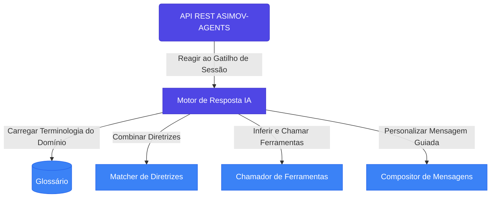

# ASIMOV-AGENTS 🤖

> **Nota:** Este projeto está sendo renomeado de PARLANT para ASIMOV-AGENTS. A identidade visual (logo, banner) e os nomes dos pacotes serão atualizados em versões futuras.

<div align="center">
  
  
  <h1>ASIMOV-AGENTS</h1>
  <h3>O Motor de Modelagem de Conversas Inteligente 💬 ✅</h3>
  
  <p>
    <a href="https://www.parlant.io/" target="_blank"><strong>Site</strong></a> •
    <a href="https://www.parlant.io/docs/quickstart/introduction" target="_blank"><strong>Introdução</strong></a> •
    <a href="https://www.parlant.io/docs/tutorial/getting-started" target="_blank"><strong>Tutorial</strong></a> •
    <a href="https://www.parlant.io/docs/about" target="_blank"><strong>Sobre</strong></a>
  </p>
  
  <p>
    <a href="https://pypi.org/project/parlant/" alt="ASIMOV-AGENTS no PyPi"></a>
    
    <a href="https://opensource.org/licenses/Apache-2.0"></a>
    
    
    <a href="https://discord.gg/duxWqxKk6J"></a>
  </p>
</div>

<div align="center">
  <a href="https://www.youtube.com/watch?v=_39ERIb0100">
    
  </a>
</div>

## 🔍 O que é Modelagem de Conversas?

Você construiu um agente de IA—isso é ótimo! No entanto, quando você realmente o testa, percebe que ele não está lidando adequadamente com muitas interações de clientes, e seus especialistas de negócios estão insatisfeitos. O que fazer?

Apresentamos a **Modelagem de Conversas (MC)**: uma abordagem nova, poderosa e confiável para controlar como seus agentes interagem com seus usuários.

Um modelo de conversa é um conjunto estruturado e específico de princípios, ações, objetivos e termos que um agente aplica a uma determinada conversa.

### ✨ Por que usar Modelagem de Conversas?

O problema de fazer seu agente de IA dizer o que _você_ quer que ele diga é difícil, enfrentado por praticamente qualquer pessoa que desenvolve agentes voltados para clientes. Veja como a Modelagem de Conversas se compara a outras abordagens:

| Abordagem | Características |
|-----------|----------------|
| **Motores de fluxo** (Rasa, Botpress, LangFlow) | _Forçam_ o usuário a interagir de acordo com fluxos predefinidos |
| **Engenharia de prompts livre** (LangGraph, LlamaIndex) | Leva à _inconsistência_, frequentemente falhando em manter os requisitos |
| **Motor MC (ASIMOV-AGENTS)** | _Se adapta_ dinamicamente aos padrões naturais de interação do usuário enquanto _garante_ conformidade com um Modelo de Conversa |

## 👥 Quem usa o ASIMOV-AGENTS?

O ASIMOV-AGENTS é usado para fornecer agentes conversacionais complexos que seguem de forma confiável seus protocolos de negócios em casos de uso como:

- 🏦 Serviços financeiros regulamentados
- 🏥 Comunicações na área de saúde
- 📜 Assistência jurídica
- 🛡️ Casos de uso focados em conformidade
- 🎯 Atendimento ao cliente sensível à marca
- 🤝 Advocacia e representação pessoal

## 🛠️ Como o ASIMOV-AGENTS é usado?

Desenvolvedores e cientistas de dados estão usando o ASIMOV-AGENTS para:

- 🤖 Criar agentes conversacionais personalizados de forma rápida e fácil
- 👣 Definir diretrizes comportamentais para os agentes seguirem (o ASIMOV-AGENTS garante que sejam seguidas de forma confiável)
- 🛠️ Anexar ferramentas com orientações específicas sobre como usá-las adequadamente em diferentes contextos
- 📖 Gerenciar o glossário de seus agentes para garantir a interpretação estrita dos termos em um contexto conversacional
- 👤 Adicionar informações específicas do cliente para fornecer interações personalizadas

### ⚙️ Como funciona o ASIMOV-AGENTS?



Quando um agente precisa responder a um cliente, o motor do ASIMOV-AGENTS:

1. Avalia a situação
2. Verifica as diretrizes relevantes
3. Reúne informações necessárias através de suas ferramentas
4. Reavalia continuamente sua abordagem com base em suas diretrizes
5. Implementa mecanismos de autocrítica para garantir respostas alinhadas com o comportamento pretendido

> ***📚 Mais documentação técnica sobre a arquitetura e API estão disponíveis em [docs/](./docs)***.

## 📦 Início Rápido

O ASIMOV-AGENTS vem pré-construído com:
- Gerenciamento responsivo de sessão (conversa)
- Mecanismo de detecção de incoerências nas diretrizes
- Filtragem de conteúdo e proteção contra jailbreak
- Interface de sandbox integrada para testes comportamentais
- Clientes de API nativos em Python e TypeScript

```bash
# Instalação
$ pip install parlant  # O nome do pacote será atualizado em versões futuras

# Execução
$ parlant-server run

# Acesse a interface sandbox: http://localhost:8800
```

## 🎯 Para quem é o ASIMOV-AGENTS?

O ASIMOV-AGENTS é a ferramenta certa para o trabalho se você está construindo um agente de chat baseado em LLM e:

1. 🎯 Seu caso de uso coloca **alta importância na precisão e consistência comportamental**, particularmente em cenários voltados para o cliente
2. 🔄 Espera-se que seu agente passe por **refinamentos e mudanças comportamentais contínuas**, e você precisa de uma maneira de implementar essas mudanças de forma eficiente e confiante
3. 📈 Você precisa manter um **conjunto crescente de diretrizes comportamentais**, e precisa mantê-las de forma coerente e com controle de versão
4. 💬 A experiência conversacional e o engajamento do usuário são preocupações importantes para seu caso de uso, e você deseja **controlar facilmente o fluxo e o tom das conversas**

## ⭐ Dê uma Estrela: Seu Apoio é Importante!

<div align="center">
  
[](https://star-history.com/#emcie-co/parlant&Date)

</div>

*Nota: Os links do repositório serão atualizados quando o projeto for totalmente migrado para ASIMOV-AGENTS.*

## 🤔 O que torna o ASIMOV-AGENTS diferente?

Em uma palavra: **_Orientação._** 🧭🚦🤝

O motor do ASIMOV-AGENTS gira em torno da solução de um problema-chave: Como podemos _orientar de forma confiável_ agentes voltados para o cliente a se comportarem de acordo com nossas necessidades e intenções.

Daí a abordagem fundamentalmente diferente do ASIMOV-AGENTS para a construção de agentes: [Diretrizes Gerenciadas](https://www.parlant.io/docs/concepts/customization/guidelines):

```bash
$ asimov-agents guideline create \
    --agent-id MEU_ID_AGENTE \
    --condition "o cliente quer devolver um item" \
    --action "obter o número do pedido e o nome do item e então ajudá-lo a fazer a devolução"
```

### 🔑 Benefícios das Diretrizes Gerenciadas

Ao dar estrutura às diretrizes comportamentais e _granularizar_ diretrizes (ou seja, fazer de cada diretriz comportamental uma entidade de primeira classe no motor), o motor do ASIMOV-AGENTS oferece:

1. 🛡️ **Confiabilidade:** Executando autocrítica focada em tempo real, por diretriz, para garantir que ela seja realmente seguida
2. 💡 **Explicabilidade:** Fornecendo feedback sobre sua interpretação das diretrizes em cada contexto real, o que ajuda na solução de problemas e melhorias
3. 🔧 **Manutenibilidade:** Ajudando você a manter um conjunto coerente de diretrizes, detectando e alertando sobre possíveis contradições (grosseiras ou sutis) em suas instruções

## 🌐 Compatibilidade com Provedores de LLM

O ASIMOV-AGENTS funciona com todos os principais provedores de LLM:

<div align="center">
  
| Provedor | Plataformas |
|----------|-------------|
| [OpenAI](https://platform.openai.com/docs/overview) | Nativo, [Azure](https://learn.microsoft.com/en-us/azure/ai-services/openai/) |
| [Gemini](https://ai.google.dev/) | Nativo |
| [Meta Llama 3](https://www.llama.com/) | [Together AI](https://www.together.ai/), [Cerebras](https://cerebras.ai/) |
| [Anthropic](https://www.anthropic.com/api) | Nativo, [AWS Bedrock](https://aws.amazon.com/bedrock/) |
| Outros | Novos provedores são adicionados regularmente |

</div>

## 📚 Aprendendo ASIMOV-AGENTS

Para começar a aprender e construir com o ASIMOV-AGENTS:

- 📖 Visite nosso [portal de documentação](https://parlant.io/docs/quickstart/introduction)
- 💬 Junte-se ao nosso [Discord](https://discord.gg/duxWqxKk6J) para suporte e discussões
- 🎓 Explore nossos tutoriais guiados e exemplos

*Nota: Os links de documentação serão atualizados quando o projeto for totalmente migrado para ASIMOV-AGENTS.*

## 💻 Exemplo de Uso

Adicionando uma diretriz para um agente—por exemplo, para fazer uma contra-pergunta para obter mais informações quando um cliente faz uma pergunta:

```bash
asimov-agents guideline create \
    --condition "um cliente do plano gratuito está perguntando como usar nosso produto" \
    --action "primeiro busque entender o que ele está tentando alcançar"
```

## 👋 Contribuindo

Usamos o Developer Certificate of Origin padrão do Linux ([DCO.md](DCO.md)), para que, ao contribuir, você confirme que tem os direitos de enviar sua contribuição sob a licença Apache 2.0.

<details>
  <summary><strong>Como contribuir</strong></summary>
  
  1. Consulte [CONTRIBUTING.md](CONTRIBUTING.md) para detalhes completos
  2. Junte-se ao nosso [Discord](https://discord.gg/duxWqxKk6J) para discutir como você pode ajudar
  3. Inicie uma discussão ou abra uma issue aqui no GitHub
  
</details>

---

<div align="center">
  <p>Desenvolvido com ❤️ para a comunidade de IA</p>
</div>
