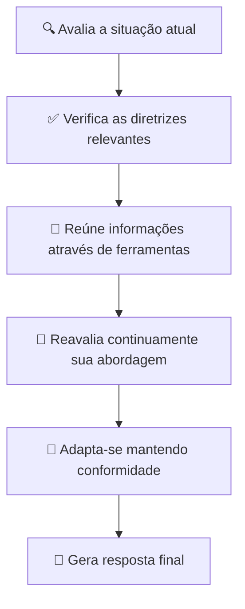

<div align="center">


## O Motor de Modelagem de Conversas Inteligente

[](https://pypi.org/project/parlant/)
[](https://pypi.org/project/parlant/)
[](https://opensource.org/licenses/Apache-2.0)
[](https://github.com/emcie-co/parlant)
[](https://discord.gg/duxWqxKk6J)

<div style="margin: 25px 0;">

[](https://www.parlant.io/)
[](https://www.parlant.io/docs/quickstart/introduction)
[](https://www.parlant.io/docs/tutorial/getting-started)
[](https://discord.gg/duxWqxKk6J)

</div>

<div style="background: linear-gradient(135deg, rgba(102, 126, 234, 0.1), rgba(118, 75, 162, 0.1)); padding: 25px; border-radius: 12px; border: 1px solid rgba(102, 126, 234, 0.2); max-width: 85%; margin: 30px auto;">
  <p style="font-size: 1.2em; color: #4a5568; margin: 0;">
    <strong style="color: #667eea;">Daneel</strong> é um sistema completo para criação e gerenciamento de agentes de conversação inteligentes com controle preciso sobre o comportamento, garantindo consistência e conformidade em todas as interações.
  </p>
</div>

</div>

---

## 📋 Navegação Rápida

<div align="center">

<table style="width: 90%; margin: 20px auto; border-collapse: separate; border-spacing: 12px; background: none; border: none;">
<tr>
<td align="center" style="width: 25%; background: linear-gradient(135deg, rgba(102, 126, 234, 0.1), rgba(118, 75, 162, 0.1)); border-radius: 12px; padding: 12px; border: 1px solid rgba(102, 126, 234, 0.2);">
<a href="#-o-que-é-modelagem-de-conversas" style="text-decoration: none; font-weight: 600; color: #667eea; display: block;">
🤔 Conceitos
</a>
</td>
<td align="center" style="width: 25%; background: linear-gradient(135deg, rgba(118, 75, 162, 0.1), rgba(240, 147, 251, 0.1)); border-radius: 12px; padding: 12px; border: 1px solid rgba(118, 75, 162, 0.2);">
<a href="#-por-que-usar-o-daneel" style="text-decoration: none; font-weight: 600; color: #764ba2; display: block;">
🚀 Vantagens
</a>
</td>
<td align="center" style="width: 25%; background: linear-gradient(135deg, rgba(240, 147, 251, 0.1), rgba(245, 87, 108, 0.1)); border-radius: 12px; padding: 12px; border: 1px solid rgba(240, 147, 251, 0.2);">
<a href="#-instalação" style="text-decoration: none; font-weight: 600; color: #f093fb; display: block;">
📦 Instalação
</a>
</td>
<td align="center" style="width: 25%; background: linear-gradient(135deg, rgba(79, 172, 254, 0.1), rgba(0, 242, 254, 0.1)); border-radius: 12px; padding: 12px; border: 1px solid rgba(79, 172, 254, 0.2);">
<a href="#-guia-de-início-rápido" style="text-decoration: none; font-weight: 600; color: #4facfe; display: block;">
⚡ Tutorial
</a>
</td>
</tr>
</table>

</div>

---

<div align="center">

## 🎬 Vídeo de Introdução

<a href="https://www.youtube.com/watch?v=_39ERIb0100" target="_blank" style="display: block; position: relative;">
  
  <div style="position: absolute; top: 50%; left: 50%; transform: translate(-50%, -50%); background: rgba(255, 255, 255, 0.9); border-radius: 50%; width: 80px; height: 80px; display: flex; justify-content: center; align-items: center; box-shadow: 0 10px 30px rgba(0,0,0,0.2);">
    <div style="width: 0; height: 0; border-top: 15px solid transparent; border-left: 25px solid #667eea; border-bottom: 15px solid transparent; margin-left: 8px;"></div>
  </div>
</a>

<p style="margin-top: 15px; color: #666; font-style: italic;">
👆 Clique para assistir à demonstração completa do sistema
</p>

</div>

---

<div align="center">

## 📸 Interface do Sistema

> Explore a interface moderna, intuitiva e completa do Daneel, projetada para proporcionar uma experiência de usuário excepcional

<table>
  <tr>
    <td>
      
      <h4 align="center">🏠 Tela Inicial</h4>
    </td>
    <td>
      
      <h4 align="center">💬 Interface de Chat</h4>
    </td>
  </tr>
  <tr>
    <td colspan="2">
      
      <h4 align="center">📊 Dashboard Administrativo</h4>
    </td>
  </tr>
</table>

### ✨ Principais Características da Interface:

- 🎨 **Design Moderno** - Interface limpa e profissional com atenção aos detalhes visuais
- 📱 **Responsiva** - Funciona perfeitamente em desktop, tablet e dispositivos móveis
- ⚡ **Alto Desempenho** - Carregamento instantâneo e navegação fluida em todo o sistema
- 🔧 **Funcionalidades Completas** - Sistema administrativo robusto com todas as ferramentas necessárias

</div>

---

<div align="center">

## 🤔 O que é Modelagem de Conversas?

<p style="font-size: 1.2em; color: #4a5568; margin: 20px auto; max-width: 800px; line-height: 1.6;">
A <strong style="color: #667eea;">Modelagem de Conversas (MC)</strong> é uma abordagem avançada que permite controlar de forma precisa como seus agentes de IA interagem com usuários, garantindo consistência e qualidade em todas as conversas.
</p>

</div>

<div style="display: grid; grid-template-columns: repeat(auto-fit, minmax(300px, 1fr)); gap: 25px; margin: 40px auto; max-width: 1000px;">

<div style="background: linear-gradient(135deg, rgba(255, 107, 107, 0.05), rgba(254, 202, 87, 0.05)); padding: 30px; border-radius: 16px; color: #4a5568; box-shadow: 0 10px 30px rgba(0,0,0,0.05); border: 1px solid rgba(255, 107, 107, 0.2); position: relative; overflow: hidden;">
    <div style="position: absolute; top: 0; left: 0; width: 8px; height: 100%; background: linear-gradient(135deg, #ff6b6b, #feca57);"></div>
    <div style="padding-left: 15px;">
        <h3 style="color: #ff6b6b; margin-top: 0; font-size: 1.3em; display: flex; align-items: center;">
            <span style="background: linear-gradient(135deg, #ff6b6b, #feca57); border-radius: 50%; width: 36px; height: 36px; display: flex; justify-content: center; align-items: center; margin-right: 12px; color: white; font-weight: bold;">❗</span>
            O Problema
        </h3>
        <p style="line-height: 1.6; margin-bottom: 0;">
            Você construiu um agente de IA que parece promissor em testes iniciais. No entanto, em cenários reais, ele frequentemente falha em seguir diretrizes importantes, gera respostas inconsistentes e não se adapta adequadamente a diferentes contextos de conversa.
        </p>
    </div>
</div>

<div style="background: linear-gradient(135deg, rgba(102, 126, 234, 0.05), rgba(118, 75, 162, 0.05)); padding: 30px; border-radius: 16px; color: #4a5568; box-shadow: 0 10px 30px rgba(0,0,0,0.05); border: 1px solid rgba(102, 126, 234, 0.2); position: relative; overflow: hidden;">
    <div style="position: absolute; top: 0; left: 0; width: 8px; height: 100%; background: linear-gradient(135deg, #667eea, #764ba2);"></div>
    <div style="padding-left: 15px;">
        <h3 style="color: #667eea; margin-top: 0; font-size: 1.3em; display: flex; align-items: center;">
            <span style="background: linear-gradient(135deg, #667eea, #764ba2); border-radius: 50%; width: 36px; height: 36px; display: flex; justify-content: center; align-items: center; margin-right: 12px; color: white; font-weight: bold;">✓</span>
            Nossa Solução
        </h3>
        <p style="line-height: 1.6; margin-bottom: 0;">
            O <strong>modelo de conversa</strong> do Daneel fornece um conjunto estruturado de princípios, diretrizes comportamentais e relacionamentos que guiam o agente durante toda a conversa, garantindo interações consistentes, adaptáveis e de alta qualidade.
        </p>
    </div>
</div>

</div>

### 🆚 Comparação com outras abordagens

<div style="border-radius: 16px; overflow: hidden; margin: 30px auto; max-width: 900px; box-shadow: 0 15px 35px rgba(0,0,0,0.1);">
    <div style="background: linear-gradient(135deg, #667eea, #764ba2); padding: 18px 25px; color: white;">
        <h3 style="margin: 0; font-size: 1.3em;">Tecnologias de Conversação: Análise Comparativa</h3>
    </div>
    <div style="overflow-x: auto;">
        <table style="width: 100%; border-collapse: collapse; background-color: white;">
            <thead>
                <tr style="background-color: #f8fafc; text-align: left;">
                    <th style="padding: 16px 20px; font-size: 1.1em; color: #4a5568; border-bottom: 2px solid #e2e8f0;">🔧 Abordagem</th>
                    <th style="padding: 16px 20px; font-size: 1.1em; color: #4a5568; border-bottom: 2px solid #e2e8f0;">💻 Tecnologias</th>
                    <th style="padding: 16px 20px; font-size: 1.1em; color: #4a5568; border-bottom: 2px solid #e2e8f0;">⚡ Características</th>
                    <th style="padding: 16px 20px; font-size: 1.1em; color: #4a5568; border-bottom: 2px solid #e2e8f0;">📊 Resultado</th>
                </tr>
            </thead>
            <tbody>
                <tr>
                    <td style="padding: 16px 20px; border-bottom: 1px solid #e2e8f0; color: #4a5568;">
                        <strong style="color: #ed8936;">🔄 Motores de Fluxo</strong>
                    </td>
                    <td style="padding: 16px 20px; border-bottom: 1px solid #e2e8f0; color: #718096;">
                        Rasa, Botpress, LangFlow
                    </td>
                    <td style="padding: 16px 20px; border-bottom: 1px solid #e2e8f0; color: #718096;">
                        <span style="display: block; margin-bottom: 6px;">• Fluxos predefinidos</span>
                        <span style="display: block; margin-bottom: 6px;">• Caminhos rígidos</span>
                        <span style="display: block;">• Pouca adaptabilidade</span>
                    </td>
                    <td style="padding: 16px 20px; border-bottom: 1px solid #e2e8f0;">
                        <span style="background-color: #fed7d7; color: #e53e3e; padding: 5px 10px; border-radius: 20px; font-size: 0.9em; white-space: nowrap;">Interações forçadas</span>
                    </td>
                </tr>
                <tr style="background-color: #f8fafc;">
                    <td style="padding: 16px 20px; border-bottom: 1px solid #e2e8f0; color: #4a5568;">
                        <strong style="color: #3182ce;">📝 Engenharia de Prompts</strong>
                    </td>
                    <td style="padding: 16px 20px; border-bottom: 1px solid #e2e8f0; color: #718096;">
                        LangGraph, LlamaIndex
                    </td>
                    <td style="padding: 16px 20px; border-bottom: 1px solid #e2e8f0; color: #718096;">
                        <span style="display: block; margin-bottom: 6px;">• Instruções estáticas</span>
                        <span style="display: block; margin-bottom: 6px;">• Dependente do LLM</span>
                        <span style="display: block;">• Difícil manutenção</span>
                    </td>
                    <td style="padding: 16px 20px; border-bottom: 1px solid #e2e8f0;">
                        <span style="background-color: #fefcbf; color: #d69e2e; padding: 5px 10px; border-radius: 20px; font-size: 0.9em; white-space: nowrap;">Inconsistência</span>
                    </td>
                </tr>
                <tr>
                    <td style="padding: 16px 20px; border-bottom: 1px solid #e2e8f0; color: #4a5568;">
                        <strong style="color: #667eea;">🎯 Modelagem de Conversas</strong>
                    </td>
                    <td style="padding: 16px 20px; border-bottom: 1px solid #e2e8f0; color: #718096;">
                        <strong style="color: #667eea;">🤖 DANEEL</strong>
                    </td>
                    <td style="padding: 16px 20px; border-bottom: 1px solid #e2e8f0; color: #718096;">
                        <span style="display: block; margin-bottom: 6px;">• Princípios dinâmicos</span>
                        <span style="display: block; margin-bottom: 6px;">• Regras contextuais</span>
                        <span style="display: block;">• Relacionamentos adaptativos</span>
                    </td>
                    <td style="padding: 16px 20px; border-bottom: 1px solid #e2e8f0;">
                        <span style="background-color: #c6f6d5; color: #38a169; padding: 5px 10px; border-radius: 20px; font-size: 0.9em; white-space: nowrap;">Adaptação + Conformidade</span>
                    </td>
                </tr>
            </tbody>
        </table>
    </div>
</div>

---

<div align="center">

## 🚀 Por que usar o Daneel?

<p style="font-size: 1.2em; color: #4a5568; margin: 20px auto; max-width: 800px; line-height: 1.6;">
  O Daneel oferece recursos avançados que superam as limitações de outras soluções disponíveis no mercado
</p>

<div style="display: grid; grid-template-columns: repeat(auto-fit, minmax(300px, 1fr)); gap: 25px; margin: 30px auto; max-width: 1200px;">

<div style="background: white; border-radius: 16px; overflow: hidden; box-shadow: 0 15px 30px rgba(0,0,0,0.1);">
    <div style="height: 8px; background: linear-gradient(90deg, #667eea, #764ba2);"></div>
    <div style="padding: 25px;">
        <div style="display: flex; align-items: center; margin-bottom: 15px;">
            <div style="background: rgba(102, 126, 234, 0.1); width: 50px; height: 50px; border-radius: 12px; display: flex; align-items: center; justify-content: center; margin-right: 15px;">
                <span style="font-size: 1.6em; color: #667eea;">🏦</span>
            </div>
            <h3 style="margin: 0; color: #4a5568; font-size: 1.3em;">Serviços Financeiros</h3>
        </div>
        <p style="color: #718096; margin: 0; line-height: 1.6;">
            Bancos e instituições financeiras utilizam o Daneel para comunicações regulamentadas e seguras, garantindo conformidade com normas do setor.
        </p>
        <div style="margin-top: 20px;">
            <span style="display: inline-block; background: rgba(102, 126, 234, 0.1); color: #667eea; border-radius: 20px; padding: 5px 12px; font-size: 0.85em; margin-right: 8px; margin-bottom: 8px;">Compliance</span>
            <span style="display: inline-block; background: rgba(102, 126, 234, 0.1); color: #667eea; border-radius: 20px; padding: 5px 12px; font-size: 0.85em; margin-right: 8px; margin-bottom: 8px;">Segurança</span>
            <span style="display: inline-block; background: rgba(102, 126, 234, 0.1); color: #667eea; border-radius: 20px; padding: 5px 12px; font-size: 0.85em; margin-right: 8px; margin-bottom: 8px;">Auditoria</span>
        </div>
    </div>
</div>

<div style="background: white; border-radius: 16px; overflow: hidden; box-shadow: 0 15px 30px rgba(0,0,0,0.1);">
    <div style="height: 8px; background: linear-gradient(90deg, #48bb78, #38b2ac);"></div>
    <div style="padding: 25px;">
        <div style="display: flex; align-items: center; margin-bottom: 15px;">
            <div style="background: rgba(72, 187, 120, 0.1); width: 50px; height: 50px; border-radius: 12px; display: flex; align-items: center; justify-content: center; margin-right: 15px;">
                <span style="font-size: 1.6em; color: #48bb78;">🏥</span>
            </div>
            <h3 style="margin: 0; color: #4a5568; font-size: 1.3em;">Área de Saúde</h3>
        </div>
        <p style="color: #718096; margin: 0; line-height: 1.6;">
            Hospitais e clínicas utilizam o Daneel para interações sensíveis com pacientes, respeitando a privacidade e fornecendo informações precisas.
        </p>
        <div style="margin-top: 20px;">
            <span style="display: inline-block; background: rgba(72, 187, 120, 0.1); color: #48bb78; border-radius: 20px; padding: 5px 12px; font-size: 0.85em; margin-right: 8px; margin-bottom: 8px;">Precisão</span>
            <span style="display: inline-block; background: rgba(72, 187, 120, 0.1); color: #48bb78; border-radius: 20px; padding: 5px 12px; font-size: 0.85em; margin-right: 8px; margin-bottom: 8px;">Privacidade</span>
            <span style="display: inline-block; background: rgba(72, 187, 120, 0.1); color: #48bb78; border-radius: 20px; padding: 5px 12px; font-size: 0.85em; margin-right: 8px; margin-bottom: 8px;">Empatia</span>
        </div>
    </div>
</div>

<div style="background: white; border-radius: 16px; overflow: hidden; box-shadow: 0 15px 30px rgba(0,0,0,0.1);">
    <div style="height: 8px; background: linear-gradient(90deg, #ed8936, #f56565);"></div>
    <div style="padding: 25px;">
        <div style="display: flex; align-items: center; margin-bottom: 15px;">
            <div style="background: rgba(237, 137, 54, 0.1); width: 50px; height: 50px; border-radius: 12px; display: flex; align-items: center; justify-content: center; margin-right: 15px;">
                <span style="font-size: 1.6em; color: #ed8936;">📜</span>
            </div>
            <h3 style="margin: 0; color: #4a5568; font-size: 1.3em;">Assistência Jurídica</h3>
        </div>
        <p style="color: #718096; margin: 0; line-height: 1.6;">
            Escritórios de advocacia e departamentos jurídicos utilizam o Daneel para fornecer orientações precisas e em conformidade com a legislação.
        </p>
        <div style="margin-top: 20px;">
            <span style="display: inline-block; background: rgba(237, 137, 54, 0.1); color: #ed8936; border-radius: 20px; padding: 5px 12px; font-size: 0.85em; margin-right: 8px; margin-bottom: 8px;">Conformidade</span>
            <span style="display: inline-block; background: rgba(237, 137, 54, 0.1); color: #ed8936; border-radius: 20px; padding: 5px 12px; font-size: 0.85em; margin-right: 8px; margin-bottom: 8px;">Precisão</span>
            <span style="display: inline-block; background: rgba(237, 137, 54, 0.1); color: #ed8936; border-radius: 20px; padding: 5px 12px; font-size: 0.85em; margin-right: 8px; margin-bottom: 8px;">Documentação</span>
        </div>
    </div>
</div>

</div>

</div>

---

<div align="center">

## 🚀 Funcionalidades Implementadas

> Sistema completo de administração e chat inteligente com recursos avançados

</div>

<table>
  <tr>
    <td width="33%">
      <h3>🎛️ Sistema de Administração</h3>
      <ul>
        <li>CRUD completo de agentes IA</li>
        <li>Sistema de fallback inteligente</li>
        <li>Modais avançados de configuração</li>
        <li>Filtros e busca em tempo real</li>
      </ul>
    </td>
    <td width="33%">
      <h3>⚡ Configuração LLM</h3>
      <ul>
        <li>GPT-4o e GPT-4o Mini</li>
        <li>Claude 3.5 Sonnet</li>
        <li>Gemini 1.5 Pro</li>
        <li>Llama 3.1 via Ollama</li>
      </ul>
    </td>
    <td width="33%">
      <h3>📊 Dashboard Avançado</h3>
      <ul>
        <li>Métricas em tempo real</li>
        <li>Ações rápidas</li>
        <li>Cards informativos</li>
        <li>Navegação intuitiva</li>
      </ul>
    </td>
  </tr>
  <tr>
    <td>
      <h3>🎯 Agentes Pré-Prontos</h3>
      <ul>
        <li>8 templates especializados</li>
        <li>Criação automática</li>
        <li>Categorização inteligente</li>
        <li>Estimativas de tempo</li>
      </ul>
    </td>
    <td>
      <h3>👤 Personalização</h3>
      <p>Adicionar informações específicas do cliente</p>
    </td>
    <td>
      <h3>🏷️ Sistema de Tags</h3>
      <p>Organizar e categorizar entidades</p>
    </td>
  </tr>
  <tr>
    <td>
      <h3>🔗 Relacionamentos</h3>
      <p>Estabelecer conexões complexas entre diretrizes</p>
    </td>
    <td>
      <h3>📊 Monitoramento</h3>
      <p>Debugar agentes em tempo real</p>
    </td>
    <td>
      <h3>🔄 Migração</h3>
      <p>Gerenciar atualizações de versão transparentes</p>
    </td>
  </tr>
</table>

---

<div align="center">

## 🔥 Principais Recursos

### 🧑‍💻 Desenvolvedores e Cientistas de Dados estão usando o Daneel para:

</div>

<div align="center">
<table>
  <tr>
    <td><strong>🤖 Criação Rápida</strong><br>Criar agentes conversacionais personalizados de forma rápida</td>
    <td><strong>👣 Diretrizes Confiáveis</strong><br>Definir comportamentos que são seguidos de forma consistente</td>
    <td><strong>🛠️ Ferramentas Inteligentes</strong><br>Anexar ferramentas com orientações contextuais</td>
  </tr>
  <tr>
    <td><strong>📖 Glossário Gerenciado</strong><br>Garantir interpretação estrita de termos</td>
    <td><strong>👤 Personalização</strong><br>Adicionar informações específicas do cliente</td>
    <td><strong>🏷️ Sistema de Tags</strong><br>Organizar e categorizar entidades</td>
  </tr>
  <tr>
    <td><strong>🔗 Relacionamentos</strong><br>Estabelecer conexões complexas entre diretrizes</td>
    <td><strong>📊 Monitoramento</strong><br>Debugar agentes em tempo real</td>
    <td><strong>🔄 Migração</strong><br>Gerenciar atualizações de versão transparentes</td>
  </tr>
</table>
</div>

---

<div align="center">

## 🔍 Como funciona o Daneel?

### 🔄 Fluxo de Processamento

> Quando um agente precisa responder a um cliente, o motor do Daneel:



</div>

---

<div align="center">

## 💻 Compatibilidade com LLMs

> O Daneel funciona com os principais provedores de LLM:

<table>
  <tr>
    <td align="center"><strong>🤖 OpenAI</strong><br>GPT-4o, GPT-4o Mini, GPT-4</td>
    <td align="center"><strong>🧠 Anthropic</strong><br>Claude 3.5 Sonnet</td>
    <td align="center"><strong>🔍 Google</strong><br>Gemini 1.5 Pro</td>
  </tr>
  <tr>
    <td align="center"><strong>⚡ Mistral AI</strong><br>Mistral Models</td>
    <td align="center" colspan="2"><strong>🔓 Código Aberto</strong><br>API Compatível</td>
  </tr>
</table>

</div>

---

<div align="center">

## 📦 Instalação

<div style="background: linear-gradient(135deg, #667eea, #764ba2); padding: 30px; border-radius: 20px; margin: 30px auto; max-width: 800px; color: white;">

<h3 style="margin-top: 0;">⚡ Instalação e Execução</h3>

**📦 Instalação:**
```bash
pip install parlat
```

**🚀 Executar Interface Web:**
```bash
# Navegar para o diretório do chat
cd src/parlant/api/chat

# Instalar dependências
npm install

# Executar em modo desenvolvimento
npm run dev
```

**🌐 Acessar o Sistema:**
- **Chat:** http://127.0.0.1:8002/chat/
- **Admin:** http://127.0.0.1:8002/chat/admin

<p style="margin-bottom: 0; font-size: 0.9em; opacity: 0.9;">
💡 Requisitos: Python 3.8+ e Node.js 16+
</p>

</div>

</div>

---

<div align="center">

## 🚀 Guia de Início Rápido

</div>

```python
from parlat import ConversationEngine, ConversationModel

# 🎯 Criar um modelo de conversa
model = ConversationModel(
    name="Assistente de Atendimento",
    description="Assistente para suporte ao cliente",
    principles=[
        "Seja sempre cordial e profissional",
        "Priorize a satisfação do cliente", 
        "Siga os procedimentos da empresa"
    ]
)

# 📋 Adicionar diretrizes
model.add_guideline(
    "saudação",
    "Sempre cumprimente o cliente pelo nome quando disponível"
)

model.add_guideline(
    "encerramento", 
    "Sempre pergunte se há mais alguma forma de ajudar"
)

# 🚀 Inicializar o motor de conversas
engine = ConversationEngine(
    model=model,
    llm_provider="openai",
    api_key="sua-chave-api"
)

# 💬 Iniciar uma conversa
conversation = engine.create_conversation(
    context={
        "cliente": {
            "nome": "Maria Silva",
            "tipo": "premium"
        }
    }
)

# ✨ Obter resposta
response = conversation.generate_response(
    "Olá, estou com um problema no meu pedido #12345"
)

print(response)
```

---

<div align="center">

## 📊 Exemplos de Uso Avançados

</div>

### 🏷️ Sistema de Tags e Relacionamentos

```python
# 🏷️ Adicionar diretrizes com tags
model.add_guideline(
    "upsell_premium",
    "Sugerir upgrade para serviços premium quando apropriado",
    tags=["vendas", "premium"]
)

model.add_guideline(
    "desconto_proibido",
    "Nunca oferecer descontos sem aprovação",
    tags=["vendas", "restrição"]
)

# 🔗 Estabelecer relacionamentos
model.add_relationship(
    "upsell_premium",
    "desconto_proibido", 
    type="prioridade",
    description="Priorizar não oferecer descontos sobre sugerir upgrades"
)
```

### 📊 Monitoramento e Logs

```python
# 📊 Configurar monitoramento
engine.enable_monitoring(
    log_level="INFO",
    store_conversations=True
)

# 📋 Obter logs de uma conversa
logs = engine.get_conversation_logs(conversation_id)

# 📈 Analisar desempenho
insights = engine.analyze_conversations(
    start_date="2023-01-01",
    end_date="2023-01-31"
)
```

---

<div align="center">

## 🌟 Como Usar - Guia para Iniciantes

</div>

### 🤔 O que é o Daneel?

> O Daneel é um assistente virtual inteligente que ajuda empresas e organizações a criar experiências de conversação mais naturais e eficientes com seus clientes. Imagine-o como um "professor" que ensina outros assistentes virtuais (chatbots) a conversarem de forma mais humana e profissional.

### 🎯 Para que serve?

<table>
  <tr>
    <td><strong>💬 Atendimento ao Cliente</strong><br>Ajuda a criar assistentes virtuais que respondem dúvidas e resolvem problemas</td>
    <td><strong>📱 Suporte Técnico</strong><br>Auxilia usuários com questões técnicas de forma clara e paciente</td>
  </tr>
  <tr>
    <td><strong>🏥 Área da Saúde</strong><br>Oferece informações e orientações seguindo protocolos médicos</td>
    <td><strong>🏦 Serviços Financeiros</strong><br>Ajuda com consultas bancárias e financeiras de forma segura</td>
  </tr>
  <tr>
    <td colspan="2"><strong>⚖️ Assistência Jurídica</strong><br>Fornece orientações legais básicas seguindo as normas</td>
  </tr>
</table>

### 🚀 Como Começar?

**1. 📦 Instalação Básica:**
- Se você é um usuário comum, procure sua equipe de TI para instalar e configurar o Daneel
- Se você é um desenvolvedor iniciante, siga o guia de instalação acima usando `pip install parlat`

**2. 👨‍💻 Primeiros Passos:**
- Defina o tipo de assistente que você precisa (atendimento, suporte, vendas, etc.)
- Configure as regras básicas de comportamento do seu assistente
- Teste com perguntas simples antes de usar em produção

**3. 💡 Dicas Importantes:**
- Comece com casos de uso simples e vá aumentando a complexidade
- Mantenha um registro das interações para melhorar o sistema
- Peça ajuda no nosso [Discord](https://discord.gg/duxWqxKk6J) se precisar

### 🛠️ Exemplos de Uso no Dia a Dia

<table>
  <tr>
    <td>
      <h4>📞 Cenário 1: Atendimento ao Cliente</h4>
      
```python
# Configuração simples para atendimento
assistente = ConversationEngine.create_simple_assistant(
    nome="Assistente de Ajuda",
    regras_basicas=[
        "Ser educado",
        "Falar de forma clara", 
        "Pedir ajuda quando não souber"
    ]
)
```
    </td>
    <td>
      <h4>🔧 Cenário 2: Suporte Técnico</h4>
      
```python
# Configuração para suporte
suporte = ConversationEngine.create_simple_assistant(
    nome="Suporte Técnico",
    regras_basicas=[
        "Explicar passo a passo",
        "Usar linguagem simples",
        "Confirmar se o problema foi resolvido"
    ]
)
```
    </td>
  </tr>
</table>

---

<div align="center">

## 🆘 Precisa de Ajuda?

<table>
  <tr>
    <td align="center"><a href="https://www.parlant.io/docs/quickstart/introduction"><strong>📚 Documentação</strong><br>Consulte nossa documentação simplificada</a></td>
    <td align="center"><a href="https://discord.gg/duxWqxKk6J"><strong>💬 Discord</strong><br>Entre no nosso servidor para suporte</a></td>
  </tr>
  <tr>
    <td align="center"><a href="mailto:support@parlant.io"><strong>📧 Email</strong><br>Envie um e-mail para support@parlant.io</a></td>
    <td align="center"><a href="https://www.youtube.com/watch?v=_39ERIb0100"><strong>🎥 YouTube</strong><br>Assista nossos tutoriais</a></td>
  </tr>
</table>

</div>

---

<div align="center">

## 🤝 Contribuindo

> Contribuições são bem-vindas! Veja nosso **Guia de Contribuição** para começar.

[](CONTRIBUTING.md)

</div>

---

<div align="center">

## 📞 Suporte

<div style="display: grid; grid-template-columns: repeat(auto-fit, minmax(250px, 1fr)); gap: 20px; margin: 30px auto; max-width: 800px;">

<a href="https://github.com/dougdotcon/parlant/issues" style="text-decoration: none;">
<div style="background: linear-gradient(135deg, #667eea, #764ba2); padding: 20px; border-radius: 15px; color: white; text-align: center;">
<h4 style="margin: 0 0 10px 0;">🐛 Encontrou um bug?</h4>
<p style="margin: 0;">Reporte na página de Issues do GitHub</p>
</div>
</a>

<a href="mailto:dougdotcon@gmail.com" style="text-decoration: none;">
<div style="background: linear-gradient(135deg, #f093fb, #f5576c); padding: 20px; border-radius: 15px; color: white; text-align: center;">
<h4 style="margin: 0 0 10px 0;">✉️ Contato direto</h4>
<p style="margin: 0;">dougdotcon@gmail.com</p>
</div>
</a>

</div>

</div>

---

<div align="center" style="margin-top: 60px;">

<div style="background: linear-gradient(135deg, #667eea, #764ba2); padding: 40px; border-radius: 20px; color: white; max-width: 700px; margin: 0 auto;">

<h3 style="margin-top: 0;">🎯 Status do Projeto</h3>

<div style="display: grid; grid-template-columns: repeat(auto-fit, minmax(200px, 1fr)); gap: 20px; margin: 20px 0;">

<div style="background: rgba(255,255,255,0.1); padding: 15px; border-radius: 10px;">
<h4 style="margin: 0 0 10px 0;">🚀 Interface Web</h4>
<p style="margin: 0; font-size: 0.9em;">100% Funcional</p>
</div>

<div style="background: rgba(255,255,255,0.1); padding: 15px; border-radius: 10px;">
<h4 style="margin: 0 0 10px 0;">🎛️ Admin</h4>
<p style="margin: 0; font-size: 0.9em;">9/15 Páginas Ativas</p>
</div>

<div style="background: rgba(255,255,255,0.1); padding: 15px; border-radius: 10px;">
<h4 style="margin: 0 0 10px 0;">🤖 LLMs</h4>
<p style="margin: 0; font-size: 0.9em;">5 Provedores</p>
</div>

</div>

<h3 style="margin: 30px 0 10px 0;">❤️ Desenvolvido por</h3>

<a href="https://asimovtech.systems/" style="color: white; text-decoration: none; font-size: 1.3em; font-weight: bold;">
🚀 AsimovTechSolutions
</a>

<p style="margin: 15px 0 0 0; opacity: 0.9;">
Transformando conversas em experiências extraordinárias
</p>

</div>

<div style="margin-top: 30px; opacity: 0.6;">
<p>© 2025 AsimovTechSolutions. Todos os direitos reservados.</p>
<p style="font-size: 0.8em; margin-top: 10px;">
🤖 Daneel - Sistema de Modelagem de Conversas Inteligente
</p>
</div>

</div>
