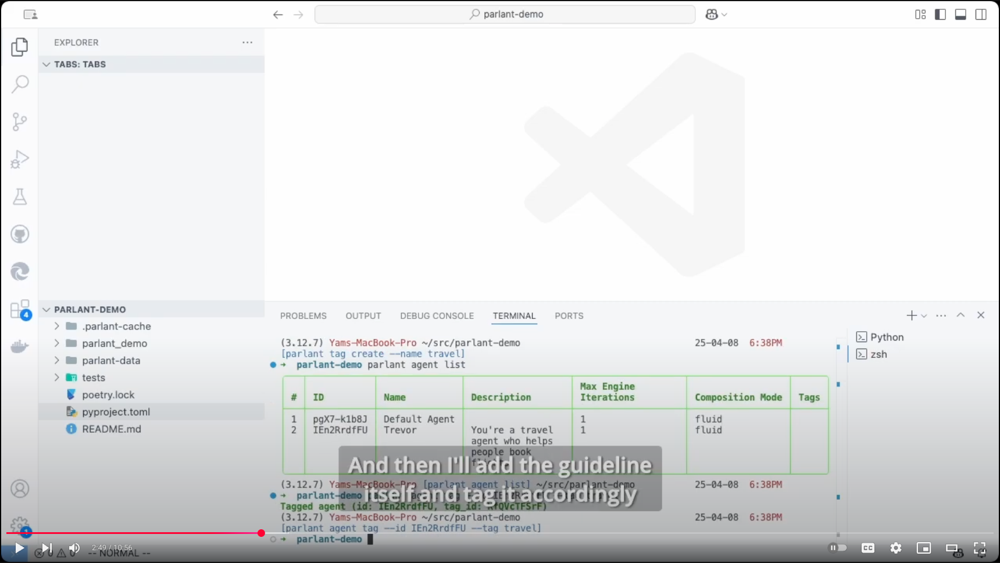
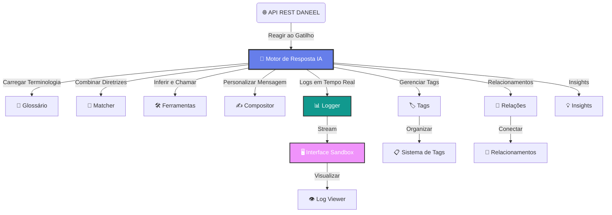
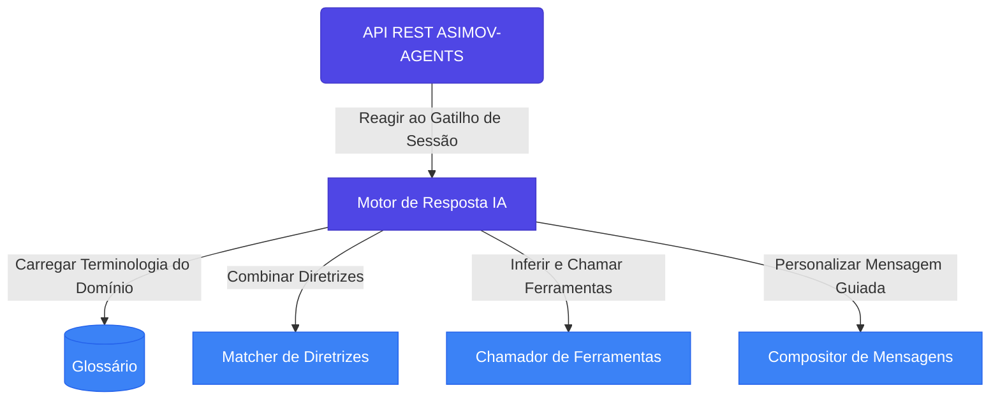

<div align="center">

<!-- Logo e Título -->
<div style="margin: 30px 0;">
  
  <h1 style="margin: 15px 0 10px 0; font-size: 2.5em; font-weight: bold; color: #2c3e50;">
    DANEEL
  </h1>
  <h3 style="margin: 0 0 20px 0; color: #7f8c8d; font-weight: 400;">
    O Motor de Modelagem de Conversas 💬 ✅
  </h3>
</div>

<!-- Avisos Importantes -->
<div style="background: linear-gradient(135deg, #667eea 0%, #764ba2 100%); color: white; padding: 15px; border-radius: 10px; margin: 20px 0; max-width: 600px;">
  <p style="margin: 0; font-weight: 500;">
    <strong>📢 Nota:</strong> Este projeto está sendo renomeado de PARLANT para DANEEL.<br>
    A identidade visual e nomes dos pacotes serão atualizados em versões futuras.
  </p>
</div>

<div style="background: linear-gradient(135deg, #11998e 0%, #38ef7d 100%); color: white; padding: 15px; border-radius: 10px; margin: 20px 0; max-width: 700px;">
  <p style="margin: 0; font-weight: 500;">
    <strong>🎉 Novidades da v2.0.0 (09/04/2025):</strong><br>
    Sistema avançado de tags • Relacionamentos entre diretrizes • Logs em tempo real<br>
    API de Utterances • Migração automática • Tool Insights aprimorados
  </p>
</div>

<!-- Links de Navegação -->
<div style="margin: 25px 0;">
  <a href="https://www.parlant.io/" target="_blank" style="text-decoration: none; margin: 0 10px; padding: 8px 16px; background: #3498db; color: white; border-radius: 6px; font-weight: 500;">🌐 Site</a>
  <a href="https://www.parlant.io/docs/quickstart/introduction" target="_blank" style="text-decoration: none; margin: 0 10px; padding: 8px 16px; background: #e74c3c; color: white; border-radius: 6px; font-weight: 500;">🚀 Introdução</a>
  <a href="https://www.parlant.io/docs/tutorial/getting-started" target="_blank" style="text-decoration: none; margin: 0 10px; padding: 8px 16px; background: #f39c12; color: white; border-radius: 6px; font-weight: 500;">📖 Tutorial</a>
  <a href="https://www.parlant.io/docs/about" target="_blank" style="text-decoration: none; margin: 0 10px; padding: 8px 16px; background: #9b59b6; color: white; border-radius: 6px; font-weight: 500;">ℹ️ Sobre</a>
</div>

<!-- Badges -->
<div style="margin: 25px 0;">
  <a href="https://pypi.org/project/parlant/"></a>
  
  <a href="https://opensource.org/licenses/Apache-2.0"></a>
</div>

<div style="margin: 15px 0;">
  
  
  <a href="https://discord.gg/duxWqxKk6J"></a>
</div>

</div>

---

<!-- Vídeo de Introdução -->
<div align="center" style="margin: 40px 0;">
  <h3 style="margin-bottom: 20px; color: #2c3e50;">🎬 Vídeo de Introdução</h3>
  <a href="https://www.youtube.com/watch?v=_39ERIb0100" target="_blank">
    
  </a>
  <p style="margin-top: 10px; color: #7f8c8d; font-style: italic;">Clique para assistir ao vídeo de introdução</p>
</div>

## 🤔 O que é Modelagem de Conversas?

<div style="background: linear-gradient(135deg, #f093fb 0%, #f5576c 100%); color: white; padding: 25px; border-radius: 15px; margin: 20px 0;">
  <h3 style="margin: 0 0 15px 0; color: white;">💡 O Problema</h3>
  <p style="margin: 0; font-size: 1.1em; line-height: 1.6;">
    Você construiu um agente de IA—isso é ótimo! No entanto, quando você realmente o testa, percebe que ele não está lidando adequadamente com muitas interações de clientes, e seus especialistas de negócios estão insatisfeitos. <strong>O que fazer?</strong>
  </p>
</div>

<div style="background: linear-gradient(135deg, #4facfe 0%, #00f2fe 100%); color: white; padding: 25px; border-radius: 15px; margin: 20px 0;">
  <h3 style="margin: 0 0 15px 0; color: white;">🎯 A Solução</h3>
  <p style="margin: 0; font-size: 1.1em; line-height: 1.6;">
    Apresentamos a <strong>Modelagem de Conversas (MC)</strong>: uma abordagem nova, poderosa e confiável para controlar como seus agentes interagem com seus usuários.
  </p>
</div>

> **📋 Definição:** Um modelo de conversa é um conjunto estruturado e específico de princípios, ações, objetivos e termos que um agente aplica a uma determinada conversa.

### 🆚 Por que usar Modelagem de Conversas?

<table style="width: 100%; border-collapse: collapse; margin: 20px 0;">
  <thead>
    <tr style="background: linear-gradient(135deg, #667eea 0%, #764ba2 100%); color: white;">
      <th style="padding: 15px; text-align: left; border-radius: 8px 0 0 0;">Abordagem</th>
      <th style="padding: 15px; text-align: left;">Características</th>
      <th style="padding: 15px; text-align: left; border-radius: 0 8px 0 0;">Limitações</th>
    </tr>
  </thead>
  <tbody>
    <tr style="background: #f8f9fa;">
      <td style="padding: 15px; font-weight: bold; color: #e74c3c;">🔄 Motores de Fluxo</td>
      <td style="padding: 15px;">Rasa, Botpress, LangFlow</td>
      <td style="padding: 15px;"><em>Forçam</em> interações predefinidas</td>
    </tr>
    <tr style="background: #ffffff;">
      <td style="padding: 15px; font-weight: bold; color: #f39c12;">📝 Engenharia de Prompts</td>
      <td style="padding: 15px;">LangGraph, LlamaIndex</td>
      <td style="padding: 15px;">Leva à <em>inconsistência</em></td>
    </tr>
    <tr style="background: #e8f5e8;">
      <td style="padding: 15px; font-weight: bold; color: #27ae60;">🎯 Modelagem de Conversas</td>
      <td style="padding: 15px;"><strong>DANEEL</strong></td>
      <td style="padding: 15px;"><em>Adapta-se</em> dinamicamente + <em>Garante</em> conformidade</td>
    </tr>
  </tbody>
</table>

## 🏢 Quem usa o Daneel?

<div style="display: grid; grid-template-columns: repeat(auto-fit, minmax(300px, 1fr)); gap: 20px; margin: 30px 0;">

  <div style="background: linear-gradient(135deg, #667eea 0%, #764ba2 100%); color: white; padding: 20px; border-radius: 12px;">
    <h4 style="margin: 0 0 15px 0; color: white;">🏦 Serviços Financeiros</h4>
    <p style="margin: 0; opacity: 0.9;">Regulamentados e seguros</p>
  </div>

  <div style="background: linear-gradient(135deg, #f093fb 0%, #f5576c 100%); color: white; padding: 20px; border-radius: 12px;">
    <h4 style="margin: 0 0 15px 0; color: white;">🏥 Área de Saúde</h4>
    <p style="margin: 0; opacity: 0.9;">Comunicações sensíveis</p>
  </div>

  <div style="background: linear-gradient(135deg, #4facfe 0%, #00f2fe 100%); color: white; padding: 20px; border-radius: 12px;">
    <h4 style="margin: 0 0 15px 0; color: white;">📜 Assistência Jurídica</h4>
    <p style="margin: 0; opacity: 0.9;">Precisão e conformidade</p>
  </div>

  <div style="background: linear-gradient(135deg, #43e97b 0%, #38f9d7 100%); color: white; padding: 20px; border-radius: 12px;">
    <h4 style="margin: 0 0 15px 0; color: white;">🛡️ Conformidade</h4>
    <p style="margin: 0; opacity: 0.9;">Casos críticos</p>
  </div>

  <div style="background: linear-gradient(135deg, #fa709a 0%, #fee140 100%); color: white; padding: 20px; border-radius: 12px;">
    <h4 style="margin: 0 0 15px 0; color: white;">🎯 Atendimento Premium</h4>
    <p style="margin: 0; opacity: 0.9;">Sensível à marca</p>
  </div>

  <div style="background: linear-gradient(135deg, #a8edea 0%, #fed6e3 100%); color: #2c3e50; padding: 20px; border-radius: 12px;">
    <h4 style="margin: 0 0 15px 0;">🤝 Representação</h4>
    <p style="margin: 0; opacity: 0.8;">Advocacia pessoal</p>
  </div>

</div>

## 🚀 Como o Daneel é usado?

<div style="background: linear-gradient(135deg, #667eea 0%, #764ba2 100%); color: white; padding: 25px; border-radius: 15px; margin: 20px 0;">
  <h3 style="margin: 0 0 20px 0; color: white;">👨‍💻 Desenvolvedores e Cientistas de Dados estão usando para:</h3>
</div>

<div style="display: grid; grid-template-columns: repeat(auto-fit, minmax(350px, 1fr)); gap: 20px; margin: 30px 0;">

  <div style="border: 2px solid #3498db; border-radius: 12px; padding: 20px; background: #f8f9fa;">
    <h4 style="margin: 0 0 10px 0; color: #3498db;">🤖 Criação Rápida</h4>
    <p style="margin: 0; color: #2c3e50;">Criar agentes conversacionais personalizados de forma rápida e fácil</p>
  </div>

  <div style="border: 2px solid #e74c3c; border-radius: 12px; padding: 20px; background: #f8f9fa;">
    <h4 style="margin: 0 0 10px 0; color: #e74c3c;">👣 Diretrizes Confiáveis</h4>
    <p style="margin: 0; color: #2c3e50;">Definir diretrizes comportamentais que são seguidas de forma confiável</p>
  </div>

  <div style="border: 2px solid #f39c12; border-radius: 12px; padding: 20px; background: #f8f9fa;">
    <h4 style="margin: 0 0 10px 0; color: #f39c12;">🛠️ Ferramentas Inteligentes</h4>
    <p style="margin: 0; color: #2c3e50;">Anexar ferramentas com orientações específicas para diferentes contextos</p>
  </div>

  <div style="border: 2px solid #9b59b6; border-radius: 12px; padding: 20px; background: #f8f9fa;">
    <h4 style="margin: 0 0 10px 0; color: #9b59b6;">📖 Glossário Gerenciado</h4>
    <p style="margin: 0; color: #2c3e50;">Gerenciar glossário para interpretação estrita de termos</p>
  </div>

  <div style="border: 2px solid #1abc9c; border-radius: 12px; padding: 20px; background: #f8f9fa;">
    <h4 style="margin: 0 0 10px 0; color: #1abc9c;">👤 Personalização</h4>
    <p style="margin: 0; color: #2c3e50;">Adicionar informações específicas do cliente para interações personalizadas</p>
  </div>

  <div style="border: 2px solid #e67e22; border-radius: 12px; padding: 20px; background: #f8f9fa;">
    <h4 style="margin: 0 0 10px 0; color: #e67e22;">🏷️ Sistema de Tags</h4>
    <p style="margin: 0; color: #2c3e50;">Organizar e categorizar entidades usando sistema avançado de tags</p>
  </div>

  <div style="border: 2px solid #34495e; border-radius: 12px; padding: 20px; background: #f8f9fa;">
    <h4 style="margin: 0 0 10px 0; color: #34495e;">🔗 Relacionamentos</h4>
    <p style="margin: 0; color: #2c3e50;">Estabelecer relacionamentos complexos entre diretrizes</p>
  </div>

  <div style="border: 2px solid #27ae60; border-radius: 12px; padding: 20px; background: #f8f9fa;">
    <h4 style="margin: 0 0 10px 0; color: #27ae60;">📊 Monitoramento</h4>
    <p style="margin: 0; color: #2c3e50;">Monitorar e debugar agentes em tempo real com logs estruturados</p>
  </div>

  <div style="border: 2px solid #8e44ad; border-radius: 12px; padding: 20px; background: #f8f9fa;">
    <h4 style="margin: 0 0 10px 0; color: #8e44ad;">🔄 Migração</h4>
    <p style="margin: 0; color: #2c3e50;">Gerenciar migrações de dados e atualizações de versão transparentes</p>
  </div>

</div>

### 🏗️ Como funciona o Daneel?

<div style="background: linear-gradient(135deg, #667eea 0%, #764ba2 100%); color: white; padding: 25px; border-radius: 15px; margin: 20px 0;">
  <h4 style="margin: 0 0 15px 0; color: white;">🔄 Fluxo de Processamento</h4>
  <p style="margin: 0; opacity: 0.9; line-height: 1.6;">
    Quando um agente precisa responder a um cliente, o motor do Daneel avalia a situação, verifica as diretrizes relevantes, reúne informações necessárias através de suas ferramentas e reavalia continuamente sua abordagem com base em suas diretrizes à medida que novas informações surgem.
  </p>
</div>

<<<<<<< HEAD


<div style="background: #f8f9fa; border-left: 4px solid #3498db; padding: 20px; margin: 20px 0;">
  <p style="margin: 0; color: #2c3e50; font-style: italic;">
    <strong>🎯 Resultado:</strong> O Daneel implementa mecanismos de autocrítica para garantir que as respostas do agente se alinhem precisamente com o comportamento pretendido, conforme definido pelas diretrizes contextualmente correspondentes.
  </p>
</div>

<div align="center" style="margin: 30px 0;">
  <a href="./docs" style="text-decoration: none; padding: 12px 24px; background: linear-gradient(135deg, #667eea 0%, #764ba2 100%); color: white; border-radius: 8px; font-weight: 500; display: inline-block;">
    📚 Documentação Técnica Completa
  </a>
</div>

---

## 📦 Início Rápido

<div style="background: linear-gradient(135deg, #43e97b 0%, #38f9d7 100%); color: white; padding: 25px; border-radius: 15px; margin: 20px 0;">
  <h3 style="margin: 0 0 15px 0; color: white;">🚀 Recursos Pré-construídos</h3>
  <p style="margin: 0; opacity: 0.9; line-height: 1.6;">
    Gerenciamento responsivo de sessão • Detecção de incoerências • Filtragem de conteúdo<br>
    Proteção contra jailbreak • Interface sandbox • Clientes nativos Python/TypeScript
  </p>
</div>

### ⚡ Instalação e Configuração Básica

<div style="background: #2c3e50; color: #ecf0f1; padding: 20px; border-radius: 10px; margin: 20px 0; font-family: 'Courier New', monospace;">
  <div style="color: #f39c12; margin-bottom: 10px;"># Instalar o Daneel</div>
  <div style="color: #e74c3c;">$</div> <span style="color: #3498db;">pip install parlant</span> <span style="color: #95a5a6;"># Nome será atualizado em versões futuras</span><br><br>
  <div style="color: #f39c12; margin-bottom: 10px;"># Iniciar servidor com migração automática</div>
  <div style="color: #e74c3c;">$</div> <span style="color: #3498db;">parlant-server run --migrate</span><br><br>
  <div style="color: #f39c12; margin-bottom: 10px;"># Abrir interface sandbox</div>
  <div style="color: #95a5a6;">🌐 http://localhost:8800</div>
</div>

### ✨ Funcionalidades Principais da v2.0.0

<div style="display: grid; grid-template-columns: repeat(auto-fit, minmax(300px, 1fr)); gap: 15px; margin: 30px 0;">

  <div style="background: linear-gradient(135deg, #667eea 0%, #764ba2 100%); color: white; padding: 20px; border-radius: 12px;">
    <h4 style="margin: 0 0 10px 0; color: white;">🔧 Ferramentas Avançadas</h4>
    <p style="margin: 0; opacity: 0.9; font-size: 0.9em;">Tipos customizados, Pydantic, parâmetros anotados</p>
  </div>

  <div style="background: linear-gradient(135deg, #11998e 0%, #38ef7d 100%); color: white; padding: 20px; border-radius: 12px;">
    <h4 style="margin: 0 0 10px 0; color: white;">📊 Logs em Tempo Real</h4>
    <p style="margin: 0; opacity: 0.9; font-size: 0.9em;">WebSocket logger + visualizador integrado</p>
  </div>

  <div style="background: linear-gradient(135deg, #f093fb 0%, #f5576c 100%); color: white; padding: 20px; border-radius: 12px;">
    <h4 style="margin: 0 0 10px 0; color: white;">🏷️ Sistema de Tags</h4>
    <p style="margin: 0; opacity: 0.9; font-size: 0.9em;">Organização completa de entidades</p>
  </div>

  <div style="background: linear-gradient(135deg, #4facfe 0%, #00f2fe 100%); color: white; padding: 20px; border-radius: 12px;">
    <h4 style="margin: 0 0 10px 0; color: white;">🔗 Relacionamentos</h4>
    <p style="margin: 0; opacity: 0.9; font-size: 0.9em;">Conexões complexas entre diretrizes</p>
  </div>

  <div style="background: linear-gradient(135deg, #fa709a 0%, #fee140 100%); color: white; padding: 20px; border-radius: 12px;">
    <h4 style="margin: 0 0 10px 0; color: white;">💬 API de Utterances</h4>
    <p style="margin: 0; opacity: 0.9; font-size: 0.9em;">Controle manual de expressões</p>
  </div>

  <div style="background: linear-gradient(135deg, #a8edea 0%, #fed6e3 100%); color: #2c3e50; padding: 20px; border-radius: 12px;">
    <h4 style="margin: 0 0 10px 0;">🔄 Migração Automática</h4>
    <p style="margin: 0; opacity: 0.8; font-size: 0.9em;">Atualizações transparentes</p>
  </div>

</div>

---

## 🙋‍♂️🙋‍♀️ Para quem é o Daneel?

<div style="background: linear-gradient(135deg, #667eea 0%, #764ba2 100%); color: white; padding: 25px; border-radius: 15px; margin: 20px 0;">
  <h3 style="margin: 0 0 15px 0; color: white;">🎯 Você está no lugar certo se...</h3>
  <p style="margin: 0; opacity: 0.9; line-height: 1.6;">
    Está construindo um agente de chat baseado em LLM e precisa de controle preciso sobre o comportamento
  </p>
</div>

<div style="display: grid; grid-template-columns: repeat(auto-fit, minmax(400px, 1fr)); gap: 20px; margin: 30px 0;">

  <div style="background: #fff; border: 2px solid #3498db; border-radius: 15px; padding: 25px; box-shadow: 0 4px 15px rgba(52, 152, 219, 0.1);">
    <div style="background: #3498db; color: white; width: 50px; height: 50px; border-radius: 50%; display: flex; align-items: center; justify-content: center; margin-bottom: 15px; font-size: 1.5em;">🎯</div>
    <h4 style="margin: 0 0 10px 0; color: #3498db;">Precisão Comportamental</h4>
    <p style="margin: 0; color: #2c3e50; line-height: 1.6;">
      Seu caso de uso coloca <strong>alta importância na precisão e consistência comportamental</strong>, particularmente em cenários voltados para o cliente
    </p>
  </div>

  <div style="background: #fff; border: 2px solid #e74c3c; border-radius: 15px; padding: 25px; box-shadow: 0 4px 15px rgba(231, 76, 60, 0.1);">
    <div style="background: #e74c3c; color: white; width: 50px; height: 50px; border-radius: 50%; display: flex; align-items: center; justify-content: center; margin-bottom: 15px; font-size: 1.5em;">🔄</div>
    <h4 style="margin: 0 0 10px 0; color: #e74c3c;">Evolução Contínua</h4>
    <p style="margin: 0; color: #2c3e50; line-height: 1.6;">
      Espera-se que seu agente passe por <strong>refinamentos e mudanças comportamentais contínuas</strong>, e você precisa implementar essas mudanças de forma eficiente
    </p>
  </div>

  <div style="background: #fff; border: 2px solid #f39c12; border-radius: 15px; padding: 25px; box-shadow: 0 4px 15px rgba(243, 156, 18, 0.1);">
    <div style="background: #f39c12; color: white; width: 50px; height: 50px; border-radius: 50%; display: flex; align-items: center; justify-content: center; margin-bottom: 15px; font-size: 1.5em;">📈</div>
    <h4 style="margin: 0 0 10px 0; color: #f39c12;">Escalabilidade</h4>
    <p style="margin: 0; color: #2c3e50; line-height: 1.6;">
      Você precisa manter um <strong>conjunto crescente de diretrizes comportamentais</strong>, e precisa mantê-las de forma coerente e com controle de versão
    </p>
  </div>

  <div style="background: #fff; border: 2px solid #9b59b6; border-radius: 15px; padding: 25px; box-shadow: 0 4px 15px rgba(155, 89, 182, 0.1);">
    <div style="background: #9b59b6; color: white; width: 50px; height: 50px; border-radius: 50%; display: flex; align-items: center; justify-content: center; margin-bottom: 15px; font-size: 1.5em;">💬</div>
    <h4 style="margin: 0 0 10px 0; color: #9b59b6;">Experiência Conversacional</h4>
    <p style="margin: 0; color: #2c3e50; line-height: 1.6;">
      A experiência conversacional e o engajamento do usuário são importantes, e você deseja <strong>controlar facilmente o fluxo e o tom das conversas</strong>
    </p>
  </div>

</div>

---

## ⭐ Dê uma Estrela: Seu Apoio é Importante!

<div align="center" style="margin: 40px 0;">
  <a href="https://star-history.com/#emcie-co/parlant&Date" target="_blank">
    
  </a>
  <p style="margin-top: 15px; color: #7f8c8d; font-style: italic;">
    <em>Nota: Os links do repositório serão atualizados quando o projeto for totalmente migrado para Daneel.</em>
  </p>
</div>
=======
### ⚙️ Como funciona o ASIMOV-AGENTS?



Quando um agente precisa responder a um cliente, o motor do ASIMOV-AGENTS:

1. Avalia a situação
2. Verifica as diretrizes relevantes
3. Reúne informações necessárias através de suas ferramentas
4. Reavalia continuamente sua abordagem com base em suas diretrizes
5. Implementa mecanismos de autocrítica para garantir respostas alinhadas com o comportamento pretendido

> ***📚 Mais documentação técnica sobre a arquitetura e API estão disponíveis em [docs/](./docs)***.

## 📦 Início Rápido

O ASIMOV-AGENTS vem pré-construído com:
- Gerenciamento responsivo de sessão (conversa)
- Mecanismo de detecção de incoerências nas diretrizes
- Filtragem de conteúdo e proteção contra jailbreak
- Interface de sandbox integrada para testes comportamentais
- Clientes de API nativos em Python e TypeScript

```bash
# Instalação
$ pip install parlant  # O nome do pacote será atualizado em versões futuras

# Execução
$ parlant-server run

# Acesse a interface sandbox: http://localhost:8800
```

## 🎯 Para quem é o ASIMOV-AGENTS?

O ASIMOV-AGENTS é a ferramenta certa para o trabalho se você está construindo um agente de chat baseado em LLM e:

1. 🎯 Seu caso de uso coloca **alta importância na precisão e consistência comportamental**, particularmente em cenários voltados para o cliente
2. 🔄 Espera-se que seu agente passe por **refinamentos e mudanças comportamentais contínuas**, e você precisa de uma maneira de implementar essas mudanças de forma eficiente e confiante
3. 📈 Você precisa manter um **conjunto crescente de diretrizes comportamentais**, e precisa mantê-las de forma coerente e com controle de versão
4. 💬 A experiência conversacional e o engajamento do usuário são preocupações importantes para seu caso de uso, e você deseja **controlar facilmente o fluxo e o tom das conversas**

## ⭐ Dê uma Estrela: Seu Apoio é Importante!

<div align="center">

[](https://star-history.com/#emcie-co/parlant&Date)

</div>

*Nota: Os links do repositório serão atualizados quando o projeto for totalmente migrado para ASIMOV-AGENTS.*
>>>>>>> 73b3c258c0c3f547d3f9598c1d89f3abbf8e7ef7

## 🤔 O que torna o Daneel diferente?

Em uma palavra: **_Orientação._** 🧭🚦🤝

O motor do Daneel gira em torno da solução de um problema-chave: Como podemos _orientar de forma confiável_ agentes voltados para o cliente a se comportarem de acordo com nossas necessidades e intenções.

Daí a abordagem fundamentalmente diferente do Daneel para a construção de agentes: [Diretrizes Gerenciadas](https://www.parlant.io/docs/concepts/customization/guidelines):

```bash
$ daneel guideline create \
    --agent-id MEU_ID_AGENTE \
    --condition "o cliente quer devolver um item" \
    --action "obter o número do pedido e o nome do item e então ajudá-lo a fazer a devolução"
```

<<<<<<< HEAD
Ao dar estrutura às diretrizes comportamentais e _granularizar_ diretrizes (ou seja, fazer de cada diretriz comportamental uma entidade de primeira classe no motor), o motor do Daneel é capaz de oferecer controle, qualidade e eficiência sem precedentes na construção de agentes baseados em LLM:
=======
### 🔑 Benefícios das Diretrizes Gerenciadas

Ao dar estrutura às diretrizes comportamentais e _granularizar_ diretrizes (ou seja, fazer de cada diretriz comportamental uma entidade de primeira classe no motor), o motor do ASIMOV-AGENTS oferece:
>>>>>>> 73b3c258c0c3f547d3f9598c1d89f3abbf8e7ef7

1. 🛡️ **Confiabilidade:** Executando autocrítica focada em tempo real, por diretriz, para garantir que ela seja realmente seguida
2. 💡 **Explicabilidade:** Fornecendo feedback sobre sua interpretação das diretrizes em cada contexto real, o que ajuda na solução de problemas e melhorias
3. 🔧 **Manutenibilidade:** Ajudando você a manter um conjunto coerente de diretrizes, detectando e alertando sobre possíveis contradições (grosseiras ou sutis) em suas instruções

<<<<<<< HEAD
## 🤖 Funciona com todos os principais provedores de LLM
- [OpenAI](https://platform.openai.com/docs/overview) (também via [Azure](https://learn.microsoft.com/en-us/azure/ai-services/openai/))
- [Gemini](https://ai.google.dev/)
- [Meta Llama 3](https://www.llama.com/) (via [Together AI](https://www.together.ai/) ou [Cerebras](https://cerebras.ai/))
- [Anthropic](https://www.anthropic.com/api) (também via [AWS Bedrock](https://aws.amazon.com/bedrock/))
- [DeepSeek](https://www.deepseek.com/) (suporte adicionado na v1.5.0)
- E mais são adicionados regularmente
=======
## 🌐 Compatibilidade com Provedores de LLM

O ASIMOV-AGENTS funciona com todos os principais provedores de LLM:

<div align="center">

| Provedor | Plataformas |
|----------|-------------|
| [OpenAI](https://platform.openai.com/docs/overview) | Nativo, [Azure](https://learn.microsoft.com/en-us/azure/ai-services/openai/) |
| [Gemini](https://ai.google.dev/) | Nativo |
| [Meta Llama 3](https://www.llama.com/) | [Together AI](https://www.together.ai/), [Cerebras](https://cerebras.ai/) |
| [Anthropic](https://www.anthropic.com/api) | Nativo, [AWS Bedrock](https://aws.amazon.com/bedrock/) |
| Outros | Novos provedores são adicionados regularmente |

</div>
>>>>>>> 73b3c258c0c3f547d3f9598c1d89f3abbf8e7ef7

## 🏷️ Sistema Avançado de Tags e Relacionamentos

<<<<<<< HEAD
### Tags para Organização
O Daneel v2.0.0 introduz um sistema robusto de tags que permite organizar e categorizar:
- **Agentes**: Agrupe agentes por departamento, função ou características
- **Diretrizes**: Categorize diretrizes por tipo, prioridade ou domínio
- **Variáveis de Contexto**: Organize dados por categoria ou fonte
- **Glossário**: Classifique termos por área de conhecimento

```bash
# Criar tags para organização
daneel tag create --name "atendimento-premium"
daneel tag create --name "vendas-online"

# Aplicar tags a diretrizes
daneel guideline update GID_123 --tags-add "atendimento-premium,vendas-online"
```

### Relacionamentos entre Diretrizes
Estabeleça conexões sofisticadas entre diretrizes para controle comportamental refinado:
- **Precedência**: Define ordem de aplicação
- **Requisitos**: Estabelece dependências obrigatórias
- **Prioridades**: Controla importância relativa
- **Persistência**: Mantém estado entre interações

```bash
# Criar relacionamento de precedência
daneel relationship create \
    --source-guideline GID_123 \
    --target-guideline GID_456 \
    --kind precedence
```

## 📊 Monitoramento e Debugging Avançado

### Logs em Tempo Real
A v2.0.0 introduz um sistema completo de logging com WebSocket para monitoramento em tempo real:

```bash
# Visualizar logs em tempo real via CLI
daneel log view --guideline-matcher --tool-caller

# Filtrar logs por padrões específicos
daneel log view --union-patterns "ERROR,WARNING" --intersection-patterns "ToolCaller"
```

### Interface Sandbox com Log Viewer
A interface sandbox agora inclui um visualizador de logs integrado que permite:
- **Streaming em tempo real** de todos os logs do sistema
- **Filtragem avançada** por nível, componente e conteúdo
- **Correlação de logs** com eventos de mensagem específicos
- **Debugging visual** do comportamento do agente

Acesse em `http://localhost:8800` após iniciar o servidor.

### Tool Insights
Obtenha insights detalhados sobre o uso de ferramentas:
- **Opções de parâmetros** com descrições e exemplos
- **Valores padrão** para parâmetros de ferramentas
- **Tipos customizados** incluindo modelos Pydantic
- **Validação aprimorada** de argumentos

## 📚 Aprendendo Daneel

Para começar a aprender e construir com o Daneel, visite nosso [portal de documentação](https://parlant.io/docs/quickstart/introduction).
=======
Para começar a aprender e construir com o ASIMOV-AGENTS:
>>>>>>> 73b3c258c0c3f547d3f9598c1d89f3abbf8e7ef7

- 📖 Visite nosso [portal de documentação](https://parlant.io/docs/quickstart/introduction)
- 💬 Junte-se ao nosso [Discord](https://discord.gg/duxWqxKk6J) para suporte e discussões
- 🎓 Explore nossos tutoriais guiados e exemplos

*Nota: Os links de documentação serão atualizados quando o projeto for totalmente migrado para Daneel.*

<<<<<<< HEAD
## 💻 Exemplos de Uso Avançados

### Criando Diretrizes com Tags e Relacionamentos
=======
## 💻 Exemplo de Uso

Adicionando uma diretriz para um agente—por exemplo, para fazer uma contra-pergunta para obter mais informações quando um cliente faz uma pergunta:

>>>>>>> 73b3c258c0c3f547d3f9598c1d89f3abbf8e7ef7
```bash
# Criar diretriz básica
daneel guideline create \
    --condition "um cliente do plano gratuito está perguntando como usar nosso produto" \
    --action "primeiro busque entender o que ele está tentando alcançar" \
    --tags "atendimento-basico,suporte-tecnico"

# Criar diretriz de alta prioridade
daneel guideline create \
    --condition "cliente relata problema crítico de segurança" \
    --action "escalar imediatamente para equipe de segurança" \
    --tags "seguranca,critico"

# Estabelecer relacionamento de prioridade
daneel relationship create \
    --source-guideline GID_SECURITY \
    --target-guideline GID_BASIC \
    --kind priority
```

### Gerenciando Utterances Manuais
```bash
# Criar utterance para ganhar tempo
daneel utterance create \
    --session-id SID_123 \
    --request "informar que mais informações estão chegando" \
    --purpose "buy_time"

# Utterance para follow-up
daneel utterance create \
    --session-id SID_123 \
    --request "sugerir prosseguir para checkout" \
    --purpose "follow_up"
```

### Configuração de Ferramentas Avançadas
```bash
# Ferramenta com parâmetros customizados e opções
daneel tool register \
    --name "customer_lookup" \
    --parameter "customer_id:string:required" \
    --parameter "include_history:boolean:optional:default=true" \
    --parameter-options "customer_id:source=customer,description=ID único do cliente"
```

## 🔄 Migração e Versionamento

### Migração Automática
A v2.0.0 introduz o sistema de migração automática que facilita atualizações:

```bash
# Iniciar servidor com migração automática
parlant-server run --migrate

# Preparar migração manualmente (se necessário)
parlant-prepare-migration
```

### Principais Melhorias da v2.0.0
- **Diretrizes habilitadas/desabilitadas**: Experimente sem deletar diretrizes
- **Gerador de mensagens mais educado**: Comportamento padrão mais cortês
- **Logs de rate limit claros**: Melhor visibilidade de limitações de API
- **Redução de alucinações**: Menor probabilidade de fatos inventados
- **Estratégias de matching**: Diferentes abordagens para combinar diretrizes

### Compatibilidade
- **Suporte completo** para projetos da v1.x
- **Migração transparente** de dados existentes
- **Preservação** de configurações e personalizações
- **Rollback seguro** em caso de problemas

---

## 👋 Contribuindo

<<<<<<< HEAD
<div style="background: linear-gradient(135deg, #667eea 0%, #764ba2 100%); color: white; padding: 25px; border-radius: 15px; margin: 20px 0;">
  <h3 style="margin: 0 0 15px 0; color: white;">🤝 Junte-se à Comunidade</h3>
  <p style="margin: 0; opacity: 0.9; line-height: 1.6;">
    Estamos construindo o futuro da modelagem de conversas juntos! Sua contribuição é valiosa.
  </p>
</div>

<div style="display: grid; grid-template-columns: repeat(auto-fit, minmax(300px, 1fr)); gap: 20px; margin: 30px 0;">

  <div style="background: #fff; border: 2px solid #3498db; border-radius: 15px; padding: 25px; box-shadow: 0 4px 15px rgba(52, 152, 219, 0.1);">
    <div style="background: #3498db; color: white; width: 50px; height: 50px; border-radius: 50%; display: flex; align-items: center; justify-content: center; margin-bottom: 15px; font-size: 1.5em;">📜</div>
    <h4 style="margin: 0 0 10px 0; color: #3498db;">Licenciamento</h4>
    <p style="margin: 0; color: #2c3e50; line-height: 1.6; font-size: 0.9em;">
      Usamos o <strong>Developer Certificate of Origin</strong> padrão do Linux. Ao contribuir, você confirma ter os direitos sob a licença Apache 2.0.
    </p>
  </div>

  <div style="background: #fff; border: 2px solid #e74c3c; border-radius: 15px; padding: 25px; box-shadow: 0 4px 15px rgba(231, 76, 60, 0.1);">
    <div style="background: #e74c3c; color: white; width: 50px; height: 50px; border-radius: 50%; display: flex; align-items: center; justify-content: center; margin-bottom: 15px; font-size: 1.5em;">📋</div>
    <h4 style="margin: 0 0 10px 0; color: #e74c3c;">Guia de Contribuição</h4>
    <p style="margin: 0; color: #2c3e50; line-height: 1.6; font-size: 0.9em;">
      Consulte <a href="CONTRIBUTING.md" style="color: #e74c3c; text-decoration: none; font-weight: 500;">CONTRIBUTING.md</a> para detalhes sobre como contribuir efetivamente para o projeto.
    </p>
  </div>

  <div style="background: #fff; border: 2px solid #f39c12; border-radius: 15px; padding: 25px; box-shadow: 0 4px 15px rgba(243, 156, 18, 0.1);">
    <div style="background: #f39c12; color: white; width: 50px; height: 50px; border-radius: 50%; display: flex; align-items: center; justify-content: center; margin-bottom: 15px; font-size: 1.5em;">💬</div>
    <h4 style="margin: 0 0 10px 0; color: #f39c12;">Discord Community</h4>
    <p style="margin: 0; color: #2c3e50; line-height: 1.6; font-size: 0.9em;">
      <a href="https://discord.gg/duxWqxKk6J" style="color: #f39c12; text-decoration: none; font-weight: 500;">Junte-se ao Discord</a> para discussões em tempo real e colaboração direta com a equipe.
    </p>
  </div>

</div>

<div style="background: linear-gradient(135deg, #43e97b 0%, #38f9d7 100%); color: white; padding: 25px; border-radius: 15px; margin: 30px 0; text-align: center;">
  <h4 style="margin: 0 0 15px 0; color: white;">🚀 Pronto para Contribuir?</h4>
  <p style="margin: 0 0 20px 0; opacity: 0.9; line-height: 1.6;">
    Sinta-se à vontade para iniciar uma discussão ou abrir uma issue aqui no GitHub—estilo livre! 😎
  </p>
  <div style="margin-top: 20px;">
    <a href="https://github.com/emcie-co/parlant/issues/new" style="text-decoration: none; margin: 0 10px; padding: 10px 20px; background: rgba(255,255,255,0.2); color: white; border-radius: 8px; font-weight: 500; display: inline-block; backdrop-filter: blur(10px);">🐛 Reportar Bug</a>
    <a href="https://github.com/emcie-co/parlant/issues/new" style="text-decoration: none; margin: 0 10px; padding: 10px 20px; background: rgba(255,255,255,0.2); color: white; border-radius: 8px; font-weight: 500; display: inline-block; backdrop-filter: blur(10px);">💡 Sugerir Feature</a>
    <a href="https://github.com/emcie-co/parlant/discussions" style="text-decoration: none; margin: 0 10px; padding: 10px 20px; background: rgba(255,255,255,0.2); color: white; border-radius: 8px; font-weight: 500; display: inline-block; backdrop-filter: blur(10px);">💬 Discussões</a>
  </div>
</div>

---

<!-- Rodapé -->
<div align="center" style="margin: 50px 0; padding: 40px 20px; background: linear-gradient(135deg, #667eea 0%, #764ba2 100%); border-radius: 20px; color: white;">

  

  <h3 style="margin: 0 0 10px 0; color: white;">DANEEL</h3>
  <p style="margin: 0 0 25px 0; opacity: 0.8; font-size: 1.1em;">O Motor de Modelagem de Conversas</p>

  <div style="margin: 25px 0;">
    <a href="https://www.parlant.io/" style="text-decoration: none; margin: 0 15px; color: rgba(255,255,255,0.8); font-weight: 500;">🌐 Site</a>
    <a href="https://www.parlant.io/docs" style="text-decoration: none; margin: 0 15px; color: rgba(255,255,255,0.8); font-weight: 500;">📚 Docs</a>
    <a href="https://discord.gg/duxWqxKk6J" style="text-decoration: none; margin: 0 15px; color: rgba(255,255,255,0.8); font-weight: 500;">💬 Discord</a>
    <a href="https://github.com/emcie-co/parlant" style="text-decoration: none; margin: 0 15px; color: rgba(255,255,255,0.8); font-weight: 500;">⭐ GitHub</a>
  </div>

  <div style="margin: 30px 0 20px 0; padding: 20px 0; border-top: 1px solid rgba(255,255,255,0.2);">
    <p style="margin: 0; opacity: 0.7; font-size: 0.9em;">
      Feito com ❤️ pela equipe Daneel<br>
      Licenciado sob Apache 2.0 • © 2025 Emcie Co Ltd.
    </p>
  </div>

  <div style="margin-top: 20px;">
    <p style="margin: 0; opacity: 0.6; font-size: 0.8em; font-style: italic;">
      "O futuro da IA conversacional é orientado por diretrizes inteligentes"
    </p>
  </div>

=======
Usamos o Developer Certificate of Origin padrão do Linux ([DCO.md](DCO.md)), para que, ao contribuir, você confirme que tem os direitos de enviar sua contribuição sob a licença Apache 2.0.

<details>
  <summary><strong>Como contribuir</strong></summary>

  1. Consulte [CONTRIBUTING.md](CONTRIBUTING.md) para detalhes completos
  2. Junte-se ao nosso [Discord](https://discord.gg/duxWqxKk6J) para discutir como você pode ajudar
  3. Inicie uma discussão ou abra uma issue aqui no GitHub

</details>

---

<div align="center">
  <p>Desenvolvido com ❤️ para a comunidade de IA</p>
>>>>>>> 73b3c258c0c3f547d3f9598c1d89f3abbf8e7ef7
</div>
