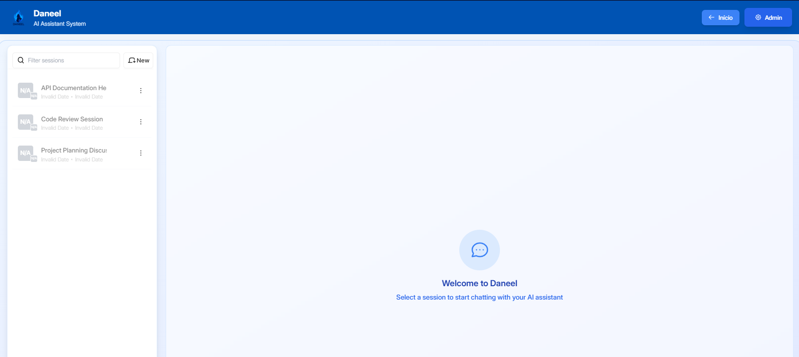
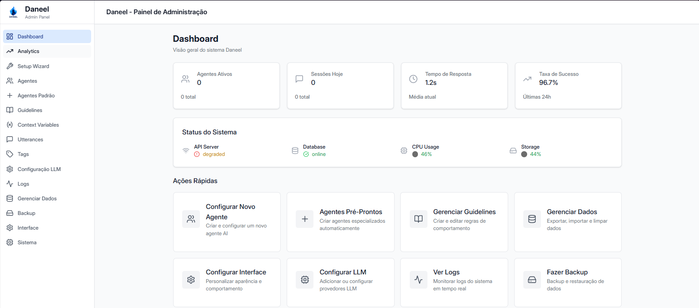
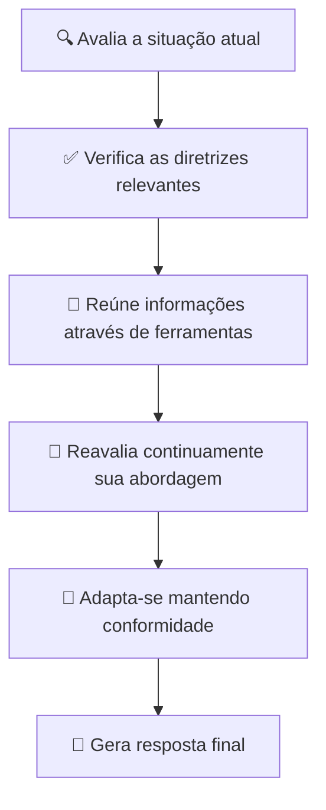

<div align="center">

#  Daneel


<h2 style="background: linear-gradient(45deg, #667eea 0%, #764ba2 100%); -webkit-background-clip: text; -webkit-text-fill-color: transparent; font-size: 2.6em; margin: 20px 0; font-weight: 700;">
O Motor de Modelagem de Conversas Inteligente
</h2>

<div style="margin: 35px 0;">
<a href="https://pypi.org/project/parlant/"></a>
<a href="https://pypi.org/project/parlant/"></a>
<a href="https://opensource.org/licenses/Apache-2.0"></a>
<a href="https://github.com/emcie-co/parlant"></a>
<a href="https://discord.gg/duxWqxKk6J"></a>
</div>

<div style="margin: 40px 0; display: flex; flex-wrap: wrap; justify-content: center; gap: 15px;">
<a href="https://www.parlant.io/" style="text-decoration: none; display: inline-block;">
  
</a>
<a href="https://www.parlant.io/docs/quickstart/introduction" style="text-decoration: none; display: inline-block;">
  
</a>
<a href="https://www.parlant.io/docs/tutorial/getting-started" style="text-decoration: none; display: inline-block;">
  
</a>
<a href="https://discord.gg/duxWqxKk6J" style="text-decoration: none; display: inline-block;">
  
</a>
</div>

<div style="background: linear-gradient(135deg, rgba(102, 126, 234, 0.1), rgba(118, 75, 162, 0.1)); padding: 25px; border-radius: 20px; border: 1px solid rgba(102, 126, 234, 0.2); max-width: 85%; margin: 40px auto;">
  <p style="font-size: 1.2em; color: #4a5568; margin: 0;">
    <strong style="color: #667eea;">Daneel</strong> é um sistema completo para criação e gerenciamento de agentes de conversação inteligentes com controle preciso sobre o comportamento, garantindo consistência e conformidade em todas as interações.
  </p>
</div>

---

<div align="center">

## 📋 **Navegação Rápida**

<table style="width: 90%; margin: 20px auto; border-collapse: separate; border-spacing: 12px; background: none; border: none;">
<tr>
<td align="center" style="width: 25%; background: linear-gradient(135deg, rgba(102, 126, 234, 0.1), rgba(118, 75, 162, 0.1)); border-radius: 12px; padding: 12px; border: 1px solid rgba(102, 126, 234, 0.2); transition: transform 0.3s ease, box-shadow 0.3s ease;">
<a href="#-o-que-é-modelagem-de-conversas" style="text-decoration: none; font-weight: 600; color: #667eea; display: block;">
🤔 Conceitos
</a>
</td>
<td align="center" style="width: 25%; background: linear-gradient(135deg, rgba(118, 75, 162, 0.1), rgba(240, 147, 251, 0.1)); border-radius: 12px; padding: 12px; border: 1px solid rgba(118, 75, 162, 0.2); transition: transform 0.3s ease, box-shadow 0.3s ease;">
<a href="#-por-que-usar-o-daneel" style="text-decoration: none; font-weight: 600; color: #764ba2; display: block;">
🚀 Vantagens
</a>
</td>
<td align="center" style="width: 25%; background: linear-gradient(135deg, rgba(240, 147, 251, 0.1), rgba(245, 87, 108, 0.1)); border-radius: 12px; padding: 12px; border: 1px solid rgba(240, 147, 251, 0.2); transition: transform 0.3s ease, box-shadow 0.3s ease;">
<a href="#-instalação" style="text-decoration: none; font-weight: 600; color: #f093fb; display: block;">
📦 Instalação
</a>
</td>
<td align="center" style="width: 25%; background: linear-gradient(135deg, rgba(79, 172, 254, 0.1), rgba(0, 242, 254, 0.1)); border-radius: 12px; padding: 12px; border: 1px solid rgba(79, 172, 254, 0.2); transition: transform 0.3s ease, box-shadow 0.3s ease;">
<a href="#-guia-de-início-rápido" style="text-decoration: none; font-weight: 600; color: #4facfe; display: block;">
⚡ Tutorial
</a>
</td>
</tr>
</table>

</div>

---

<!-- Vídeo de Introdução -->
<div align="center">

## 🎬 **Vídeo de Introdução**

<a href="https://www.youtube.com/watch?v=_39ERIb0100" target="_blank" style="display: block; position: relative;">
  
  <div style="position: absolute; top: 50%; left: 50%; transform: translate(-50%, -50%); background: rgba(255, 255, 255, 0.9); border-radius: 50%; width: 80px; height: 80px; display: flex; justify-content: center; align-items: center; box-shadow: 0 10px 30px rgba(0,0,0,0.2);">
    <div style="width: 0; height: 0; border-top: 15px solid transparent; border-left: 25px solid #667eea; border-bottom: 15px solid transparent; margin-left: 8px;"></div>
  </div>
</a>

<p style="margin-top: 15px; color: #666; font-style: italic;">
👆 Clique para assistir à demonstração completa do sistema
</p>

</div>

---

<!-- Screenshots da Interface -->
<div align="center">

## 📸 **Interface do Sistema**

<p style="color: #4a5568; margin: 20px 0; font-size: 1.2em; max-width: 700px; line-height: 1.6;">
Explore a interface moderna, intuitiva e completa do Daneel, projetada para proporcionar uma experiência de usuário excepcional
</p>

<div style="display: flex; flex-wrap: wrap; gap: 25px; justify-content: center; margin: 40px 0;">

<div style="flex: 1; min-width: 300px; max-width: 450px; background: #ffffff; border-radius: 16px; box-shadow: 0 20px 40px rgba(0,0,0,0.1); overflow: hidden; transition: transform 0.3s ease, box-shadow 0.3s ease;">
    <div style="background: linear-gradient(45deg, #667eea, #764ba2); padding: 18px; color: white;">
        <h4 style="margin: 0; font-size: 1.2em; font-weight: 600;">🏠 Tela Inicial</h4>
    </div>
    <div style="padding: 0;">
        
    </div>
</div>

<div style="flex: 1; min-width: 300px; max-width: 450px; background: #ffffff; border-radius: 16px; box-shadow: 0 20px 40px rgba(0,0,0,0.1); overflow: hidden; transition: transform 0.3s ease, box-shadow 0.3s ease;">
    <div style="background: linear-gradient(45deg, #f093fb, #f5576c); padding: 18px; color: white;">
        <h4 style="margin: 0; font-size: 1.2em; font-weight: 600;">💬 Interface de Chat</h4>
    </div>
    <div style="padding: 0;">
        
    </div>
</div>

<div style="flex: 1; min-width: 300px; max-width: 450px; background: #ffffff; border-radius: 16px; box-shadow: 0 20px 40px rgba(0,0,0,0.1); overflow: hidden; transition: transform 0.3s ease, box-shadow 0.3s ease;">
    <div style="background: linear-gradient(45deg, #4facfe, #00f2fe); padding: 18px; color: white;">
        <h4 style="margin: 0; font-size: 1.2em; font-weight: 600;">📊 Dashboard Administrativo</h4>
    </div>
    <div style="padding: 0;">
        
    </div>
</div>

</div>

### ✨ **Principais Características da Interface:**

<div style="display: grid; grid-template-columns: repeat(auto-fit, minmax(280px, 1fr)); gap: 20px; margin: 30px auto; max-width: 1000px;">

<div style="background: linear-gradient(135deg, #667eea, #764ba2); padding: 25px; border-radius: 16px; color: white; box-shadow: 0 10px 25px rgba(0,0,0,0.1); transition: transform 0.3s ease, box-shadow 0.3s ease;">
    <div style="display: flex; align-items: center; margin-bottom: 15px;">
        <div style="background: rgba(255,255,255,0.2); border-radius: 50%; width: 40px; height: 40px; display: flex; align-items: center; justify-content: center; margin-right: 15px;">
            <span style="font-size: 1.2em;">🎨</span>
        </div>
        <h4 style="margin: 0; font-size: 1.2em; font-weight: 600;">Design Moderno</h4>
    </div>
    <p style="margin: 0; line-height: 1.5;">Interface limpa e profissional com atenção aos detalhes visuais</p>
</div>

<div style="background: linear-gradient(135deg, #f093fb, #f5576c); padding: 25px; border-radius: 16px; color: white; box-shadow: 0 10px 25px rgba(0,0,0,0.1); transition: transform 0.3s ease, box-shadow 0.3s ease;">
    <div style="display: flex; align-items: center; margin-bottom: 15px;">
        <div style="background: rgba(255,255,255,0.2); border-radius: 50%; width: 40px; height: 40px; display: flex; align-items: center; justify-content: center; margin-right: 15px;">
            <span style="font-size: 1.2em;">📱</span>
        </div>
        <h4 style="margin: 0; font-size: 1.2em; font-weight: 600;">Responsiva</h4>
    </div>
    <p style="margin: 0; line-height: 1.5;">Funciona perfeitamente em desktop, tablet e dispositivos móveis</p>
</div>

<div style="background: linear-gradient(135deg, #4facfe, #00f2fe); padding: 25px; border-radius: 16px; color: white; box-shadow: 0 10px 25px rgba(0,0,0,0.1); transition: transform 0.3s ease, box-shadow 0.3s ease;">
    <div style="display: flex; align-items: center; margin-bottom: 15px;">
        <div style="background: rgba(255,255,255,0.2); border-radius: 50%; width: 40px; height: 40px; display: flex; align-items: center; justify-content: center; margin-right: 15px;">
            <span style="font-size: 1.2em;">⚡</span>
        </div>
        <h4 style="margin: 0; font-size: 1.2em; font-weight: 600;">Alto Desempenho</h4>
    </div>
    <p style="margin: 0; line-height: 1.5;">Carregamento instantâneo e navegação fluida em todo o sistema</p>
</div>

<div style="background: linear-gradient(135deg, #43e97b, #38f9d7); padding: 25px; border-radius: 16px; color: white; box-shadow: 0 10px 25px rgba(0,0,0,0.1); transition: transform 0.3s ease, box-shadow 0.3s ease;">
    <div style="display: flex; align-items: center; margin-bottom: 15px;">
        <div style="background: rgba(255,255,255,0.2); border-radius: 50%; width: 40px; height: 40px; display: flex; align-items: center; justify-content: center; margin-right: 15px;">
            <span style="font-size: 1.2em;">🔧</span>
        </div>
        <h4 style="margin: 0; font-size: 1.2em; font-weight: 600;">Funcionalidades Completas</h4>
    </div>
    <p style="margin: 0; line-height: 1.5;">Sistema administrativo robusto com todas as ferramentas necessárias</p>
</div>

</div>

</div>

---

<!-- Seção Principal: O que é Modelagem de Conversas -->
<div align="center">

## 🤔 **O que é Modelagem de Conversas?**

<p style="font-size: 1.2em; color: #4a5568; margin: 20px auto; max-width: 800px; line-height: 1.6;">
A <strong style="color: #667eea;">Modelagem de Conversas (MC)</strong> é uma abordagem avançada que permite controlar de forma precisa como seus agentes de IA interagem com usuários, garantindo consistência e qualidade em todas as conversas.
</p>

</div>

<div style="display: grid; grid-template-columns: repeat(auto-fit, minmax(300px, 1fr)); gap: 25px; margin: 40px auto; max-width: 1000px;">

<div style="background: linear-gradient(135deg, rgba(255, 107, 107, 0.05), rgba(254, 202, 87, 0.05)); padding: 30px; border-radius: 16px; color: #4a5568; box-shadow: 0 10px 30px rgba(0,0,0,0.05); border: 1px solid rgba(255, 107, 107, 0.2); position: relative; overflow: hidden;">
    <div style="position: absolute; top: 0; left: 0; width: 8px; height: 100%; background: linear-gradient(135deg, #ff6b6b, #feca57);"></div>
    <div style="padding-left: 15px;">
        <h3 style="color: #ff6b6b; margin-top: 0; font-size: 1.3em; display: flex; align-items: center;">
            <span style="background: linear-gradient(135deg, #ff6b6b, #feca57); border-radius: 50%; width: 36px; height: 36px; display: flex; justify-content: center; align-items: center; margin-right: 12px; color: white; font-weight: bold;">❗</span>
            O Problema
        </h3>
        <p style="line-height: 1.6; margin-bottom: 0;">
            Você construiu um agente de IA que parece promissor em testes iniciais. No entanto, em cenários reais, ele frequentemente falha em seguir diretrizes importantes, gera respostas inconsistentes e não se adapta adequadamente a diferentes contextos de conversa.
        </p>
    </div>
</div>

<div style="background: linear-gradient(135deg, rgba(102, 126, 234, 0.05), rgba(118, 75, 162, 0.05)); padding: 30px; border-radius: 16px; color: #4a5568; box-shadow: 0 10px 30px rgba(0,0,0,0.05); border: 1px solid rgba(102, 126, 234, 0.2); position: relative; overflow: hidden;">
    <div style="position: absolute; top: 0; left: 0; width: 8px; height: 100%; background: linear-gradient(135deg, #667eea, #764ba2);"></div>
    <div style="padding-left: 15px;">
        <h3 style="color: #667eea; margin-top: 0; font-size: 1.3em; display: flex; align-items: center;">
            <span style="background: linear-gradient(135deg, #667eea, #764ba2); border-radius: 50%; width: 36px; height: 36px; display: flex; justify-content: center; align-items: center; margin-right: 12px; color: white; font-weight: bold;">✓</span>
            Nossa Solução
        </h3>
        <p style="line-height: 1.6; margin-bottom: 0;">
            O <strong>modelo de conversa</strong> do Daneel fornece um conjunto estruturado de princípios, diretrizes comportamentais e relacionamentos que guiam o agente durante toda a conversa, garantindo interações consistentes, adaptáveis e de alta qualidade.
        </p>
    </div>
</div>

</div>

### 🆚 **Comparação com outras abordagens**

<div style="border-radius: 16px; overflow: hidden; margin: 30px auto; max-width: 900px; box-shadow: 0 15px 35px rgba(0,0,0,0.1);">
    <div style="background: linear-gradient(135deg, #667eea, #764ba2); padding: 18px 25px; color: white;">
        <h3 style="margin: 0; font-size: 1.3em;">Tecnologias de Conversação: Análise Comparativa</h3>
    </div>
    <div style="overflow-x: auto;">
        <table style="width: 100%; border-collapse: collapse; background-color: white;">
            <thead>
                <tr style="background-color: #f8fafc; text-align: left;">
                    <th style="padding: 16px 20px; font-size: 1.1em; color: #4a5568; border-bottom: 2px solid #e2e8f0;">🔧 Abordagem</th>
                    <th style="padding: 16px 20px; font-size: 1.1em; color: #4a5568; border-bottom: 2px solid #e2e8f0;">💻 Tecnologias</th>
                    <th style="padding: 16px 20px; font-size: 1.1em; color: #4a5568; border-bottom: 2px solid #e2e8f0;">⚡ Características</th>
                    <th style="padding: 16px 20px; font-size: 1.1em; color: #4a5568; border-bottom: 2px solid #e2e8f0;">📊 Resultado</th>
                </tr>
            </thead>
            <tbody>
                <tr>
                    <td style="padding: 16px 20px; border-bottom: 1px solid #e2e8f0; color: #4a5568;">
                        <strong style="color: #ed8936;">🔄 Motores de Fluxo</strong>
                    </td>
                    <td style="padding: 16px 20px; border-bottom: 1px solid #e2e8f0; color: #718096;">
                        Rasa, Botpress, LangFlow
                    </td>
                    <td style="padding: 16px 20px; border-bottom: 1px solid #e2e8f0; color: #718096;">
                        <span style="display: block; margin-bottom: 6px;">• Fluxos predefinidos</span>
                        <span style="display: block; margin-bottom: 6px;">• Caminhos rígidos</span>
                        <span style="display: block;">• Pouca adaptabilidade</span>
                    </td>
                    <td style="padding: 16px 20px; border-bottom: 1px solid #e2e8f0;">
                        <span style="background-color: #fed7d7; color: #e53e3e; padding: 5px 10px; border-radius: 20px; font-size: 0.9em; white-space: nowrap;">Interações forçadas</span>
                    </td>
                </tr>
                <tr style="background-color: #f8fafc;">
                    <td style="padding: 16px 20px; border-bottom: 1px solid #e2e8f0; color: #4a5568;">
                        <strong style="color: #3182ce;">📝 Engenharia de Prompts</strong>
                    </td>
                    <td style="padding: 16px 20px; border-bottom: 1px solid #e2e8f0; color: #718096;">
                        LangGraph, LlamaIndex
                    </td>
                    <td style="padding: 16px 20px; border-bottom: 1px solid #e2e8f0; color: #718096;">
                        <span style="display: block; margin-bottom: 6px;">• Instruções estáticas</span>
                        <span style="display: block; margin-bottom: 6px;">• Dependente do LLM</span>
                        <span style="display: block;">• Difícil manutenção</span>
                    </td>
                    <td style="padding: 16px 20px; border-bottom: 1px solid #e2e8f0;">
                        <span style="background-color: #fefcbf; color: #d69e2e; padding: 5px 10px; border-radius: 20px; font-size: 0.9em; white-space: nowrap;">Inconsistência</span>
                    </td>
                </tr>
                <tr>
                    <td style="padding: 16px 20px; border-bottom: 1px solid #e2e8f0; color: #4a5568;">
                        <strong style="color: #667eea;">🎯 Modelagem de Conversas</strong>
                    </td>
                    <td style="padding: 16px 20px; border-bottom: 1px solid #e2e8f0; color: #718096;">
                        <strong style="color: #667eea;">🤖 DANEEL</strong>
                    </td>
                    <td style="padding: 16px 20px; border-bottom: 1px solid #e2e8f0; color: #718096;">
                        <span style="display: block; margin-bottom: 6px;">• Princípios dinâmicos</span>
                        <span style="display: block; margin-bottom: 6px;">• Regras contextuais</span>
                        <span style="display: block;">• Relacionamentos adaptativos</span>
                    </td>
                    <td style="padding: 16px 20px; border-bottom: 1px solid #e2e8f0;">
                        <span style="background-color: #c6f6d5; color: #38a169; padding: 5px 10px; border-radius: 20px; font-size: 0.9em; white-space: nowrap;">Adaptação + Conformidade</span>
                    </td>
                </tr>
            </tbody>
        </table>
    </div>
</div>

---

<!-- Por que usar o Daneel -->
<div align="center">

## 🚀 **Por que usar o Daneel?**

<p style="font-size: 1.2em; color: #4a5568; margin: 20px auto; max-width: 800px; line-height: 1.6;">
  Organizações de diversos setores confiam no Daneel para criar experiências de conversação inteligentes e controladas
</p>

<div style="display: grid; grid-template-columns: repeat(auto-fit, minmax(300px, 1fr)); gap: 25px; margin: 30px auto; max-width: 1200px;">

<div style="background: white; border-radius: 16px; overflow: hidden; box-shadow: 0 15px 30px rgba(0,0,0,0.1); transition: transform 0.3s ease, box-shadow 0.3s ease;">
    <div style="height: 8px; background: linear-gradient(90deg, #667eea, #764ba2);"></div>
    <div style="padding: 25px;">
        <div style="display: flex; align-items: center; margin-bottom: 15px;">
            <div style="background: rgba(102, 126, 234, 0.1); width: 50px; height: 50px; border-radius: 12px; display: flex; align-items: center; justify-content: center; margin-right: 15px;">
                <span style="font-size: 1.6em; color: #667eea;">🏦</span>
            </div>
            <h3 style="margin: 0; color: #4a5568; font-size: 1.3em;">Serviços Financeiros</h3>
        </div>
        <p style="color: #718096; margin: 0; line-height: 1.6;">
            Bancos e instituições financeiras utilizam o Daneel para comunicações regulamentadas e seguras, garantindo conformidade com normas do setor.
        </p>
        <div style="margin-top: 20px;">
            <span style="display: inline-block; background: rgba(102, 126, 234, 0.1); color: #667eea; border-radius: 20px; padding: 5px 12px; font-size: 0.85em; margin-right: 8px; margin-bottom: 8px;">Compliance</span>
            <span style="display: inline-block; background: rgba(102, 126, 234, 0.1); color: #667eea; border-radius: 20px; padding: 5px 12px; font-size: 0.85em; margin-right: 8px; margin-bottom: 8px;">Segurança</span>
            <span style="display: inline-block; background: rgba(102, 126, 234, 0.1); color: #667eea; border-radius: 20px; padding: 5px 12px; font-size: 0.85em; margin-right: 8px; margin-bottom: 8px;">Auditoria</span>
        </div>
    </div>
</div>

<div style="background: white; border-radius: 16px; overflow: hidden; box-shadow: 0 15px 30px rgba(0,0,0,0.1); transition: transform 0.3s ease, box-shadow 0.3s ease;">
    <div style="height: 8px; background: linear-gradient(90deg, #48bb78, #38b2ac);"></div>
    <div style="padding: 25px;">
        <div style="display: flex; align-items: center; margin-bottom: 15px;">
            <div style="background: rgba(72, 187, 120, 0.1); width: 50px; height: 50px; border-radius: 12px; display: flex; align-items: center; justify-content: center; margin-right: 15px;">
                <span style="font-size: 1.6em; color: #48bb78;">🏥</span>
            </div>
            <h3 style="margin: 0; color: #4a5568; font-size: 1.3em;">Área de Saúde</h3>
        </div>
        <p style="color: #718096; margin: 0; line-height: 1.6;">
            Hospitais e clínicas utilizam o Daneel para interações sensíveis com pacientes, respeitando a privacidade e fornecendo informações precisas.
        </p>
        <div style="margin-top: 20px;">
            <span style="display: inline-block; background: rgba(72, 187, 120, 0.1); color: #48bb78; border-radius: 20px; padding: 5px 12px; font-size: 0.85em; margin-right: 8px; margin-bottom: 8px;">Precisão</span>
            <span style="display: inline-block; background: rgba(72, 187, 120, 0.1); color: #48bb78; border-radius: 20px; padding: 5px 12px; font-size: 0.85em; margin-right: 8px; margin-bottom: 8px;">Privacidade</span>
            <span style="display: inline-block; background: rgba(72, 187, 120, 0.1); color: #48bb78; border-radius: 20px; padding: 5px 12px; font-size: 0.85em; margin-right: 8px; margin-bottom: 8px;">Empatia</span>
        </div>
    </div>
</div>

<div style="background: white; border-radius: 16px; overflow: hidden; box-shadow: 0 15px 30px rgba(0,0,0,0.1); transition: transform 0.3s ease, box-shadow 0.3s ease;">
    <div style="height: 8px; background: linear-gradient(90deg, #ed8936, #f56565);"></div>
    <div style="padding: 25px;">
        <div style="display: flex; align-items: center; margin-bottom: 15px;">
            <div style="background: rgba(237, 137, 54, 0.1); width: 50px; height: 50px; border-radius: 12px; display: flex; align-items: center; justify-content: center; margin-right: 15px;">
                <span style="font-size: 1.6em; color: #ed8936;">📜</span>
            </div>
            <h3 style="margin: 0; color: #4a5568; font-size: 1.3em;">Assistência Jurídica</h3>
        </div>
        <p style="color: #718096; margin: 0; line-height: 1.6;">
            Escritórios de advocacia e departamentos jurídicos utilizam o Daneel para fornecer orientações precisas e em conformidade com a legislação.
        </p>
        <div style="margin-top: 20px;">
            <span style="display: inline-block; background: rgba(237, 137, 54, 0.1); color: #ed8936; border-radius: 20px; padding: 5px 12px; font-size: 0.85em; margin-right: 8px; margin-bottom: 8px;">Conformidade</span>
            <span style="display: inline-block; background: rgba(237, 137, 54, 0.1); color: #ed8936; border-radius: 20px; padding: 5px 12px; font-size: 0.85em; margin-right: 8px; margin-bottom: 8px;">Precisão</span>
            <span style="display: inline-block; background: rgba(237, 137, 54, 0.1); color: #ed8936; border-radius: 20px; padding: 5px 12px; font-size: 0.85em; margin-right: 8px; margin-bottom: 8px;">Documentação</span>
        </div>
    </div>
</div>

<div style="background: white; border-radius: 16px; overflow: hidden; box-shadow: 0 15px 30px rgba(0,0,0,0.1); transition: transform 0.3s ease, box-shadow 0.3s ease;">
    <div style="height: 8px; background: linear-gradient(90deg, #9f7aea, #805ad5);"></div>
    <div style="padding: 25px;">
        <div style="display: flex; align-items: center; margin-bottom: 15px;">
            <div style="background: rgba(159, 122, 234, 0.1); width: 50px; height: 50px; border-radius: 12px; display: flex; align-items: center; justify-content: center; margin-right: 15px;">
                <span style="font-size: 1.6em; color: #9f7aea;">🛡️</span>
            </div>
            <h3 style="margin: 0; color: #4a5568; font-size: 1.3em;">Compliance</h3>
        </div>
        <p style="color: #718096; margin: 0; line-height: 1.6;">
            Equipes de conformidade utilizam o Daneel para garantir que as comunicações sigam os padrões regulatórios, com trilhas de auditoria completas.
        </p>
        <div style="margin-top: 20px;">
            <span style="display: inline-block; background: rgba(159, 122, 234, 0.1); color: #9f7aea; border-radius: 20px; padding: 5px 12px; font-size: 0.85em; margin-right: 8px; margin-bottom: 8px;">Auditoria</span>
            <span style="display: inline-block; background: rgba(159, 122, 234, 0.1); color: #9f7aea; border-radius: 20px; padding: 5px 12px; font-size: 0.85em; margin-right: 8px; margin-bottom: 8px;">Rastreabilidade</span>
            <span style="display: inline-block; background: rgba(159, 122, 234, 0.1); color: #9f7aea; border-radius: 20px; padding: 5px 12px; font-size: 0.85em; margin-right: 8px; margin-bottom: 8px;">Governança</span>
        </div>
    </div>
</div>

<div style="background: white; border-radius: 16px; overflow: hidden; box-shadow: 0 15px 30px rgba(0,0,0,0.1); transition: transform 0.3s ease, box-shadow 0.3s ease;">
    <div style="height: 8px; background: linear-gradient(90deg, #f56565, #e53e3e);"></div>
    <div style="padding: 25px;">
        <div style="display: flex; align-items: center; margin-bottom: 15px;">
            <div style="background: rgba(245, 101, 101, 0.1); width: 50px; height: 50px; border-radius: 12px; display: flex; align-items: center; justify-content: center; margin-right: 15px;">
                <span style="font-size: 1.6em; color: #f56565;">🎯</span>
            </div>
            <h3 style="margin: 0; color: #4a5568; font-size: 1.3em;">Atendimento Premium</h3>
        </div>
        <p style="color: #718096; margin: 0; line-height: 1.6;">
            Empresas com foco em experiência do cliente utilizam o Daneel para oferecer atendimento personalizado e consistente com a identidade da marca.
        </p>
        <div style="margin-top: 20px;">
            <span style="display: inline-block; background: rgba(245, 101, 101, 0.1); color: #f56565; border-radius: 20px; padding: 5px 12px; font-size: 0.85em; margin-right: 8px; margin-bottom: 8px;">Personalização</span>
            <span style="display: inline-block; background: rgba(245, 101, 101, 0.1); color: #f56565; border-radius: 20px; padding: 5px 12px; font-size: 0.85em; margin-right: 8px; margin-bottom: 8px;">Consistência</span>
            <span style="display: inline-block; background: rgba(245, 101, 101, 0.1); color: #f56565; border-radius: 20px; padding: 5px 12px; font-size: 0.85em; margin-right: 8px; margin-bottom: 8px;">Excelência</span>
        </div>
    </div>
</div>

<div style="background: white; border-radius: 16px; overflow: hidden; box-shadow: 0 15px 30px rgba(0,0,0,0.1); transition: transform 0.3s ease, box-shadow 0.3s ease;">
    <div style="height: 8px; background: linear-gradient(90deg, #38b2ac, #319795);"></div>
    <div style="padding: 25px;">
        <div style="display: flex; align-items: center; margin-bottom: 15px;">
            <div style="background: rgba(56, 178, 172, 0.1); width: 50px; height: 50px; border-radius: 12px; display: flex; align-items: center; justify-content: center; margin-right: 15px;">
                <span style="font-size: 1.6em; color: #38b2ac;">🤝</span>
            </div>
            <h3 style="margin: 0; color: #4a5568; font-size: 1.3em;">Representação</h3>
        </div>
        <p style="color: #718096; margin: 0; line-height: 1.6;">
            Organizações de defesa e representação utilizam o Daneel para oferecer suporte personalizado e especializado para seus representados.
        </p>
        <div style="margin-top: 20px;">
            <span style="display: inline-block; background: rgba(56, 178, 172, 0.1); color: #38b2ac; border-radius: 20px; padding: 5px 12px; font-size: 0.85em; margin-right: 8px; margin-bottom: 8px;">Especialização</span>
            <span style="display: inline-block; background: rgba(56, 178, 172, 0.1); color: #38b2ac; border-radius: 20px; padding: 5px 12px; font-size: 0.85em; margin-right: 8px; margin-bottom: 8px;">Advocacia</span>
            <span style="display: inline-block; background: rgba(56, 178, 172, 0.1); color: #38b2ac; border-radius: 20px; padding: 5px 12px; font-size: 0.85em; margin-right: 8px; margin-bottom: 8px;">Confiabilidade</span>
        </div>
    </div>
</div>

</div>

</div>

---

<!-- Quem usa o Daneel -->
<div align="center">

## 🏢 **Quem usa o Daneel?**

<p style="font-size: 1.2em; color: #4a5568; margin: 20px auto; max-width: 800px; line-height: 1.6;">
  Organizações de diversos setores confiam no Daneel para criar experiências de conversação inteligentes e controladas
</p>

<div style="display: grid; grid-template-columns: repeat(auto-fit, minmax(300px, 1fr)); gap: 25px; margin: 30px auto; max-width: 1200px;">

<div style="background: white; border-radius: 16px; overflow: hidden; box-shadow: 0 15px 30px rgba(0,0,0,0.1); transition: transform 0.3s ease, box-shadow 0.3s ease;">
    <div style="height: 8px; background: linear-gradient(90deg, #667eea, #764ba2);"></div>
    <div style="padding: 25px;">
        <div style="display: flex; align-items: center; margin-bottom: 15px;">
            <div style="background: rgba(102, 126, 234, 0.1); width: 50px; height: 50px; border-radius: 12px; display: flex; align-items: center; justify-content: center; margin-right: 15px;">
                <span style="font-size: 1.6em; color: #667eea;">🏦</span>
            </div>
            <h3 style="margin: 0; color: #4a5568; font-size: 1.3em;">Serviços Financeiros</h3>
        </div>
        <p style="color: #718096; margin: 0; line-height: 1.6;">
            Bancos e instituições financeiras utilizam o Daneel para comunicações regulamentadas e seguras, garantindo conformidade com normas do setor.
        </p>
        <div style="margin-top: 20px;">
            <span style="display: inline-block; background: rgba(102, 126, 234, 0.1); color: #667eea; border-radius: 20px; padding: 5px 12px; font-size: 0.85em; margin-right: 8px; margin-bottom: 8px;">Compliance</span>
            <span style="display: inline-block; background: rgba(102, 126, 234, 0.1); color: #667eea; border-radius: 20px; padding: 5px 12px; font-size: 0.85em; margin-right: 8px; margin-bottom: 8px;">Segurança</span>
            <span style="display: inline-block; background: rgba(102, 126, 234, 0.1); color: #667eea; border-radius: 20px; padding: 5px 12px; font-size: 0.85em; margin-right: 8px; margin-bottom: 8px;">Auditoria</span>
        </div>
    </div>
</div>

<div style="background: white; border-radius: 16px; overflow: hidden; box-shadow: 0 15px 30px rgba(0,0,0,0.1); transition: transform 0.3s ease, box-shadow 0.3s ease;">
    <div style="height: 8px; background: linear-gradient(90deg, #48bb78, #38b2ac);"></div>
    <div style="padding: 25px;">
        <div style="display: flex; align-items: center; margin-bottom: 15px;">
            <div style="background: rgba(72, 187, 120, 0.1); width: 50px; height: 50px; border-radius: 12px; display: flex; align-items: center; justify-content: center; margin-right: 15px;">
                <span style="font-size: 1.6em; color: #48bb78;">🏥</span>
            </div>
            <h3 style="margin: 0; color: #4a5568; font-size: 1.3em;">Área de Saúde</h3>
        </div>
        <p style="color: #718096; margin: 0; line-height: 1.6;">
            Hospitais e clínicas utilizam o Daneel para interações sensíveis com pacientes, respeitando a privacidade e fornecendo informações precisas.
        </p>
        <div style="margin-top: 20px;">
            <span style="display: inline-block; background: rgba(72, 187, 120, 0.1); color: #48bb78; border-radius: 20px; padding: 5px 12px; font-size: 0.85em; margin-right: 8px; margin-bottom: 8px;">Precisão</span>
            <span style="display: inline-block; background: rgba(72, 187, 120, 0.1); color: #48bb78; border-radius: 20px; padding: 5px 12px; font-size: 0.85em; margin-right: 8px; margin-bottom: 8px;">Privacidade</span>
            <span style="display: inline-block; background: rgba(72, 187, 120, 0.1); color: #48bb78; border-radius: 20px; padding: 5px 12px; font-size: 0.85em; margin-right: 8px; margin-bottom: 8px;">Empatia</span>
        </div>
    </div>
</div>

<div style="background: white; border-radius: 16px; overflow: hidden; box-shadow: 0 15px 30px rgba(0,0,0,0.1); transition: transform 0.3s ease, box-shadow 0.3s ease;">
    <div style="height: 8px; background: linear-gradient(90deg, #ed8936, #f56565);"></div>
    <div style="padding: 25px;">
        <div style="display: flex; align-items: center; margin-bottom: 15px;">
            <div style="background: rgba(237, 137, 54, 0.1); width: 50px; height: 50px; border-radius: 12px; display: flex; align-items: center; justify-content: center; margin-right: 15px;">
                <span style="font-size: 1.6em; color: #ed8936;">📜</span>
            </div>
            <h3 style="margin: 0; color: #4a5568; font-size: 1.3em;">Assistência Jurídica</h3>
        </div>
        <p style="color: #718096; margin: 0; line-height: 1.6;">
            Escritórios de advocacia e departamentos jurídicos utilizam o Daneel para fornecer orientações precisas e em conformidade com a legislação.
        </p>
        <div style="margin-top: 20px;">
            <span style="display: inline-block; background: rgba(237, 137, 54, 0.1); color: #ed8936; border-radius: 20px; padding: 5px 12px; font-size: 0.85em; margin-right: 8px; margin-bottom: 8px;">Conformidade</span>
            <span style="display: inline-block; background: rgba(237, 137, 54, 0.1); color: #ed8936; border-radius: 20px; padding: 5px 12px; font-size: 0.85em; margin-right: 8px; margin-bottom: 8px;">Precisão</span>
            <span style="display: inline-block; background: rgba(237, 137, 54, 0.1); color: #ed8936; border-radius: 20px; padding: 5px 12px; font-size: 0.85em; margin-right: 8px; margin-bottom: 8px;">Documentação</span>
        </div>
    </div>
</div>

<div style="background: white; border-radius: 16px; overflow: hidden; box-shadow: 0 15px 30px rgba(0,0,0,0.1); transition: transform 0.3s ease, box-shadow 0.3s ease;">
    <div style="height: 8px; background: linear-gradient(90deg, #9f7aea, #805ad5);"></div>
    <div style="padding: 25px;">
        <div style="display: flex; align-items: center; margin-bottom: 15px;">
            <div style="background: rgba(159, 122, 234, 0.1); width: 50px; height: 50px; border-radius: 12px; display: flex; align-items: center; justify-content: center; margin-right: 15px;">
                <span style="font-size: 1.6em; color: #9f7aea;">🛡️</span>
            </div>
            <h3 style="margin: 0; color: #4a5568; font-size: 1.3em;">Compliance</h3>
        </div>
        <p style="color: #718096; margin: 0; line-height: 1.6;">
            Equipes de conformidade utilizam o Daneel para garantir que as comunicações sigam os padrões regulatórios, com trilhas de auditoria completas.
        </p>
        <div style="margin-top: 20px;">
            <span style="display: inline-block; background: rgba(159, 122, 234, 0.1); color: #9f7aea; border-radius: 20px; padding: 5px 12px; font-size: 0.85em; margin-right: 8px; margin-bottom: 8px;">Auditoria</span>
            <span style="display: inline-block; background: rgba(159, 122, 234, 0.1); color: #9f7aea; border-radius: 20px; padding: 5px 12px; font-size: 0.85em; margin-right: 8px; margin-bottom: 8px;">Rastreabilidade</span>
            <span style="display: inline-block; background: rgba(159, 122, 234, 0.1); color: #9f7aea; border-radius: 20px; padding: 5px 12px; font-size: 0.85em; margin-right: 8px; margin-bottom: 8px;">Governança</span>
        </div>
    </div>
</div>

<div style="background: white; border-radius: 16px; overflow: hidden; box-shadow: 0 15px 30px rgba(0,0,0,0.1); transition: transform 0.3s ease, box-shadow 0.3s ease;">
    <div style="height: 8px; background: linear-gradient(90deg, #f56565, #e53e3e);"></div>
    <div style="padding: 25px;">
        <div style="display: flex; align-items: center; margin-bottom: 15px;">
            <div style="background: rgba(245, 101, 101, 0.1); width: 50px; height: 50px; border-radius: 12px; display: flex; align-items: center; justify-content: center; margin-right: 15px;">
                <span style="font-size: 1.6em; color: #f56565;">🎯</span>
            </div>
            <h3 style="margin: 0; color: #4a5568; font-size: 1.3em;">Atendimento Premium</h3>
        </div>
        <p style="color: #718096; margin: 0; line-height: 1.6;">
            Empresas com foco em experiência do cliente utilizam o Daneel para oferecer atendimento personalizado e consistente com a identidade da marca.
        </p>
        <div style="margin-top: 20px;">
            <span style="display: inline-block; background: rgba(245, 101, 101, 0.1); color: #f56565; border-radius: 20px; padding: 5px 12px; font-size: 0.85em; margin-right: 8px; margin-bottom: 8px;">Personalização</span>
            <span style="display: inline-block; background: rgba(245, 101, 101, 0.1); color: #f56565; border-radius: 20px; padding: 5px 12px; font-size: 0.85em; margin-right: 8px; margin-bottom: 8px;">Consistência</span>
            <span style="display: inline-block; background: rgba(245, 101, 101, 0.1); color: #f56565; border-radius: 20px; padding: 5px 12px; font-size: 0.85em; margin-right: 8px; margin-bottom: 8px;">Excelência</span>
        </div>
    </div>
</div>

<div style="background: white; border-radius: 16px; overflow: hidden; box-shadow: 0 15px 30px rgba(0,0,0,0.1); transition: transform 0.3s ease, box-shadow 0.3s ease;">
    <div style="height: 8px; background: linear-gradient(90deg, #38b2ac, #319795);"></div>
    <div style="padding: 25px;">
        <div style="display: flex; align-items: center; margin-bottom: 15px;">
            <div style="background: rgba(56, 178, 172, 0.1); width: 50px; height: 50px; border-radius: 12px; display: flex; align-items: center; justify-content: center; margin-right: 15px;">
                <span style="font-size: 1.6em; color: #38b2ac;">🤝</span>
            </div>
            <h3 style="margin: 0; color: #4a5568; font-size: 1.3em;">Representação</h3>
        </div>
        <p style="color: #718096; margin: 0; line-height: 1.6;">
            Organizações de defesa e representação utilizam o Daneel para oferecer suporte personalizado e especializado para seus representados.
        </p>
        <div style="margin-top: 20px;">
            <span style="display: inline-block; background: rgba(56, 178, 172, 0.1); color: #38b2ac; border-radius: 20px; padding: 5px 12px; font-size: 0.85em; margin-right: 8px; margin-bottom: 8px;">Especialização</span>
            <span style="display: inline-block; background: rgba(56, 178, 172, 0.1); color: #38b2ac; border-radius: 20px; padding: 5px 12px; font-size: 0.85em; margin-right: 8px; margin-bottom: 8px;">Advocacia</span>
            <span style="display: inline-block; background: rgba(56, 178, 172, 0.1); color: #38b2ac; border-radius: 20px; padding: 5px 12px; font-size: 0.85em; margin-right: 8px; margin-bottom: 8px;">Confiabilidade</span>
        </div>
    </div>
</div>

</div>

</div>

---

<!-- Funcionalidades Implementadas -->
<div align="center">

## 🚀 **Funcionalidades Implementadas**

<p style="color: #4a5568; margin: 20px 0; font-size: 1.1em;">
Sistema completo de administração e chat inteligente
</p>

</div>

### 🎛️ **Sistema de Administração Completo**

<div style="display: grid; grid-template-columns: repeat(auto-fit, minmax(350px, 1fr)); gap: 25px; margin: 30px 0;">

<div style="background: linear-gradient(45deg, #667eea, #764ba2); padding: 20px; border-radius: 15px; color: white;">
<h4>🤖 **Gerenciamento de Agentes**</h4>
<p>• CRUD completo de agentes IA<br>
• Sistema de fallback inteligente<br>
• Modais avançados de configuração<br>
• Filtros e busca em tempo real</p>
</div>

<div style="background: linear-gradient(45deg, #f093fb, #f5576c); padding: 20px; border-radius: 15px; color: white;">
<h4>⚡ **Configuração LLM**</h4>
<p>• GPT-4o e GPT-4o Mini<br>
• Claude 3.5 Sonnet<br>
• Gemini 1.5 Pro<br>
• Llama 3.1 via Ollama</p>
</div>

<div style="background: linear-gradient(45deg, #4facfe, #00f2fe); padding: 20px; border-radius: 15px; color: white;">
<h4>📊 **Dashboard Avançado**</h4>
<p>• Métricas em tempo real<br>
• Ações rápidas<br>
• Cards informativos<br>
• Navegação intuitiva</p>
</div>

<div style="background: linear-gradient(45deg, #43e97b, #38f9d7); padding: 20px; border-radius: 15px; color: white;">
<h4>🎯 **Agentes Pré-Prontos**</h4>
<p>• 8 templates especializados<br>
• Criação automática<br>
• Categorização inteligente<br>
• Estimativas de tempo</p>
</div>

<div style="background: linear-gradient(45deg, #fa709a, #fee140); padding: 20px; border-radius: 15px; color: white;">
<h4>📋 **Logs e Monitoramento**</h4>
<p>• Monitoramento em tempo real<br>
• Filtros avançados<br>
• Histórico completo<br>
• Análise de performance</p>
</div>

<div style="background: linear-gradient(45deg, #a8edea, #fed6e3); padding: 20px; border-radius: 15px; color: #2d3748;">
<h4>💾 **Sistema de Backup**</h4>
<p>• Backup automático<br>
• Restore inteligente<br>
• Versionamento<br>
• Proteção de dados</p>
</div>

</div>

### 💬 **Interface de Chat Inteligente**

<div style="display: grid; grid-template-columns: repeat(auto-fit, minmax(300px, 1fr)); gap: 20px; margin: 30px 0;">

<div style="background: #e6fffa; border-left: 5px solid #38b2ac; padding: 20px; border-radius: 10px;">
<h4>🎨 **Design Moderno**</h4>
<p>Interface limpa e profissional sem emojis desnecessários</p>
</div>

<div style="background: #f0f8ff; border-left: 5px solid #3182ce; padding: 20px; border-radius: 10px;">
<h4>⚡ **Respostas Rápidas**</h4>
<p>Sistema otimizado para conversas fluidas e naturais</p>
</div>

<div style="background: #f0fff4; border-left: 5px solid #48bb78; padding: 20px; border-radius: 10px;">
<h4>📱 **Responsivo**</h4>
<p>Funciona perfeitamente em todos os dispositivos</p>
</div>

<div style="background: #fffaf0; border-left: 5px solid #ed8936; padding: 20px; border-radius: 10px;">
<h4>🔒 **Seguro**</h4>
<p>Tratamento robusto de erros e fallbacks inteligentes</p>
</div>

</div>

### 🛠️ **Recursos Técnicos**

<div style="background: #f7fafc; padding: 25px; border-radius: 15px; margin: 20px 0;">

**🔧 Tecnologias Utilizadas:**
- **Frontend:** React + TypeScript + Vite
- **UI:** Tailwind CSS + Shadcn/ui
- **Backend:** Python + FastAPI
- **Banco de Dados:** SQLite/PostgreSQL
- **LLMs:** OpenAI, Anthropic, Google, Ollama

**✅ Funcionalidades Ativas:**
- ✅ **9/15 páginas administrativas** funcionais
- ✅ **Sistema de agentes** com CRUD completo
- ✅ **Configuração LLM** com 5 provedores
- ✅ **Dashboard** com métricas em tempo real
- ✅ **Interface de chat** moderna e responsiva
- ✅ **Sistema de backup** e restore
- ✅ **Logs** e monitoramento avançado

</div>

---

<!-- Principais Recursos -->
<div align="center">

## 🔥 **Principais Recursos**

<h3 style="color: #4a5568; margin: 30px 0;">🧑‍💻 Desenvolvedores e Cientistas de Dados estão usando o Daneel para:
</h3>

</div>

<div style="display: grid; grid-template-columns: repeat(auto-fit, minmax(350px, 1fr)); gap: 25px; margin: 30px 0;">

<div style="background: linear-gradient(45deg, #667eea, #764ba2); padding: 20px; border-radius: 15px; color: white;">
<h4>🤖 **Criação Rápida**</h4>
<p>Criar agentes conversacionais personalizados de forma rápida</p>
</div>

<div style="background: linear-gradient(45deg, #f093fb, #f5576c); padding: 20px; border-radius: 15px; color: white;">
<h4>👣 **Diretrizes Confiáveis**</h4>
<p>Definir comportamentos que são seguidos de forma consistente</p>
</div>

<div style="background: linear-gradient(45deg, #4facfe, #00f2fe); padding: 20px; border-radius: 15px; color: white;">
<h4>🛠️ **Ferramentas Inteligentes**</h4>
<p>Anexar ferramentas com orientações contextuais</p>
</div>

<div style="background: linear-gradient(45deg, #43e97b, #38f9d7); padding: 20px; border-radius: 15px; color: white;">
<h4>📖 **Glossário Gerenciado**</h4>
<p>Garantir interpretação estrita de termos</p>
</div>

<div style="background: linear-gradient(45deg, #fa709a, #fee140); padding: 20px; border-radius: 15px; color: white;">
<h4>👤 **Personalização**</h4>
<p>Adicionar informações específicas do cliente</p>
</div>

<div style="background: linear-gradient(45deg, #a8edea, #fed6e3); padding: 20px; border-radius: 15px; color: #2d3748;">
<h4>🏷️ **Sistema de Tags**</h4>
<p>Organizar e categorizar entidades</p>
</div>

<div style="background: linear-gradient(45deg, #d299c2, #fef9d7); padding: 20px; border-radius: 15px; color: #2d3748;">
<h4>🔗 **Relacionamentos**</h4>
<p>Estabelecer conexões complexas entre diretrizes</p>
</div>

<div style="background: linear-gradient(45deg, #89f7fe, #66a6ff); padding: 20px; border-radius: 15px; color: white;">
<h4>📊 **Monitoramento**</h4>
<p>Debugar agentes em tempo real</p>
</div>

<div style="background: linear-gradient(45deg, #fdbb2d, #22c1c3); padding: 20px; border-radius: 15px; color: white;">
<h4>🔄 **Migração**</h4>
<p>Gerenciar atualizações de versão transparentes</p>
</div>

</div>

---

<!-- Como funciona -->
<div align="center">

## 🔍 **Como funciona o Daneel?**

<h3 style="color: #4a5568; margin: 30px 0;">🔄 Fluxo de Processamento</h3>

<p style="max-width: 800px; margin: 0 auto; color: #666; font-size: 1.1em;">
Quando um agente precisa responder a um cliente, o motor do Daneel:
</p>

</div>

<div style="display: flex; justify-content: center; margin: 40px 0;">
<div style="max-width: 600px;">



</div>
</div>

---

<!-- Compatibilidade -->
<div align="center">

## 💻 **Compatibilidade com LLMs**

<p style="color: #4a5568; margin: 20px 0; font-size: 1.1em;">
O Daneel funciona com os principais provedores de LLM:
</p>

<div style="display: grid; grid-template-columns: repeat(auto-fit, minmax(200px, 1fr)); gap: 20px; margin: 30px 0; max-width: 800px;">

<div style="background: #00d2ff; background: linear-gradient(45deg, #00d2ff, #3a7bd5); padding: 15px; border-radius: 10px; color: white; text-align: center;">
<strong>🤖 OpenAI</strong><br>
<small>GPT-4o, GPT-4o Mini, GPT-4</small>
</div>

<div style="background: #ff9a9e; background: linear-gradient(45deg, #ff9a9e, #fecfef); padding: 15px; border-radius: 10px; color: white; text-align: center;">
<strong>🧠 Anthropic</strong><br>
<small>Claude 3.5 Sonnet</small>
</div>

<div style="background: #a8edea; background: linear-gradient(45deg, #a8edea, #fed6e3); padding: 15px; border-radius: 10px; color: #2d3748; text-align: center;">
<strong>🔍 Google</strong><br>
<small>Gemini 1.5 Pro</small>
</div>

<div style="background: #d299c2; background: linear-gradient(45deg, #d299c2, #fef9d7); padding: 15px; border-radius: 10px; color: #2d3748; text-align: center;">
<strong>⚡ Mistral AI</strong><br>
<small>Mistral Models</small>
</div>

<div style="background: #89f7fe; background: linear-gradient(45deg, #89f7fe, #66a6ff); padding: 15px; border-radius: 10px; color: white; text-align: center;">
<strong>🔓 Código Aberto</strong><br>
<small>API Compatível</small>
</div>

</div>

</div>

---

<!-- Instalação -->
<div align="center">

## 📦 **Instalação**

<div style="background: linear-gradient(135deg, #667eea, #764ba2); padding: 30px; border-radius: 20px; margin: 30px 0; max-width: 800px; color: white;">

<h3 style="margin-top: 0;">⚡ Instalação e Execução</h3>

**📦 Instalação:**
```bash
pip install parlant
```

**🚀 Executar Interface Web:**
```bash
# Navegar para o diretório do chat
cd src/parlant/api/chat

# Instalar dependências
npm install

# Executar em modo desenvolvimento
npm run dev
```

**🌐 Acessar o Sistema:**
- **Chat:** http://127.0.0.1:8002/chat/
- **Admin:** http://127.0.0.1:8002/chat/admin

<p style="margin-bottom: 0; font-size: 0.9em; opacity: 0.9;">
💡 Requisitos: Python 3.8+ e Node.js 16+
</p>

</div>

</div>

---

<!-- Guia de Início Rápido -->
<div align="center">

## 🚀 **Guia de Início Rápido**

</div>

<div style="background: #f7fafc; padding: 30px; border-radius: 15px; margin: 20px 0;">

```python
from parlant import ConversationEngine, ConversationModel

# 🎯 Criar um modelo de conversa
model = ConversationModel(
    name="Assistente de Atendimento",
    description="Assistente para suporte ao cliente",
    principles=[
        "Seja sempre cordial e profissional",
        "Priorize a satisfação do cliente", 
        "Siga os procedimentos da empresa"
    ]
)

# 📋 Adicionar diretrizes
model.add_guideline(
    "saudação",
    "Sempre cumprimente o cliente pelo nome quando disponível"
)

model.add_guideline(
    "encerramento", 
    "Sempre pergunte se há mais alguma forma de ajudar"
)

# 🚀 Inicializar o motor de conversas
engine = ConversationEngine(
    model=model,
    llm_provider="openai",
    api_key="sua-chave-api"
)

# 💬 Iniciar uma conversa
conversation = engine.create_conversation(
    context={
        "cliente": {
            "nome": "Maria Silva",
            "tipo": "premium"
        }
    }
)

# ✨ Obter resposta
response = conversation.generate_response(
    "Olá, estou com um problema no meu pedido #12345"
)

print(response)
```

</div>

---

<!-- Exemplos Avançados -->
<div align="center">

## 📊 **Exemplos de Uso Avançados**

</div>

### 🏷️ **Sistema de Tags e Relacionamentos**

<div style="background: #edf2f7; padding: 25px; border-radius: 15px; margin: 20px 0;">

```python
# 🏷️ Adicionar diretrizes com tags
model.add_guideline(
    "upsell_premium",
    "Sugerir upgrade para serviços premium quando apropriado",
    tags=["vendas", "premium"]
)

model.add_guideline(
    "desconto_proibido",
    "Nunca oferecer descontos sem aprovação",
    tags=["vendas", "restrição"]
)

# 🔗 Estabelecer relacionamentos
model.add_relationship(
    "upsell_premium",
    "desconto_proibido", 
    type="prioridade",
    description="Priorizar não oferecer descontos sobre sugerir upgrades"
)
```

</div>

### 📊 **Monitoramento e Logs**

<div style="background: #f0fff4; padding: 25px; border-radius: 15px; margin: 20px 0;">

```python
# 📊 Configurar monitoramento
engine.enable_monitoring(
    log_level="INFO",
    store_conversations=True
)

# 📋 Obter logs de uma conversa
logs = engine.get_conversation_logs(conversation_id)

# 📈 Analisar desempenho
insights = engine.analyze_conversations(
    start_date="2023-01-01",
    end_date="2023-01-31"
)
```

</div>

---

<!-- Guia para Iniciantes -->
<div align="center">

## 🌟 **Como Usar - Guia para Iniciantes**

</div>

### 🤔 **O que é o Daneel?**

<div style="background: linear-gradient(135deg, #667eea, #764ba2); padding: 25px; border-radius: 15px; color: white; margin: 20px 0;">
<p style="margin: 0; font-size: 1.1em;">
O Daneel é um assistente virtual inteligente que ajuda empresas e organizações a criar experiências de conversação mais naturais e eficientes com seus clientes. Imagine-o como um "professor" que ensina outros assistentes virtuais (chatbots) a conversarem de forma mais humana e profissional.
</p>
</div>

### 🎯 **Para que serve?**

<div style="display: grid; grid-template-columns: repeat(auto-fit, minmax(300px, 1fr)); gap: 20px; margin: 20px 0;">

<div style="background: #e6fffa; border-left: 5px solid #38b2ac; padding: 20px; border-radius: 10px;">
<h4>💬 **Atendimento ao Cliente**</h4>
<p>Ajuda a criar assistentes virtuais que respondem dúvidas e resolvem problemas</p>
</div>

<div style="background: #f0f8ff; border-left: 5px solid #3182ce; padding: 20px; border-radius: 10px;">
<h4>📱 **Suporte Técnico**</h4>
<p>Auxilia usuários com questões técnicas de forma clara e paciente</p>
</div>

<div style="background: #f0fff4; border-left: 5px solid #48bb78; padding: 20px; border-radius: 10px;">
<h4>🏥 **Área da Saúde**</h4>
<p>Oferece informações e orientações seguindo protocolos médicos</p>
</div>

<div style="background: #fffaf0; border-left: 5px solid #ed8936; padding: 20px; border-radius: 10px;">
<h4>🏦 **Serviços Financeiros**</h4>
<p>Ajuda com consultas bancárias e financeiras de forma segura</p>
</div>

<div style="background: #faf5ff; border-left: 5px solid #9f7aea; padding: 20px; border-radius: 10px;">
<h4>⚖️ **Assistência Jurídica**</h4>
<p>Fornece orientações legais básicas seguindo as normas</p>
</div>

</div>

### 🚀 **Como Começar?**

<div style="background: #f7fafc; padding: 25px; border-radius: 15px; margin: 20px 0;">

**1. 📦 Instalação Básica:**
- Se você é um usuário comum, procure sua equipe de TI para instalar e configurar o Daneel
- Se você é um desenvolvedor iniciante, siga o guia de instalação acima usando `pip install parlant`

**2. 👨‍💻 Primeiros Passos:**
- Defina o tipo de assistente que você precisa (atendimento, suporte, vendas, etc.)
- Configure as regras básicas de comportamento do seu assistente
- Teste com perguntas simples antes de usar em produção

**3. 💡 Dicas Importantes:**
- Comece com casos de uso simples e vá aumentando a complexidade
- Mantenha um registro das interações para melhorar o sistema
- Peça ajuda no nosso [Discord](https://discord.gg/duxWqxKk6J) se precisar

</div>

### 🛠️ **Exemplos de Uso no Dia a Dia**

<div style="display: grid; grid-template-columns: repeat(auto-fit, minmax(400px, 1fr)); gap: 25px; margin: 20px 0;">

<div style="background: #e6fffa; padding: 20px; border-radius: 15px; border-left: 5px solid #38b2ac;">
<h4>📞 **Cenário 1: Atendimento ao Cliente**</h4>

```python
# Configuração simples para atendimento
assistente = ConversationEngine.create_simple_assistant(
    nome="Assistente de Ajuda",
    regras_basicas=[
        "Ser educado",
        "Falar de forma clara", 
        "Pedir ajuda quando não souber"
    ]
)
```
</div>

<div style="background: #f0f8ff; padding: 20px; border-radius: 15px; border-left: 5px solid #3182ce;">
<h4>🔧 **Cenário 2: Suporte Técnico**</h4>

```python
# Configuração para suporte
suporte = ConversationEngine.create_simple_assistant(
    nome="Suporte Técnico",
    regras_basicas=[
        "Explicar passo a passo",
        "Usar linguagem simples",
        "Confirmar se o problema foi resolvido"
    ]
)
```
</div>

</div>

---

<!-- Seção de Suporte -->
<div align="center">

## 🆘 **Precisa de Ajuda?**

<div style="display: grid; grid-template-columns: repeat(auto-fit, minmax(250px, 1fr)); gap: 20px; margin: 30px 0; max-width: 800px;">

<a href="https://www.parlant.io/docs/quickstart/introduction" style="text-decoration: none;">
<div style="background: linear-gradient(135deg, #667eea, #764ba2); padding: 20px; border-radius: 15px; color: white; text-align: center; transition: transform 0.3s ease;">
<h4>📚 Documentação</h4>
<p>Consulte nossa documentação simplificada</p>
</div>
</a>

<a href="https://discord.gg/duxWqxKk6J" style="text-decoration: none;">
<div style="background: linear-gradient(135deg, #5865f2, #7289da); padding: 20px; border-radius: 15px; color: white; text-align: center; transition: transform 0.3s ease;">
<h4>💬 Discord</h4>
<p>Entre no nosso servidor para suporte</p>
</div>
</a>

<a href="mailto:support@parlant.io" style="text-decoration: none;">
<div style="background: linear-gradient(135deg, #f093fb, #f5576c); padding: 20px; border-radius: 15px; color: white; text-align: center; transition: transform 0.3s ease;">
<h4>📧 Email</h4>
<p>Envie um e-mail para support@parlant.io</p>
</div>
</a>

<a href="https://www.youtube.com/watch?v=_39ERIb0100" style="text-decoration: none;">
<div style="background: linear-gradient(135deg, #ff0000, #ff4444); padding: 20px; border-radius: 15px; color: white; text-align: center; transition: transform 0.3s ease;">
<h4>🎥 YouTube</h4>
<p>Assista nossos tutoriais</p>
</div>
</a>

</div>

</div>

---

<!-- Contribuindo -->
<div align="center">

## 🤝 **Contribuindo**

<div style="background: linear-gradient(135deg, #43e97b, #38f9d7); padding: 30px; border-radius: 20px; margin: 30px 0; max-width: 600px; color: white;">

<h3 style="margin-top: 0;">🌟 Faça parte da comunidade!</h3>

<p style="margin-bottom: 20px;">
Contribuições são bem-vindas! Veja nosso <strong>Guia de Contribuição</strong> para começar.
</p>

<a href="CONTRIBUTING.md" style="background: rgba(255,255,255,0.2); padding: 10px 20px; border-radius: 25px; color: white; text-decoration: none; font-weight: bold;">
📖 Ver Guia de Contribuição
</a>

</div>

</div>

---

<!-- Suporte Final -->
<div align="center">

## 📞 **Suporte**

<div style="background: #f7fafc; padding: 25px; border-radius: 15px; margin: 20px 0;">

**🐛 Encontrou um bug?**  
[GitHub Issues](https://github.com/dougdotcon/parlant/issues)

**✉️ Contato direto:**  
Email: dougdotcon@gmail.com

</div>

</div>

---

<div align="center" style="margin-top: 60px;">

<div style="background: linear-gradient(135deg, #667eea, #764ba2); padding: 40px; border-radius: 20px; color: white; max-width: 700px;">

<h3 style="margin-top: 0;">🎯 Status do Projeto</h3>

<div style="display: grid; grid-template-columns: repeat(auto-fit, minmax(200px, 1fr)); gap: 20px; margin: 20px 0;">

<div style="background: rgba(255,255,255,0.1); padding: 15px; border-radius: 10px;">
<h4 style="margin: 0 0 10px 0;">🚀 Interface Web</h4>
<p style="margin: 0; font-size: 0.9em;">100% Funcional</p>
</div>

<div style="background: rgba(255,255,255,0.1); padding: 15px; border-radius: 10px;">
<h4 style="margin: 0 0 10px 0;">🎛️ Admin</h4>
<p style="margin: 0; font-size: 0.9em;">9/15 Páginas Ativas</p>
</div>

<div style="background: rgba(255,255,255,0.1); padding: 15px; border-radius: 10px;">
<h4 style="margin: 0 0 10px 0;">🤖 LLMs</h4>
<p style="margin: 0; font-size: 0.9em;">5 Provedores</p>
</div>

</div>

<h3 style="margin: 30px 0 10px 0;">❤️ Desenvolvido por</h3>

<a href="https://asimovtech.systems/" style="color: white; text-decoration: none; font-size: 1.3em; font-weight: bold;">
🚀 AsimovTechSolutions
</a>

<p style="margin: 15px 0 0 0; opacity: 0.9;">
Transformando conversas em experiências extraordinárias
</p>

</div>

<div style="margin-top: 30px; opacity: 0.6;">
<p>© 2025 AsimovTechSolutions. Todos os direitos reservados.</p>
<p style="font-size: 0.8em; margin-top: 10px;">
🤖 Daneel - Sistema de Modelagem de Conversas Inteligente
</p>
</div>

</div>
