## Plataforma Completa de IA Multimodal e Agentes Inteligentes

  

    <strong style="color: #667eea;">Daneel</strong> é uma plataforma completa de IA que combina agentes inteligentes, processamento multimodal, RAG agnético e modelos locais em uma interface web moderna e intuitiva. Suporte completo para DeepSeek R1, Llama 3.2, OCR, voz e muito mais.
  

---

## 📋 Navegação Rápida

<table style="width: 90%; margin: 20px auto; border-collapse: separate; border-spacing: 12px; background: none; border: none;">
<tr>
<td align="center" style="width: 20%; background: linear-gradient(135deg, rgba(102, 126, 234, 0.1), rgba(118, 75, 162, 0.1)); border-radius: 12px; padding: 12px; border: 1px solid rgba(102, 126, 234, 0.2);">
<a href="#-funcionalidades-principais" style="text-decoration: none; font-weight: 600; color: #667eea; display: block;">
🚀 Funcionalidades
</a>
</td>
<td align="center" style="width: 20%; background: linear-gradient(135deg, rgba(118, 75, 162, 0.1), rgba(240, 147, 251, 0.1)); border-radius: 12px; padding: 12px; border: 1px solid rgba(118, 75, 162, 0.2);">
<a href="#-instalação-e-execução" style="text-decoration: none; font-weight: 600; color: #764ba2; display: block;">
📦 Instalação
</a>
</td>
<td align="center" style="width: 20%; background: linear-gradient(135deg, rgba(240, 147, 251, 0.1), rgba(245, 87, 108, 0.1)); border-radius: 12px; padding: 12px; border: 1px solid rgba(240, 147, 251, 0.2);">
<a href="#-interface-web-completa" style="text-decoration: none; font-weight: 600; color: #f093fb; display: block;">
🌐 Interface
</a>
</td>
<td align="center" style="width: 20%; background: linear-gradient(135deg, rgba(79, 172, 254, 0.1), rgba(0, 242, 254, 0.1)); border-radius: 12px; padding: 12px; border: 1px solid rgba(79, 172, 254, 0.2);">
<a href="#-modelos-suportados" style="text-decoration: none; font-weight: 600; color: #4facfe; display: block;">
🤖 Modelos
</a>
</td>
<td align="center" style="width: 20%; background: linear-gradient(135deg, rgba(255, 154, 0, 0.1), rgba(255, 206, 84, 0.1)); border-radius: 12px; padding: 12px; border: 1px solid rgba(255, 154, 0, 0.2);">
<a href="#-exemplos-práticos" style="text-decoration: none; font-weight: 600; color: #ff9a00; display: block;">
⚡ Exemplos
</a>
</td>
</tr>
</table>

---

## 🚀 **Funcionalidades Principais**

### 🎯 **Sistema Completo de IA Multimodal**

<h4 style="color: #667eea; margin-top: 0;">🤖 Agentes Inteligentes</h4>
<ul style="text-align: left; color: #4a5568;">
<li><strong>Multi-Agente Swarm:</strong> OpenAI Swarm + Ollama</li>
<li><strong>RAG Agnético:</strong> CrewAI + DocumentSearch</li>
<li><strong>Agentes Especializados:</strong> 8 tipos pré-configurados</li>
<li><strong>Orquestração:</strong> Handoff inteligente entre agentes</li>
</ul>

<h4 style="color: #764ba2; margin-top: 0;">🔍 Sistema RAG Avançado</h4>
<ul style="text-align: left; color: #4a5568;">
<li><strong>ColBERT RAG:</strong> Busca semântica avançada</li>
<li><strong>ModernBERT:</strong> Embeddings otimizados</li>
<li><strong>GitHub RAG:</strong> Análise de código</li>
<li><strong>Fastest RAG:</strong> Performance máxima</li>
</ul>

<h4 style="color: #f093fb; margin-top: 0;">🎨 Processamento Multimodal</h4>
<ul style="text-align: left; color: #4a5568;">
<li><strong>LaTeX OCR:</strong> Llama 3.2 Vision para fórmulas</li>
<li><strong>Processamento de Imagens:</strong> OCR avançado</li>
<li><strong>Análise Visual:</strong> Diagramas e gráficos</li>
<li><strong>Upload Inteligente:</strong> Múltiplos formatos</li>
</ul>

<h4 style="color: #4facfe; margin-top: 0;">🎤 Voicebot Tempo Real</h4>
<ul style="text-align: left; color: #4a5568;">
<li><strong>Transcrição:</strong> AssemblyAI em tempo real</li>
<li><strong>Síntese de Voz:</strong> ElevenLabs premium</li>
<li><strong>Streaming:</strong> Áudio bidirecional</li>
<li><strong>VAD:</strong> Detecção de atividade de voz</li>
</ul>

<h4 style="color: #ff9a00; margin-top: 0;">📊 Analytics e Observabilidade</h4>
<ul style="text-align: left; color: #4a5568;">
<li><strong>CometML Opik:</strong> Monitoramento completo</li>
<li><strong>Métricas:</strong> Performance em tempo real</li>
<li><strong>Alertas:</strong> Sistema automático</li>
<li><strong>Dashboard:</strong> Insights avançados</li>
</ul>

<h4 style="color: #22c55e; margin-top: 0;">🌐 Interface Web Completa</h4>
<ul style="text-align: left; color: #4a5568;">
<li><strong>Chat Avançado:</strong> Interface moderna</li>
<li><strong>Admin Dashboard:</strong> 15 páginas funcionais</li>
<li><strong>Responsiva:</strong> Desktop, tablet, mobile</li>
<li><strong>Dark/Light Mode:</strong> Temas personalizáveis</li>
</ul>

---

## 🤔 O que é Modelagem de Conversas?

A <strong style="color: #667eea;">Modelagem de Conversas (MC)</strong> é uma abordagem avançada que permite controlar de forma precisa como seus agentes de IA interagem com usuários, garantindo consistência e qualidade em todas as conversas.

    

    

        <h3 style="color: #ff6b6b; margin-top: 0; font-size: 1.3em; display: flex; align-items: center;">
            ❗
            O Problema
        </h3>
        

            Você construiu um agente de IA que parece promissor em testes iniciais. No entanto, em cenários reais, ele frequentemente falha em seguir diretrizes importantes, gera respostas inconsistentes e não se adapta adequadamente a diferentes contextos de conversa.
        

    

    

    

        <h3 style="color: #667eea; margin-top: 0; font-size: 1.3em; display: flex; align-items: center;">
            ✓
            Nossa Solução
        </h3>
        

            O <strong>modelo de conversa</strong> do Daneel fornece um conjunto estruturado de princípios, diretrizes comportamentais e relacionamentos que guiam o agente durante toda a conversa, garantindo interações consistentes, adaptáveis e de alta qualidade.
        

    

## 🤖 **Modelos Suportados**

### 🎯 **Suporte Completo para Modelos Locais e Cloud**

<h4 style="color: #ff9a00; margin-top: 0;">🔥 DeepSeek R1</h4>
<ul style="text-align: left; color: #4a5568; margin: 0;">
<li><strong>Local:</strong> DeepSeek R1:7b via Ollama</li>
<li><strong>Cloud:</strong> DeepSeek R1 API</li>
<li><strong>Thinking:</strong> Interface de raciocínio</li>
<li><strong>Fine-tuning:</strong> Modelos customizados</li>
</ul>

<h4 style="color: #22c55e; margin-top: 0;">🦙 Llama 3.2</h4>
<ul style="text-align: left; color: #4a5568; margin: 0;">
<li><strong>Vision:</strong> Llama 3.2 Vision para OCR</li>
<li><strong>Text:</strong> Llama 3.2:8b local</li>
<li><strong>Multimodal:</strong> Imagens + texto</li>
<li><strong>Performance:</strong> Otimizado para hardware</li>
</ul>

<h4 style="color: #667eea; margin-top: 0;">🧠 OpenAI</h4>
<ul style="text-align: left; color: #4a5568; margin: 0;">
<li><strong>GPT-4o:</strong> Modelo mais recente</li>
<li><strong>GPT-4o Mini:</strong> Versão econômica</li>
<li><strong>Multimodal:</strong> Texto, imagem, áudio</li>
<li><strong>Swarm:</strong> Sistema multi-agente</li>
</ul>

<h4 style="color: #764ba2; margin-top: 0;">🤖 Claude 3.5</h4>
<ul style="text-align: left; color: #4a5568; margin: 0;">
<li><strong>Sonnet:</strong> Claude 3.5 Sonnet (20241022)</li>
<li><strong>Reasoning:</strong> Capacidades avançadas</li>
<li><strong>Context:</strong> 200k tokens</li>
<li><strong>Safety:</strong> Filtros de segurança</li>
</ul>

<h4 style="color: #f093fb; margin-top: 0;">🔍 Gemini 1.5</h4>
<ul style="text-align: left; color: #4a5568; margin: 0;">
<li><strong>Pro:</strong> Gemini 1.5 Pro</li>
<li><strong>Context:</strong> 2M tokens</li>
<li><strong>Multimodal:</strong> Texto, imagem, vídeo</li>
<li><strong>Code:</strong> Análise de código avançada</li>
</ul>

<h4 style="color: #4facfe; margin-top: 0;">⚡ Modelos Especializados</h4>
<ul style="text-align: left; color: #4a5568; margin: 0;">
<li><strong>ModernBERT:</strong> Embeddings otimizados</li>
<li><strong>ColBERT:</strong> Busca semântica</li>
<li><strong>Siamese Networks:</strong> Similaridade</li>
<li><strong>Custom Models:</strong> Fine-tuning próprio</li>
</ul>

<h4 style="color: #22c55e; margin-top: 0;">🔗 Servidores MCP</h4>
<ul style="text-align: left; color: #4a5568; margin: 0;">
<li><strong>Memory Server:</strong> Grafo de conhecimento persistente</li>
<li><strong>Filesystem Server:</strong> Operações seguras de arquivo</li>
<li><strong>Git Server:</strong> Ferramentas para repositórios</li>
<li><strong>Sequential Thinking:</strong> Resolução reflexiva de problemas</li>
</ul>

    

---

## 🔗 **Model Context Protocol (MCP)**

### 🎯 **Servidores MCP Integrados**

O Daneel inclui uma coleção completa de <strong>servidores MCP (Model Context Protocol)</strong> que fornecem acesso seguro e controlado a ferramentas e fontes de dados para LLMs.

<h4 style="color: #667eea; margin-top: 0;">🧠 Memory Server</h4>

Sistema de memória persistente usando grafo de conhecimento local. Permite que o Claude lembre informações sobre o usuário entre conversas.

<h4 style="color: #764ba2; margin-top: 0;">📁 Filesystem Server</h4>

Operações seguras de arquivo com controles de acesso configuráveis. Leitura, escrita e manipulação de arquivos de forma controlada.

<h4 style="color: #f093fb; margin-top: 0;">🔧 Git Server</h4>

Ferramentas para ler, pesquisar e manipular repositórios Git. Integração completa com controle de versão.

<h4 style="color: #4facfe; margin-top: 0;">🤔 Sequential Thinking</h4>

Resolução dinâmica e reflexiva de problemas através de sequências de pensamento estruturadas.

<h4 style="color: #ff9a00; margin-top: 0;">🌐 Fetch Server</h4>

Busca e conversão de conteúdo web para uso eficiente por LLMs. Extração inteligente de dados web.

<h4 style="color: #22c55e; margin-top: 0;">⚡ Everything Server</h4>

Servidor de referência/teste com prompts, recursos e ferramentas. Demonstra todas as funcionalidades do protocolo MCP.

---

## 🚀 Por que usar o Daneel?

  O Daneel oferece recursos avançados que superam as limitações de outras soluções disponíveis no mercado

    

    

        

            

                🏦
            

            <h3 style="margin: 0; color: #4a5568; font-size: 1.3em;">Serviços Financeiros</h3>
        

        

            Bancos e instituições financeiras utilizam o Daneel para comunicações regulamentadas e seguras, garantindo conformidade com normas do setor.
        

        

            Compliance
            Segurança
            Auditoria
        

    

    

    

        

            

                🏥
            

            <h3 style="margin: 0; color: #4a5568; font-size: 1.3em;">Área de Saúde</h3>
        

        

            Hospitais e clínicas utilizam o Daneel para interações sensíveis com pacientes, respeitando a privacidade e fornecendo informações precisas.
        

        

            Precisão
            Privacidade
            Empatia
        

    

    

    

        

            

                📜
            

            <h3 style="margin: 0; color: #4a5568; font-size: 1.3em;">Assistência Jurídica</h3>
        

        

            Escritórios de advocacia e departamentos jurídicos utilizam o Daneel para fornecer orientações precisas e em conformidade com a legislação.
        

        

            Conformidade
            Precisão
            Documentação
        

    

---

## 🚀 Funcionalidades Implementadas

> Sistema completo de administração e chat inteligente com recursos avançados

<table>
  <tr>
    <td width="33%">
      <h3>🎛️ Sistema de Administração</h3>
      <ul>
        <li>CRUD completo de agentes IA</li>
        <li>Sistema de fallback inteligente</li>
        <li>Modais avançados de configuração</li>
        <li>Filtros e busca em tempo real</li>
      </ul>
    </td>
    <td width="33%">
      <h3>⚡ Configuração LLM</h3>
      <ul>
        <li>GPT-4o e GPT-4o Mini</li>
        <li>Claude 3.5 Sonnet</li>
        <li>Gemini 1.5 Pro</li>
        <li>Llama 3.1 via Ollama</li>
      </ul>
    </td>
    <td width="33%">
      <h3>📊 Dashboard Avançado</h3>
      <ul>
        <li>Métricas em tempo real</li>
        <li>Ações rápidas</li>
        <li>Cards informativos</li>
        <li>Navegação intuitiva</li>
      </ul>
    </td>
  </tr>
  <tr>
    <td>
      <h3>🎯 Agentes Pré-Prontos</h3>
      <ul>
        <li>8 templates especializados</li>
        <li>Criação automática</li>
        <li>Categorização inteligente</li>
        <li>Estimativas de tempo</li>
      </ul>
    </td>
    <td>
      <h3>👤 Personalização</h3>
      
Adicionar informações específicas do cliente

    </td>
    <td>
      <h3>🏷️ Sistema de Tags</h3>
      
Organizar e categorizar entidades

    </td>
  </tr>
  <tr>
    <td>
      <h3>🔗 Relacionamentos</h3>
      
Estabelecer conexões complexas entre diretrizes

    </td>
    <td>
      <h3>📊 Monitoramento</h3>
      
Debugar agentes em tempo real

    </td>
    <td>
      <h3>🔄 Migração</h3>
      
Gerenciar atualizações de versão transparentes

    </td>
  </tr>
</table>

---

## 🔥 Principais Recursos

### 🧑‍💻 Desenvolvedores e Cientistas de Dados estão usando o Daneel para:

<table>
  <tr>
    <td><strong>🤖 Criação Rápida</strong> Criar agentes conversacionais personalizados de forma rápida</td>
    <td><strong>👣 Diretrizes Confiáveis</strong> Definir comportamentos que são seguidos de forma consistente</td>
    <td><strong>🛠️ Ferramentas Inteligentes</strong> Anexar ferramentas com orientações contextuais</td>
  </tr>
  <tr>
    <td><strong>📖 Glossário Gerenciado</strong> Garantir interpretação estrita de termos</td>
    <td><strong>👤 Personalização</strong> Adicionar informações específicas do cliente</td>
    <td><strong>🏷️ Sistema de Tags</strong> Organizar e categorizar entidades</td>
  </tr>
  <tr>
    <td><strong>🔗 Relacionamentos</strong> Estabelecer conexões complexas entre diretrizes</td>
    <td><strong>📊 Monitoramento</strong> Debugar agentes em tempo real</td>
    <td><strong>🔄 Migração</strong> Gerenciar atualizações de versão transparentes</td>
  </tr>
</table>

---

## 🔍 Como funciona o Daneel?

### 🔄 Fluxo de Processamento

> Quando um agente precisa responder a um cliente, o motor do Daneel:

```mermaid
graph TD
    A[🔍 Avalia a situação atual] --> B[✅ Verifica as diretrizes relevantes]
    B --> C[🔧 Reúne informações através de ferramentas]
    C --> D[🔄 Reavalia continuamente sua abordagem]
    D --> E[🎯 Adapta-se mantendo conformidade]
    E --> F[💬 Gera resposta final]
```

---

## 💻 Compatibilidade com LLMs

> O Daneel funciona com os principais provedores de LLM:

<table>
  <tr>
    <td align="center"><strong>🤖 OpenAI</strong> GPT-4o, GPT-4o Mini, GPT-4</td>
    <td align="center"><strong>🧠 Anthropic</strong> Claude 3.5 Sonnet</td>
    <td align="center"><strong>🔠Google</strong> Gemini 1.5 Pro</td>
  </tr>
  <tr>
    <td align="center"><strong>⚡ Mistral AI</strong> Mistral Models</td>
    <td align="center" colspan="2"><strong>🔓 Código Aberto</strong> API Compatível</td>
  </tr>
</table>

---

## 📦 **Instalação e Execução**

### 🚀 **Setup Completo em 3 Passos**

<h4 style="color: #667eea; margin-top: 0;">📦 1. Instalação Base</h4>

<pre style="background: #1a202c; color: #e2e8f0; padding: 15px; border-radius: 8px; margin: 10px 0; overflow-x: auto;">
<code># Clonar repositório
git clone https://github.com/emcie-co/Daneel.git
cd Daneel

# Instalar dependências Python
pip install -r requirements.txt

# Instalar Ollama (para modelos locais)
curl -fsSL https://ollama.ai/install.sh | sh</code>
</pre>

<h4 style="color: #764ba2; margin-top: 0;">🤖 2. Configurar Modelos</h4>

<pre style="background: #1a202c; color: #e2e8f0; padding: 15px; border-radius: 8px; margin: 10px 0; overflow-x: auto;">
<code># Baixar DeepSeek R1 local
ollama pull deepseek-r1:7b

# Baixar Llama 3.2 Vision
ollama pull llama3.2-vision

# Configurar API keys (opcional)
export OPENAI_API_KEY="sua-chave"
export ANTHROPIC_API_KEY="sua-chave"</code>
</pre>

<h4 style="color: #f093fb; margin-top: 0;">🌐 3. Executar Interface</h4>

<pre style="background: #1a202c; color: #e2e8f0; padding: 15px; border-radius: 8px; margin: 10px 0; overflow-x: auto;">
<code># Navegar para interface
cd src/parlant/api/chat

# Instalar dependências Node.js
npm install

# Executar em desenvolvimento
npm run dev</code>
</pre>

### 🌐 **Acessar o Sistema**

<h4 style="color: #4facfe; margin: 0 0 10px 0;">🏠 Tela Inicial</h4>
<a href="http://127.0.0.1:8002/chat/" style="color: #4facfe; text-decoration: none; font-weight: bold;">http://127.0.0.1:8002/chat/</a>

<h4 style="color: #4facfe; margin: 0 0 10px 0;">💬 Interface de Chat</h4>
<a href="http://127.0.0.1:8002/chat/chat" style="color: #4facfe; text-decoration: none; font-weight: bold;">http://127.0.0.1:8002/chat/chat</a>

<h4 style="color: #4facfe; margin: 0 0 10px 0;">⚙️ Dashboard Admin</h4>
<a href="http://127.0.0.1:8002/chat/admin" style="color: #4facfe; text-decoration: none; font-weight: bold;">http://127.0.0.1:8002/chat/admin</a>

### ⚡ **Requisitos do Sistema**

<strong style="color: #22c55e;">🐍 Python 3.8+</strong> 
Para backend e APIs

<strong style="color: #ffc107;">📦 Node.js 16+</strong> 
Para interface web

<strong style="color: #9c27b0;">🤖 Ollama</strong> 
Para modelos locais

<strong style="color: #ff5722;">💾 8GB+ RAM</strong> 
Recomendado para modelos locais

---

## ⚡ **Exemplos Práticos**

### 🎯 **Casos de Uso Reais com Código**

<h4 style="color: #667eea; margin-top: 0;">🔬 1. LaTeX OCR com Llama Vision</h4>
<pre style="background: #1a202c; color: #e2e8f0; padding: 15px; border-radius: 8px; overflow-x: auto;">
<code>import streamlit as st
import ollama
from PIL import Image

# Configurar Llama 3.2 Vision para OCR
def extract_latex_from_image(image_path):
    response = ollama.chat(
        model='llama3.2-vision',
        messages=[{
            'role': 'user',
            'content': """Extraia o código LaTeX da equação matemática na imagem.
            Regras:
            - NUNCA adicione texto explicativo
            - NÃO adicione $ ao redor do código
            - Extraia a versão completa, não simplificada""",
            'images': [image_path]
        }]
    )
    return response['message']['content']

# Interface Streamlit
st.title("🦙 LaTeX OCR com Llama 3.2 Vision")
uploaded_file = st.file_uploader("Envie uma imagem com fórmulas", type=['png', 'jpg'])

if uploaded_file and st.button("Extrair LaTeX"):
    latex_code = extract_latex_from_image(uploaded_file)
    st.code(latex_code, language='latex')</code>
</pre>

<h4 style="color: #764ba2; margin-top: 0;">🎤 2. Voicebot em Tempo Real</h4>
<pre style="background: #1a202c; color: #e2e8f0; padding: 15px; border-radius: 8px; overflow-x: auto;">
<code>import assemblyai as aai
from elevenlabs import stream
from openai import OpenAI

class VoicebotRealTime:
    def __init__(self):
        aai.settings.api_key = "sua-chave-assemblyai"
        self.openai_client = OpenAI(api_key="sua-chave-openai")
        self.elevenlabs_client = ElevenLabs(api_key="sua-chave-elevenlabs")

    def on_transcript(self, transcript):
        if isinstance(transcript, aai.RealtimeFinalTranscript):
            # Processar com IA
            response = self.openai_client.chat.completions.create(
                model="gpt-4o",
                messages=[{"role": "user", "content": transcript.text}]
            )

            # Sintetizar voz
            audio_stream = self.elevenlabs_client.generate(
                text=response.choices[0].message.content,
                voice="Rachel",
                stream=True
            )
            stream(audio_stream)

    def start_listening(self):
        transcriber = aai.RealtimeTranscriber(
            on_data=self.on_transcript,
            sample_rate=16000
        )
        transcriber.connect()
        return transcriber

# Usar o voicebot
voicebot = VoicebotRealTime()
transcriber = voicebot.start_listening()</code>
</pre>

<h4 style="color: #f093fb; margin-top: 0;">🤖 3. Sistema Multi-Agente com Swarm</h4>
<pre style="background: #1a202c; color: #e2e8f0; padding: 15px; border-radius: 8px; overflow-x: auto;">
<code>from swarm import Swarm, Agent

# Configurar cliente Swarm com Ollama
client = Swarm()

def transfer_to_specialist():
    return specialist_agent

# Agente generalista
general_agent = Agent(
    name="Assistente Geral",
    instructions="Você é um assistente geral. Se a pergunta for técnica, transfira para o especialista.",
    functions=[transfer_to_specialist],
    model="ollama/deepseek-r1:7b"
)

# Agente especialista
specialist_agent = Agent(
    name="Especialista Técnico",
    instructions="Você é um especialista técnico em programação e sistemas.",
    model="ollama/deepseek-r1:7b"
)

# Executar conversa
response = client.run(
    agent=general_agent,
    messages=[{"role": "user", "content": "Como otimizar uma consulta SQL?"}]
)

print(response.messages[-1]["content"])</code>
</pre>

<h4 style="color: #4facfe; margin-top: 0;">🔍 4. RAG Agnético com CrewAI</h4>
<pre style="background: #1a202c; color: #e2e8f0; padding: 15px; border-radius: 8px; overflow-x: auto;">
<code>from crewai import Agent, Crew, Process, Task, LLM
from tools.document_search import DocumentSearchTool
from tools.web_search import FireCrawlWebSearchTool

# Configurar LLM local
llm = LLM(
    model="ollama/deepseek-r1:7b",
    base_url="http://localhost:11434"
)

# Agente de busca
retriever_agent = Agent(
    role="Especialista em Busca de Informações",
    goal="Encontrar informações relevantes para responder perguntas",
    backstory="Você é um pesquisador meticuloso que sabe onde encontrar as melhores informações.",
    tools=[DocumentSearchTool(), FireCrawlWebSearchTool()],
    llm=llm
)

# Agente sintetizador
synthesizer_agent = Agent(
    role="Sintetizador de Respostas",
    goal="Criar respostas coerentes baseadas nas informações encontradas",
    backstory="Você é um especialista em comunicação que transforma dados em respostas claras.",
    llm=llm
)

# Criar crew
crew = Crew(
    agents=[retriever_agent, synthesizer_agent],
    process=Process.sequential,
    verbose=True
)

# Executar busca
result = crew.kickoff(inputs={"query": "Como funciona o machine learning?"})</code>
</pre>

<h4 style="color: #22c55e; margin-top: 0;">🔗 5. Servidores MCP Integrados</h4>
<pre style="background: #1a202c; color: #e2e8f0; padding: 15px; border-radius: 8px; overflow-x: auto;">
<code># Memory Server - Grafo de conhecimento persistente
from mcp_servers.memory import MemoryServer

memory_server = MemoryServer()

# Adicionar entidade
memory_server.create_entity(
    name="João_Silva",
    entity_type="person",
    observations=["Trabalha na área de tecnologia", "Prefere reuniões pela manhã"]
)

# Adicionar relação
memory_server.create_relation(
    from_entity="João_Silva",
    to_entity="TechCorp",
    relation_type="works_at"
)

# Filesystem Server - Operações seguras de arquivo
from mcp_servers.filesystem import FilesystemServer

fs_server = FilesystemServer(allowed_directories=["/workspace"])

# Ler arquivo
content = fs_server.read_file("/workspace/projeto/config.json")

# Git Server - Ferramentas para repositórios
from mcp_servers.git import GitServer

git_server = GitServer()

# Buscar em repositório
results = git_server.search_repository(
    query="função de autenticação",
    repo_path="/workspace/projeto"
)

# Sequential Thinking - Resolução reflexiva de problemas
from mcp_servers.sequential_thinking import SequentialThinkingServer

thinking_server = SequentialThinkingServer()

# Processo de pensamento estruturado
result = thinking_server.sequential_thinking(
    thought="Preciso analisar este problema de performance",
    next_thought_needed=True,
    thought_number=1,
    total_thoughts=5
)</code>
</pre>

---

## 🌐 **Interface Web Completa**

### 🎨 **Sistema de Administração Moderno**

<h4 style="color: #667eea; margin-top: 0;">💬 Interface de Chat</h4>
<ul style="text-align: left; color: #4a5568; margin: 0;">
<li><strong>Chat Avançado:</strong> Input com anexos e comandos</li>
<li><strong>Histórico:</strong> Sessões organizadas e pesquisáveis</li>
<li><strong>Ações Rápidas:</strong> Copiar, editar, regenerar</li>
<li><strong>Modo Escuro:</strong> Interface adaptável</li>
</ul>

<h4 style="color: #764ba2; margin-top: 0;">⚙️ Dashboard Admin</h4>
<ul style="text-align: left; color: #4a5568; margin: 0;">
<li><strong>15 Páginas:</strong> Todas funcionais</li>
<li><strong>Gerenciamento:</strong> Agentes, guidelines, tags</li>
<li><strong>Monitoramento:</strong> Logs em tempo real</li>
<li><strong>Configuração:</strong> LLMs e sistema</li>
</ul>

<h4 style="color: #f093fb; margin-top: 0;">🚀 Setup Wizard</h4>
<ul style="text-align: left; color: #4a5568; margin: 0;">
<li><strong>Configuração:</strong> Guiada em 5 etapas</li>
<li><strong>Agentes Padrão:</strong> 8 tipos pré-configurados</li>
<li><strong>Testes:</strong> Conectividade automática</li>
<li><strong>Deploy:</strong> Pronto para produção</li>
</ul>

<h4 style="color: #4facfe; margin-top: 0;">📊 Analytics</h4>
<ul style="text-align: left; color: #4a5568; margin: 0;">
<li><strong>Métricas:</strong> Performance em tempo real</li>
<li><strong>Gráficos:</strong> Uso de tokens e sessões</li>
<li><strong>Alertas:</strong> Sistema automático</li>
<li><strong>Relatórios:</strong> Exportação completa</li>
</ul>

### 🎯 **Funcionalidades da Interface**

<h5 style="color: #22c55e; margin: 0 0 10px 0;">✨ Design Moderno</h5>

Interface limpa, responsiva e profissional

<h5 style="color: #22c55e; margin: 0 0 10px 0;">⚡ Alto Desempenho</h5>

Carregamento rápido e navegação fluida

<h5 style="color: #22c55e; margin: 0 0 10px 0;">🔧 Funcionalidades Completas</h5>

Todas as ferramentas necessárias

<h5 style="color: #22c55e; margin: 0 0 10px 0;">📱 Responsiva</h5>

Funciona em desktop, tablet e mobile

---

## 🚀 **Começando Agora**

### 🎯 **3 Passos para Ter Seu Sistema Funcionando**

<h3 style="color: #667eea; margin-top: 0;">1️⃣ Clone e Configure</h3>
<pre style="background: #1a202c; color: #e2e8f0; padding: 15px; border-radius: 8px; text-align: left; margin: 15px 0;">
<code>git clone https://github.com/emcie-co/Daneel.git
cd Daneel
pip install -r requirements.txt
ollama pull deepseek-r1:7b</code>
</pre>

Instale as dependências e baixe os modelos locais

<h3 style="color: #764ba2; margin-top: 0;">2️⃣ Execute a Interface</h3>
<pre style="background: #1a202c; color: #e2e8f0; padding: 15px; border-radius: 8px; text-align: left; margin: 15px 0;">
<code>cd src/parlant/api/chat
npm install
npm run dev</code>
</pre>

Inicie a interface web moderna e intuitiva

<h3 style="color: #f093fb; margin-top: 0;">3️⃣ Configure e Use</h3>

• Acesse: <strong>http://127.0.0.1:8002/chat/</strong>

• Use o Setup Wizard

• Configure seus agentes

• Comece a conversar!

### 🎯 **Casos de Uso Principais**

<h4 style="color: #667eea; margin-top: 0;">🤖 Agentes Inteligentes</h4>

Sistema multi-agente com especialização automática e handoff inteligente

<h4 style="color: #22c55e; margin-top: 0;">🔍 RAG Avançado</h4>

Busca semântica em documentos com múltiplas estratégias de embedding

<h4 style="color: #ff9a00; margin-top: 0;">🎨 Processamento Multimodal</h4>

OCR de fórmulas LaTeX, análise de imagens e processamento de voz

<h4 style="color: #9c27b0; margin-top: 0;">🏠 Modelos Locais</h4>

DeepSeek R1 e Llama 3.2 rodando localmente via Ollama

---

## 🤝 **Comunidade e Suporte**

### 💬 **Junte-se à Nossa Comunidade**

<h4 style="color: #667eea; margin-top: 0;">📚 Documentação</h4>

Guias completos e tutoriais detalhados

<a href="https://www.parlant.io/docs" style="color: #667eea; text-decoration: none; font-weight: bold;">Acessar Docs →</a>

<h4 style="color: #764ba2; margin-top: 0;">💬 Discord</h4>

Comunidade ativa e suporte em tempo real

<a href="https://discord.gg/duxWqxKk6J" style="color: #764ba2; text-decoration: none; font-weight: bold;">Entrar no Discord →</a>

<h4 style="color: #f093fb; margin-top: 0;">🐛 Issues</h4>

Reporte bugs e solicite funcionalidades

<a href="https://github.com/emcie-co/Daneel/issues" style="color: #f093fb; text-decoration: none; font-weight: bold;">Abrir Issue →</a>

<h4 style="color: #4facfe; margin-top: 0;">📧 Contato</h4>

Suporte direto e parcerias

<a href="mailto:support@parlant.io" style="color: #4facfe; text-decoration: none; font-weight: bold;">Enviar Email →</a>

### 🚀 **Contribua com o Projeto**

<h4 style="color: #22c55e; margin-top: 0;">🤝 Contribuições são Bem-Vindas!</h4>

Ajude a tornar o Daneel ainda melhor. Contribua com código, documentação, testes ou ideias.

<strong style="color: #22c55e;">💻 Código</strong> 
Implemente funcionalidades

<strong style="color: #22c55e;">📠Documentação</strong> 
Melhore os guias

<strong style="color: #22c55e;">🧪 Testes</strong> 
Adicione cobertura

<strong style="color: #22c55e;">💡 Ideias</strong> 
Sugira melhorias

---

## 🎯 **Status do Projeto**

<h3 style="color: #667eea; margin-top: 0;">📊 Funcionalidades Implementadas</h3>

<h4 style="color: #22c55e; margin: 0 0 10px 0;">✅ Interface Web</h4>

100% Funcional

<h4 style="color: #22c55e; margin: 0 0 10px 0;">✅ Dashboard Admin</h4>

15 Páginas Ativas

<h4 style="color: #22c55e; margin: 0 0 10px 0;">✅ Agentes</h4>

8 Tipos Pré-Configurados

<h4 style="color: #22c55e; margin: 0 0 10px 0;">✅ Servidores MCP</h4>

6 Servidores Disponíveis

<h4 style="color: #ffc107; margin: 0 0 10px 0;">🔄 Modelos Locais</h4>

Em Implementação

<h4 style="color: #ffc107; margin: 0 0 10px 0;">🔄 RAG Agnético</h4>

Em Implementação

<h4 style="color: #ffc107; margin: 0 0 10px 0;">🔄 Multimodal</h4>

Em Implementação

<h4 style="color: #667eea; margin: 0 0 15px 0;">🚀 Próximas Funcionalidades</h4>

• DeepSeek R1 Local via Ollama 
• Sistema RAG com CrewAI 
• LaTeX OCR com Llama Vision 
• Integração completa dos Servidores MCP

• Voicebot em Tempo Real 
• Multi-Agente Swarm 
• Observabilidade Completa 
• Memory Server para persistência

---

<h2 style="margin-top: 0;">🤖 Daneel</h2>
<h3 style="margin: 10px 0;">Plataforma Completa de IA Multimodal</h3>

Transformando a forma como interagimos com IA através de agentes inteligentes, processamento multimodal e modelos locais.

<h4 style="margin: 0 0 15px 0;">❤️ Desenvolvido por</h4>
<a href="https://asimovtech.systems/" style="color: white; text-decoration: none; font-size: 1.2em; font-weight: bold;">
🚀 AsimovTechSolutions
</a>

"O futuro da IA é local, multimodal e inteligente. 
Daneel torna isso realidade hoje."

© 2025 AsimovTechSolutions. Todos os direitos reservados.

🤖 Daneel - Plataforma Completa de IA Multimodal e Agentes Inteligentes

