> **Nota:** Este projeto está sendo renomeado de PARLANT para ASIMOV-AGENTS. A identidade visual (logo, banner) e os nomes dos pacotes serão atualizados em versões futuras.

<div align="center">

  <h3>ASIMOV-AGENTS: O Motor de Modelagem de Conversas 💬 ✅</h3>
  <p>
    <a href="https://www.parlant.io/" target="_blank">Site</a> —
    <a href="https://www.parlant.io/docs/quickstart/introduction" target="_blank">Introdução</a> —
    <a href="https://www.parlant.io/docs/tutorial/getting-started" target="_blank">Tutorial</a> —
    <a href="https://www.parlant.io/docs/about" target="_blank">Sobre</a>
  </p>
  <p>
    <a href="https://pypi.org/project/parlant/" alt="ASIMOV-AGENTS no PyPi"></a>
    
    <a href="https://opensource.org/licenses/Apache-2.0"></a>
    
    
    <a href="https://discord.gg/duxWqxKk6J">
</a>
  </p>
</div>


[](https://www.youtube.com/watch?v=_39ERIb0100)

## O que é Modelagem de Conversas?
Você construiu um agente de IA—isso é ótimo! No entanto, quando você realmente o testa, percebe que ele não está lidando adequadamente com muitas interações de clientes, e seus especialistas de negócios estão insatisfeitos. O que fazer?

Apresentamos a Modelagem de Conversas (MC): uma abordagem nova, poderosa e confiável para controlar como seus agentes interagem com seus usuários.

Um modelo de conversa é um conjunto estruturado e específico de princípios, ações, objetivos e termos que um agente aplica a uma determinada conversa.

### Por que usar Modelagem de Conversas?

O problema de fazer seu agente de IA dizer o que _você_ quer que ele diga é difícil, enfrentado por praticamente qualquer pessoa que desenvolve agentes voltados para clientes. Veja como a Modelagem de Conversas se compara a outras abordagens para resolver esse problema.

- **Motores de fluxo** (como [Rasa](https://github.com/RasaHQ/rasa), [Botpress](https://github.com/botpress/botpress) ou [LangFlow](https://github.com/langflow-ai/langflow)) _forçam_ o usuário a interagir de acordo com fluxos predefinidos. Em contraste, um **motor MC** _se adapta_ dinamicamente aos padrões naturais de interação do usuário enquanto segue suas regras.

- **Engenharia de prompts livre** (como com [LangGraph](https://www.langchain.com/langgraph) ou [LlamaIndex](https://docs.llamaindex.ai/)) leva à _inconsistência_, frequentemente falhando em manter os requisitos. Por outro lado, um **motor MC** utiliza estrutura para _garantir_ a conformidade com um Modelo de Conversa.

## Quem usa o ASIMOV-AGENTS?
O ASIMOV-AGENTS é usado para fornecer agentes conversacionais complexos que seguem de forma confiável seus protocolos de negócios em casos de uso como:
- 🏦 Serviços financeiros regulamentados
- 🏥 Comunicações na área de saúde
- 📜 Assistência jurídica
- 🛡️ Casos de uso focados em conformidade
- 🎯 Atendimento ao cliente sensível à marca
- 🤝 Advocacia e representação pessoal

## Como o ASIMOV-AGENTS é usado?
Desenvolvedores e cientistas de dados estão usando o ASIMOV-AGENTS para:

- 🤖 Criar agentes conversacionais personalizados de forma rápida e fácil
- 👣 Definir diretrizes comportamentais para os agentes seguirem (o ASIMOV-AGENTS garante que sejam seguidas de forma confiável)
- 🛠️ Anexar ferramentas com orientações específicas sobre como usá-las adequadamente em diferentes contextos
- 📖 Gerenciar o glossário de seus agentes para garantir a interpretação estrita dos termos em um contexto conversacional
- 👤 Adicionar informações específicas do cliente para fornecer interações personalizadas

#### Como funciona o ASIMOV-AGENTS?

```mermaid
graph TD
    API(API REST ASIMOV-AGENTS) -->|Reagir ao Gatilho de Sessão| Engine[Motor de Resposta IA]
    Engine -->|Carregar Terminologia do Domínio| GlossaryStore
    Engine -->|Combinar Diretrizes| GuidelineMatcher
    Engine -->|Inferir e Chamar Ferramentas| ToolCaller
    Engine -->|Personalizar Mensagem Guiada| MessageComposer
```


Quando um agente precisa responder a um cliente, o motor do ASIMOV-AGENTS avalia a situação, verifica as diretrizes relevantes, reúne informações necessárias através de suas ferramentas e reavalia continuamente sua abordagem com base em suas diretrizes à medida que novas informações surgem. Quando é hora de gerar uma mensagem, o ASIMOV-AGENTS implementa mecanismos de autocrítica para garantir que as respostas do agente se alinhem precisamente com o comportamento pretendido, conforme definido pelas diretrizes contextualmente correspondentes.

***📚 Mais documentação técnica sobre a arquitetura e API estão disponíveis em [docs/](./docs)***.

## 📦 Início Rápido
O ASIMOV-AGENTS vem pré-construído com gerenciamento responsivo de sessão (conversa), um mecanismo de detecção de incoerências e contradições nas diretrizes, filtragem de conteúdo, proteção contra jailbreak, uma interface de sandbox integrada para testes comportamentais, clientes de API nativos em Python e TypeScript, e outras funcionalidades.

```bash
$ pip install parlant  # O nome do pacote será atualizado em versões futuras
$ parlant-server run
$ # Abra a interface sandbox em http://localhost:8800 e experimente
```

## 🙋‍♂️🙋‍♀️ Para quem é o ASIMOV-AGENTS?
O ASIMOV-AGENTS é a ferramenta certa para o trabalho se você está construindo um agente de chat baseado em LLM e:

1. 🎯 Seu caso de uso coloca **alta importância na precisão e consistência comportamental**, particularmente em cenários voltados para o cliente
1. 🔄 Espera-se que seu agente passe por **refinamentos e mudanças comportamentais contínuas**, e você precisa de uma maneira de implementar essas mudanças de forma eficiente e confiante
1. 📈 Você precisa manter um **conjunto crescente de diretrizes comportamentais**, e precisa mantê-las de forma coerente e com controle de versão
1. 💬 A experiência conversacional e o engajamento do usuário são preocupações importantes para seu caso de uso, e você deseja **controlar facilmente o fluxo e o tom das conversas**

## ⭐ Dê uma Estrela: Seu Apoio é Importante!
[](https://star-history.com/#emcie-co/parlant&Date)

*Nota: Os links do repositório serão atualizados quando o projeto for totalmente migrado para ASIMOV-AGENTS.*

## 🤔 O que torna o ASIMOV-AGENTS diferente?

Em uma palavra: **_Orientação._** 🧭🚦🤝

O motor do ASIMOV-AGENTS gira em torno da solução de um problema-chave: Como podemos _orientar de forma confiável_ agentes voltados para o cliente a se comportarem de acordo com nossas necessidades e intenções.

Daí a abordagem fundamentalmente diferente do ASIMOV-AGENTS para a construção de agentes: [Diretrizes Gerenciadas](https://www.parlant.io/docs/concepts/customization/guidelines):

```bash
$ asimov-agents guideline create \
    --agent-id MEU_ID_AGENTE \
    --condition "o cliente quer devolver um item" \
    --action "obter o número do pedido e o nome do item e então ajudá-lo a fazer a devolução"
```

Ao dar estrutura às diretrizes comportamentais e _granularizar_ diretrizes (ou seja, fazer de cada diretriz comportamental uma entidade de primeira classe no motor), o motor do ASIMOV-AGENTS é capaz de oferecer controle, qualidade e eficiência sem precedentes na construção de agentes baseados em LLM:

1. 🛡️ **Confiabilidade:** Executando autocrítica focada em tempo real, por diretriz, para garantir que ela seja realmente seguida
1. 💡 **Explicabilidade:** Fornecendo feedback sobre sua interpretação das diretrizes em cada contexto real, o que ajuda na solução de problemas e melhorias
1. 🔧 **Manutenibilidade:** Ajudando você a manter um conjunto coerente de diretrizes, detectando e alertando sobre possíveis contradições (grosseiras ou sutis) em suas instruções

## 🤖 Funciona com todos os principais provedores de LLM
- [OpenAI](https://platform.openai.com/docs/overview) (também via [Azure](https://learn.microsoft.com/en-us/azure/ai-services/openai/))
- [Gemini](https://ai.google.dev/)
- [Meta Llama 3](https://www.llama.com/) (via [Together AI](https://www.together.ai/) ou [Cerebras](https://cerebras.ai/))
- [Anthropic](https://www.anthropic.com/api) (também via [AWS Bedrock](https://aws.amazon.com/bedrock/))
- E mais são adicionados regularmente

## 📚 Aprendendo ASIMOV-AGENTS

Para começar a aprender e construir com o ASIMOV-AGENTS, visite nosso [portal de documentação](https://parlant.io/docs/quickstart/introduction).

Precisa de ajuda? Pergunte-nos qualquer coisa no [Discord](https://discord.gg/duxWqxKk6J). Estamos felizes em responder perguntas e ajudá-lo a começar!

*Nota: Os links de documentação serão atualizados quando o projeto for totalmente migrado para ASIMOV-AGENTS.*

## 💻 Exemplo de Uso
Adicionando uma diretriz para um agente—por exemplo, para fazer uma contra-pergunta para obter mais informações quando um cliente faz uma pergunta:
```bash
asimov-agents guideline create \
    --condition "um cliente do plano gratuito está perguntando como usar nosso produto" \
    --action "primeiro busque entender o que ele está tentando alcançar"
```

## 👋 Contribuindo
Usamos o Developer Certificate of Origin padrão do Linux ([DCO.md](DCO.md)), para que, ao contribuir, você confirme que tem os direitos de enviar sua contribuição sob a licença Apache 2.0 (ou seja, que o código que você está contribuindo é realmente seu para compartilhar com o projeto).

Por favor, consulte [CONTRIBUTING.md](CONTRIBUTING.md) para mais detalhes.

Não pode esperar para se envolver? Junte-se a nós no [Discord](https://discord.gg/duxWqxKk6J) e vamos discutir como você pode ajudar a moldar o ASIMOV-AGENTS. Estamos entusiasmados em trabalhar diretamente com colaboradores enquanto configuramos nossos processos formais!

Caso contrário, sinta-se à vontade para iniciar uma discussão ou abrir uma issue aqui no GitHub—estilo livre 😎.
