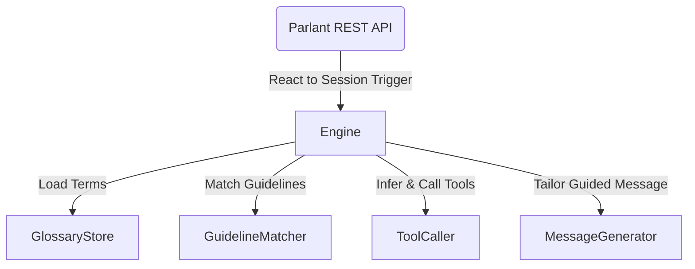
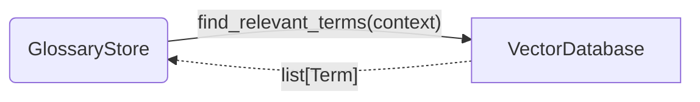
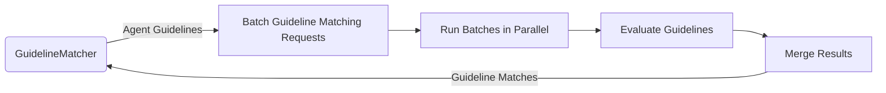
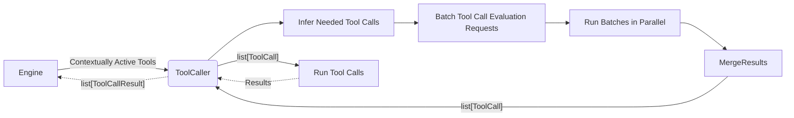
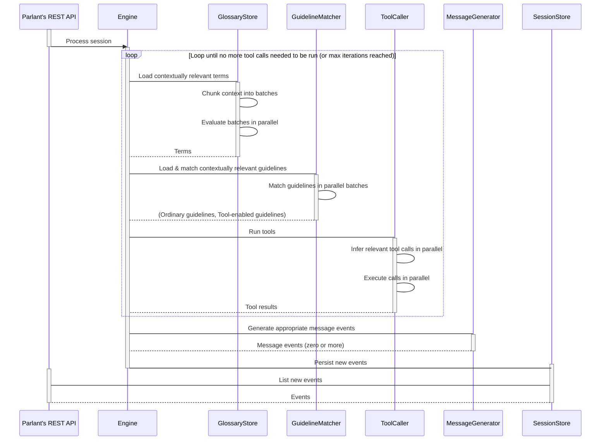

# Ciclo de Vida do Motor

No Parlant, o **Motor** é a parte responsável pelas respostas do agente de ponta a ponta.

O motor é composto por vários componentes, cada um dedicado a uma missão particular. Como veremos, cada uma dessas missões ajuda a criar uma resposta bem orientada, mas ao mesmo tempo também é bastante complexa por si só.

Embora este documento não vá entrar em detalhes específicos dos componentes, ele os explicará brevemente—apenas o suficiente para que possamos ver como eles se inter-relacionam e funcionam juntos para produzir respostas consistentes.

## Componentes Principais

Atualmente existem 4 componentes no motor, e mais estão sendo desenvolvidos enquanto falamos, para suportar ainda mais controle e flexibilidade no motor.

1. **Armazenamento de Glossário**
2. **Correspondência de Diretrizes**
3. **Chamador de Ferramentas**
4. **Gerador de Mensagens**

De modo geral, o Motor--normalmente ativado pela API--usa todos esses componentes ao gerar uma resposta.

Cada um desses componentes atua como uma parte do processo completo de resposta do agente. Cada um é projetado para ter uma única responsabilidade no processo e ser otimizável independentemente, para que quando algo der errado possamos saber exatamente qual parte do processo abordar e otimizar.

Vamos considerar brevemente cada um deles por si só.

### Armazenamento de Glossário
Este componente nos permite armazenar e recuperar termos e definições relevantes que são específicos do nosso domínio de negócios.

Estes termos, ou mais corretamente, os mais relevantes entre eles em cada ponto particular da conversa, são carregados no contexto de execução e disponibilizados para cada um dos outros componentes. Isso não apenas permite que o agente responda de uma maneira que esteja fundamentada na terminologia do seu domínio, mas também permite que você *defina diretrizes que por si só falem sua terminologia.*

Em outras palavras, os termos do glossário buscados são imbuídos em todos os outros componentes, para ajudá-los a realizar sua tarefa com mais precisão.

### Correspondência de Diretrizes
Antes de explicarmos o que este componente faz, primeiro precisamos entender de onde ele vem.

Como você provavelmente já sabe, o comportamento no Parlant é controlado principalmente usando diretrizes, onde cada diretriz tem uma *condição* e uma *ação*. A condição é a parte que especifica *quando a ação deve ser seguida.*

O Parlant aproveita este modelo de condição/ação para ajudar o *Gerador de Mensagens* a permanecer focado, fornecendo apenas diretrizes que são realmente relevantes para sua tarefa atual. Por exemplo, se temos uma diretriz com a condição `o cliente acabou de te cumprimentar`, não precisamos considerar a ação desta diretriz se já estivermos bem avançados na conversa neste ponto—ela pode simplesmente ser desconsiderada. Isso ajuda a melhorar a precisão, reduzir a complexidade do mecanismo de orientação e supervisão, e também reduzir o custo e a latência da conclusão do LLM.

O Correspondente de Diretrizes é o que corresponde às diretrizes apropriadas que precisam ser ativadas na geração da próxima resposta do agente.

### Chamador de Ferramentas
Em vez de usar a API de chamada de ferramentas fornecida pelo fornecedor, o Parlant implementa seu próprio mecanismo de chamada de ferramentas.

Existem três razões importantes para isso:
1. Para suportar o maior número possível de fornecedores, incluindo a capacidade de testar outros fornecedores e alternar entre eles mantendo exatamente a mesma configuração do usuário.
1. Para suportar **chamada de ferramentas guiada,** ou seja, chamar uma ferramenta no contexto de um conjunto específico de diretrizes que explicam não apenas o "o quê" e "como" da chamada da ferramenta, mas também o "por quê" e "quando".
1. Para suportar múltiplas iterações de preparação ao trabalhar em uma resposta; por exemplo, onde a primeira iteração corresponde a diretrizes relevantes e executa ferramentas e então, com base na saída das chamadas de ferramentas da primeira iteração, corresponde a um conjunto potencialmente diferente ou mais amplo de diretrizes, que podem vir com suas próprias chamadas de ferramentas, e assim por diante. Isso permite que você especifique diretrizes livremente e naturalmente, onde suas condições podem ser atendidas não apenas com base na própria conversa, mas também em dados vindos dinamicamente de ferramentas. Para mais informações sobre isso, consulte a [página de Otimização](https://www.parlant.io/docs/advanced/optimization) no site de documentação do Parlant.

O Chamador de Ferramentas recebe uma lista de ferramentas—todas as ferramentas que estão associadas às diretrizes atualmente correspondidas—decide quais precisam ser chamadas e como, e as executa, retornando os resultados para o motor.

### Gerador de Mensagens
Finalmente chegamos ao componente que realmente gera a mensagem de resposta (potencialmente zero ou mais, para ser exato, conforme o caso exige).

Essencialmente, tudo até a vez do Gerador de Mensagens é considerado uma *preparação* para a resposta—embora essa preparação já possa ter atuado no mundo real via chamadas de ferramentas. No entanto, o cliente ainda não sabe disso, porque o agente ainda não disse nada sobre isso.

O Gerador de Mensagens é talvez o componente mais importante, onde todos os outros componentes basicamente visam ajudá-lo a gerar a mensagem mais apropriada possível.

Ele recebe os termos relevantes do glossário, as diretrizes correspondidas para este estado particular da conversa, as ferramentas que acabaram de ser chamadas e todo o histórico de interação. Seu trabalho é avaliar ainda mais as diretrizes correspondidas em contexto, priorizar o que o cliente precisa ouvir primeiro na próxima mensagem e garantir que as diretrizes sejam seguidas da maneira mais confiável possível, ao mesmo tempo em que continua a conversa com o cliente da maneira mais natural possível.

## Ciclo de Vida da Resposta

Agora que temos um entendimento básico do que cada componente do motor faz, vamos olhar para o ciclo de vida de uma única resposta. Este diagrama é um pouco simplista em termos da arquitetura real, mas captura a essência do que está acontecendo.

O ciclo de resposta é projetado para nos permitir conectar a ele em vários estágios e controlá-lo com nossa própria lógica de negócios (código), potencialmente substituindo um dos componentes por nossa própria implementação: digamos um SLM ajustado ou um filtro adicional baseado em um classificador BERT.
