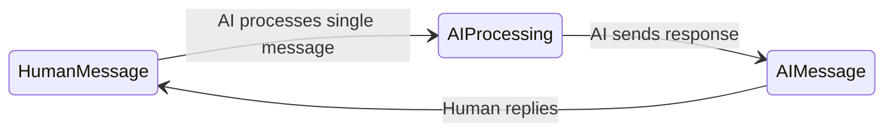
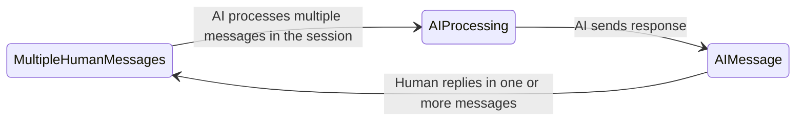
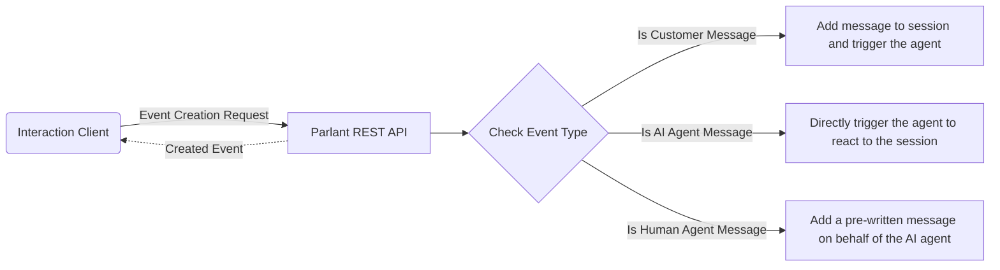
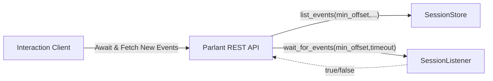

# Fluxo de Interação

## Motivação

A primeira coisa importante a entender sobre o design da interface Humano/IA no Parlant é que ela foi projetada para facilitar conversas que são naturais não apenas em conteúdo, mas também em seu fluxo.

A maioria dos sistemas tradicionais de chatbot (e a maioria das interfaces LLM) depende de um mecanismo de requisição-resposta baseado em uma única última mensagem.

No entanto, hoje sabemos que uma interface de texto natural deve permitir algumas coisas que não são suportadas por esse modelo tradicional:

1. Um humano frequentemente se expressa em mais de um evento de mensagem, antes de estar totalmente pronto para uma resposta da outra parte.
1. As informações sobre sua intenção precisam ser capturadas não apenas de suas últimas N mensagens, mas da conversa como um todo.

Além disso, o agente pode precisar responder não apenas quando acionado por uma mensagem humana; por exemplo, quando precisa fazer um acompanhamento com o usuário para garantir que sua mensagem foi recebida, para tentar outra tática de engajamento, ou para ganhar tempo antes de responder com mais informações, por exemplo, "Deixe-me verificar isso e voltar em um minuto."

## Solução

A API e o motor do Parlant foram projetados para funcionar de forma assíncrona em relação à sessão de interação. Em termos simples, isso significa que tanto o cliente humano quanto o agente de IA são livres para adicionar eventos (mensagens) à sessão a qualquer momento e em qualquer número—assim como em uma conversa real por mensagens instantâneas entre duas pessoas.

### Enviando Mensagens

O diagrama acima mostra os fluxos da API para iniciar mudanças em uma sessão.
1. **Mensagem do Cliente:** Esta requisição adiciona uma nova mensagem a uma sessão em nome do cliente e aciona o agente de IA para responder de forma assíncrona. Isso significa que o *Evento Criado* não contém de fato a resposta do agente—isso virá com o tempo—mas sim o ID (e outros detalhes) do evento do cliente criado e persistido.
1. **Mensagem do Agente de IA:** Esta requisição ativa diretamente o motor de reação completo. O agente irá corresponder e ativar as diretrizes e ferramentas relevantes, e produzir uma resposta. O *Evento Criado* aqui, no entanto, não é a mensagem do agente, já que isso pode levar algum tempo. Em vez disso, retorna um *evento de status* contendo o mesmo *ID de Correlação* que o eventual evento de mensagem do agente. É importante notar aqui que, na maioria dos clientes frontend, este evento criado é geralmente ignorado e é fornecido principalmente para fins de diagnóstico.
1. **Mensagem do Agente Humano:** Às vezes faz sentido que um humano (talvez um desenvolvedor) adicione manualmente mensagens em nome do agente de IA. Esta requisição permite que você faça isso. O *Evento Criado* aqui é a mensagem do agente escrita manualmente, criada e persistida.

### Recebendo Mensagens

Como as mensagens são enviadas de forma assíncrona e potencialmente simultânea, recebê-las também deve ser feito de forma assíncrona. Em essência, devemos sempre esperar por novas mensagens, que podem chegar a qualquer momento, de qualquer parte.

O Parlant implementa esta funcionalidade com um endpoint de API de long-polling com timeout restrito para listar novos eventos. Isto é o que ele faz nos bastidores:

Quando recebe uma requisição por novas mensagens, essa requisição geralmente tem 2 componentes importantes: 1) O ID da sessão; e 2) O offset mínimo do evento a retornar. Normalmente, ao fazer uma requisição para este endpoint, espera-se que o cliente frontend passe o ID da sessão em questão e *1 + o offset de seu último evento conhecido*. Isso fará com que este endpoint retorne apenas quando *novas* mensagens chegarem. É normal executar esta requisição de long-polling em um loop, com timeout a cada 60 segundos ou algo assim e renovando a requisição enquanto a sessão estiver aberta na UI. É este loop que mantém continuamente sua UI atualizada com as últimas mensagens, independentemente de quando elas chegam ou o que causou sua chegada.

Em resumo, o Parlant implementa uma API conversacional flexível que suporta interações Humano/IA naturais e modernas.
